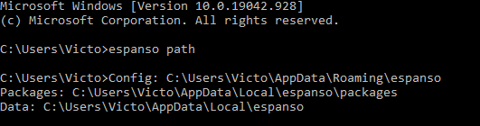
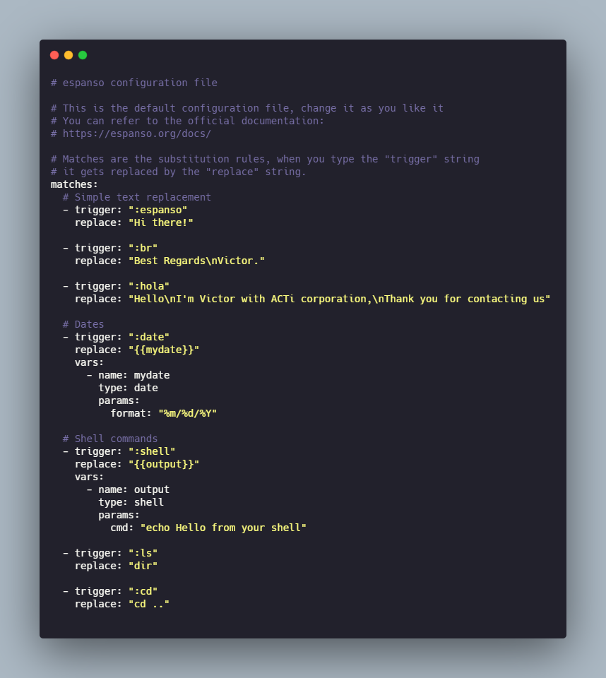

{: .center}

#Espanso

Espanso is "A Privacy-first, Cross-platform Text Expander" according to the official website [espanso.org](https://espanso.org/).
In the nutshell Allow me to save pieces of text or code under a specific trigger, for example, let say i want to create a trigger that will give me as result the current date, so i will create a **Match**, the *trigger* will be `:now` and will be *replace* by the current time ( example `5/11/2021`).

{: .center}

1. [Official Website](https://espanso.org/).  
2. [Documentation](https://espanso.org/docs/).  

## Installation

This section is copy directly from the website, there are instructions to install in Windows, Linux and Mac.

[How to install](https://espanso.org/install/)

## Getting start 

This are some of the CMD or terminal command that will be useful with Espanso

1. `espanso status`.    
2. `espanso start` and `espanso stop`.  
3. `espanso restart`.  

By Default we can enable or disable Espanso by double tap alt (for windows)
 


### Initial and Basic Configuration

The configuration is **file_based** here the common paths to the configuration file:

* Linux: `$XDG_CONFIG_HOME/espanso` (e.g. `/home/user/.config/espanso`).  
* macOS: `$HOME/Library/Preferences/espanso` (e.g. `/Users/user/Library/Preferences/espanso`).  
* Windows: `{FOLDERID_RoamingAppData}\espanso` (e.g. `C:\Users\user\AppData\Roaming\espanso`).  

The qucik way to find the files is recommended by the documentation.

```
espanso path
```
The result will be something like:
{: .center}

The folder mentioned might have several other folders or other documents but the main document will be `default.yml`, this file contain all the main configuration, it use YAML  syntax, and here we can add several *Matches*.
Later we will see that we can even create different files to store matches specific for a software or or oriented to specific purpose.


More details on the official documentation [Getting started](https://espanso.org/docs/get-started/)

### Basic Matches

Later i will dig deeper in the different matches but here an example of a matches file:



The basics here is that `trigger` will be the word to type and `replace` with be the string that will be expanded or appear instead 

1. Simple Text replace: Those will be replacing just text 
2. Dates: this case it will replace using variables and will be a dynamic match
3. Advance matches: these will involve more things and will be more complex to set up.

### Installing packages 

We can add some emojis or some extras to espanso, for that we can use the packages, we can find them on [espanso hub](https://hub.espanso.org/)

To installed it:

```cmd
espanso install basic-emojis
```
adn later restart espanso

```cmd 
espanso restart
```

If we install the package all emoji `espanso install all-emojis` here is a [cheatsheet](https://www.webfx.com/tools/emoji-cheat-sheet/) for those emojis 

### Backspace Undo

If the expansion was trigger by mistake we can use *BACKSPACE* to reverted the action, for that we need to add the line

```YAML
undo_backspace: false
```

to the **default.yml** file.