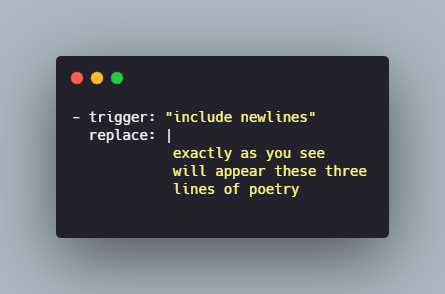
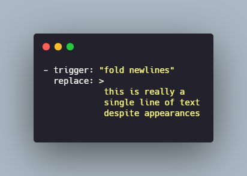

{: .center}

#Espanso

Espanso is "A Privacy-first, Cross-platform Text Expander" according to the official website [espanso.org](https://espanso.org/).
In the nutshell Allow me to save pieces of text or code under a specific trigger, for example, let say i want to create a trigger that will give me as result the current date, so i will create a **Match**, the *trigger* will be `:now` and will be *replace* by the current time ( example `5/11/2021`).

{: .center}

1. [Official Website](https://espanso.org/).
2. [Documentation](https://espanso.org/docs/).

Created by **[Federico Terzi]**(https://federicoterzi.com/).

## Installation

This section is copy directly from the website, there are instructions to install in Windows, Linux and Mac.

[How to install](https://espanso.org/install/)

## Getting start

This are some of the CMD or terminal command that will be useful with Espanso

1. `espanso status`.
2. `espanso start` and `espanso stop`.
3. `espanso restart`.

By Default we can enable or disable Espanso by double tap alt (for windows)
 


### Initial and Basic Configuration

The configuration is **file_based** here the common paths to the configuration file:

* Linux: `$XDG_CONFIG_HOME/espanso` (e.g. `/home/user/.config/espanso`).
* macOS: `$HOME/Library/Preferences/espanso` (e.g. `/Users/user/Library/Preferences/espanso`).
* Windows: `{FOLDERID_RoamingAppData}\espanso` (e.g. `C:\Users\user\AppData\Roaming\espanso`).

The qucik way to find the files is recommended by the documentation.

```
espanso path
```
The result will be something like:
{: .center}

The folder mentioned might have several other folders or other documents but the main document will be `default.yml`, this file contain all the main configuration, it use YAML  syntax, and here we can add several *Matches*.
Later we will see that we can even create different files to store matches specific for a software or or oriented to specific purpose.


More details on the official documentation [Getting started](https://espanso.org/docs/get-started/)

### Basic Matches

Later i will dig deeper in the different matches but here an example of a matches file:


The basics here is that `trigger` will be the word to type and `replace` with be the string that will be expanded or appear instead

1. Simple Text replace: Those will be replacing just text
2. Dates: this case it will replace using variables and will be a dynamic match
3. Advance matches: these will involve more things and will be more complex to set up.

### Installing packages

We can add some emojis or some extras to espanso, for that we can use the packages, we can find them on [espanso hub](https://hub.espanso.org/)

To installed it:

```cmd
espanso install basic-emojis
```
adn later restart espanso

```cmd
espanso restart
```

If we install the package all emoji `espanso install all-emojis` here is a [cheatsheet](https://www.webfx.com/tools/emoji-cheat-sheet/) for those emojis

### Backspace Undo

If the expansion was trigger by mistake we can use *BACKSPACE* to reverted the action, for that we need to add the line

```YAML
undo_backspace: false
```

to the **default.yml** file.

## Matches

The exact documentation about the matches can be find here [Matches](https://espanso.org/docs/matches/)

In the official documentation words **"Matches are pairs that associate a trigger with a replaced text."**

#### Static Matches

These are the most basic,. it will consist of:
* **trigger**: the word that will trigger the expansion.
* **replace**: Expression or word that will be place instead of the trigger.

```YAML
- trigger: ":Hola"
  replace: "Hello  world"
```

#### Multi-line expansions

To replace the original text with a multi-line message we can use `\n` the line terminator to jump to the next line.

```YAML
- trigger: ":hello"
  replace: "Hello\nWorld!"
```

or we can use (From the official documentation) :

**Literal Block Scalar**
It will include any line or trailing spaces added on the replaces section.

{: .center}

**Folded Block Scalar**
It will fold the newlines to spaces, so no matter if the replace section contain new lines they will be fold to spaces.

{: .center}


#### Dynamic Matches

For this type of Matches  there will be two additional concepts **variable** and **extensions**.

* **Variable:** it is use on the replace clause to include the output of a dynamic component.
* **Extension:**  It is the dynamic component that will produce an output that will be take place of the variable on the replace clause.

**Example**:

```YAML
- trigger: ":now"
  replace: "It's {{mytime}}"
  vars:
    - name: mytime
      type: date
      params:
        format: "%H:%M"

```

1. The Trigger is `:now`.
2. Te replace close `"It's {{mytime}}"` contain the variable `{{mytime}}`.
3. now the dynamic component will be on the next part that start with `vars`.

```YAML
vars:
	- name: mytime
	  type: date
```

In these lines we define the variable `mytime` as a `date` type.
In this example the [Date Extension](https://espanso.org/docs/matches/#date-extension) is use

The most important part of this extension is the `format` parameter
```YAML
	  params:
	  	format: "%H:%M"
```
> A list of all the possible options can be found in the [official chrono documentation](https://docs.rs/chrono/0.3.1/chrono/format/strftime/index.html).

#### Cursor Hints

In some cases we want to set the cursor in the middle of the expression expanded, in that case we use the the cursor hint `$|$` so for example:

```YAML
  - trigger: ":div"
    replace: "<div>$|$</div>"
```

#### Multi-trigger

In some cases we want to have more than one trigger, in that case we can list the triggers like a list.

```YAML
	- triggers: ["hello", "hi"]
  	  replace: "world"

```

#### Script Expansion

In this case we will use espanso to execute a external script, in this case we will run a python script

**script.py**
```python
print("Hello from python")
```

now the match will look like:

```YAML
- trigger: ":pyscript"
  replace: "{{output}}"
  vars:
    - name: output
      type: script
      params:
        args:
          - python
          - /path/to/your/script.py
```

> `args` must change depending of the programming language and the location of the script.


There is a good practice mentioned in the official documentation

##### Script Placement

The best-practice is to create a folder called `scripts` inside the directory `espanso` to store all the scripts to be use.

Now, we use the `%CONFIG%` wildcard to automatically replace the configuration directory

```YAML
- trigger: ":pyscript"
  replace: "{{output}}"
  vars:
    - name: output
      type: script
      params:
        args:
          - python
          - "%CONFIG%/scripts/script.py"
```

#### Shell Extension

Similar to the Script Expansion, this is use to execute a script, in this case will be a shell command.

```YAML
- trigger: ":ip"
  replace: "{{output}}"
  vars:
    - name: output
      type: shell
      params:
        cmd: "curl 'https://api.ipify.org'"
```

> this will get the IP address with [ipify](https://www.ipify.org/).

We can choose the Shell:

* On Windows: `cmd`, `powershell`, `wsl`.
* On macOS: `sh`, `bash`.
* On Linux: `sh`, `bash`.

#### Clipboard

In some cases we want to add the content of the clipboard as part of the expansion.

```YAML
  - trigger: ":a"
    replace: "<a href='{{clipboard}}' />$|$</a>"
    vars:
      - name: "clipboard"
        type: "clipboard"
```

so if we copy a link and later use the trigger `:a` the content of the clipboard will be paste on the location of the variable `{{clipboard}}`.


## Configuration

Espanso uses files to manage its configuration, so this can be add to git or dropbox/Google drive (more about [synchronization](https://espanso.org/docs/sync/)).

We can organize the triggers and expansion can be organize in different files, those files will be on the directory `user/`.

for example for a file that will contain expansion for emails we will:

1. create a new file inside `user/` by `espanso edit emails` command.
2. Inside the file `user/emails.yml`we add.

```YAML
name: emails
parent: default

matches:
  - trigger: ":sig"
    replace: |
      Best regards,
      Victor.
```
The connection of this child file with the parent is with the line `parent: default` instruction.

### Filters

In some cases we want to espanso behave different depending of the application or the program, in that case we use filters.

* `filter_title`.
* `filter_exec`.
* `filter_class`.

> The filter will request some information, in that case we can use `espanso detect`  which will provide information need it for the filters, see [official documentation](https://espanso.org/docs/configuration/#application-specific-configurations).

For example in a different document title `telegram.yml` on the folder `user/`

```YAML
filter_title: "Telegram"

matches:
  - trigger: ":ok"
    replace: "👍"

```
