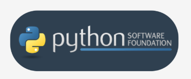
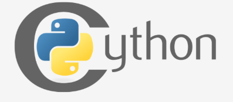

Lets start with some basic concept that are present in bold in the course 

* **Machine language**: LAnguage use for the computers, very rudimentary.
* **Natural Language**: Language use by people, it is constantly evolving, new words are created every day and old one disappear. 
* **Instruction list** (IL): a complete set of know commands 

## What is a language

> I paraphrased the original information of the course since it is condense and simple

* **An Alphabet:** A set of symbols use to build a word.
* **A Lexis:**  also known as dictionary, it is a set of words available in to be use.
* **A Syntax:** A set of rules used to determine if a certain string of words make a valid sentence 
* **Semantics:** a set of rules to determining if a certain phrase make sense.

The IL o Instruction list is the alphabet for the machine, this is the simplest set of symbols that can be use to give commands to the computer.
In order to give instruction to the computer we need a intermediary language, complex enough to be human readable, simple enough so computer can follow, this languages are called **High-Level programming Language**, a program written with this language is call **source code** and a file  containing this code will be a **source file**.

## Compilation vs. Interpretation

A code or source code must be correct in many senses:

* **Alphabetically:** A program must be written in recognizable script, using recognizable character, as example Roman alphabet.
* **Lexically:** Each programming language ahas a dictionary and one must master it, although is simpler than a natural language dictionary.
* **Syntactically:** Each language has it rules and must be obeyed
* **Semantically:** The program has to make sense

Assuming the program is written correctly, now we need the computer to translate it to machine language, this transformation from **high-Level Programming Language** into **Machine Language**.

## Compilation

The source code is translate once (but this act needs to be repeated each time we modify the code) by getting a file, that contain the machine code, now the code can be distribute.

## Interpretation
We can translate the source program each time it has to be run; the program performing this kind of transformation is called an interpreter, as it interprets the code every time it is intended to be executed; it also means that you cannot just distribute the source code *as-is*, because the end-user also needs the interpreter to execute it.

|			|:--Compilation--:|Interpretation|
|:---------:|:----------|:--------|
||* The execution of the translated code is usually faster;|* You can run the code as soon as you complete it - there are no additional phases of translation;|
| **ADVANTAGES** | * Only the user has to have the compiler - the end-user may use the code without it; | * The code is stored using programming language, not the machine one - this means that it can be run on computers using different machine languages; you don't compile your code separately for each different architecture.|
| |* The translated code is stored using machine language - as it is very hard to understand it, your own inventions and programming tricks are likely to remain your secret.| |
|**DISADVANTAGES**|* The compilation itself may be a very time-consuming process - you may not be able to run your code immediately after any amendment;| *don't expect that interpretation will ramp your code to high speed - your code will share the computer's power with the interpreter, so it can't be really fast;  |
||* You have to have as many compilers as hardware platforms you want your code to be run on. |* Both you and the end user have to have the interpreter to run your code. |

Python is an **Interpreted Language**  you just need the *Python Interpreter* 

## Python Goals

* An **Easy and Intuitive** yet powerful language.
* **Open Source**
* Understandable code, just like plain English.
* **Suitable for Everyday programming**.

## Python, CPhyton and Cython 

Python is maintain for people around the PSF or Python Software Foundation, the president is the creator of the language itself, *Guido van Rossum*, these Pythons are called **Canonical** 

{: .center}

Python was implemented in C, it was, it is, and, probably continue been, implemented in C, this is why it is often refer as **CPython**

### Cython

**Cython** is other family member of Python, it is a solution for many trade off, such the lack of efficiency, once the code is written in Python, and it is prove that there is not issue, one can translate this code to C. 
This is what Cython is intended to do so, translate python code to C.

{: .center}

The last two "flavors" of python mentioned in the course are **Jython** and **PyPy**.

### Jython and pypy

**Jython** is similar to Cython, but instead of translate the python script to C, this will translate to java, it is specially use in big systems, where java is the main language, this Flavor, Jython just support Python 2 and there is not implementation for Python3 so far.

{: .center}

**pypy** it is an environment written in **RPython** and is mostly use for develop python, it doesn't run the interpreter it translate everything to C.

{: .center}