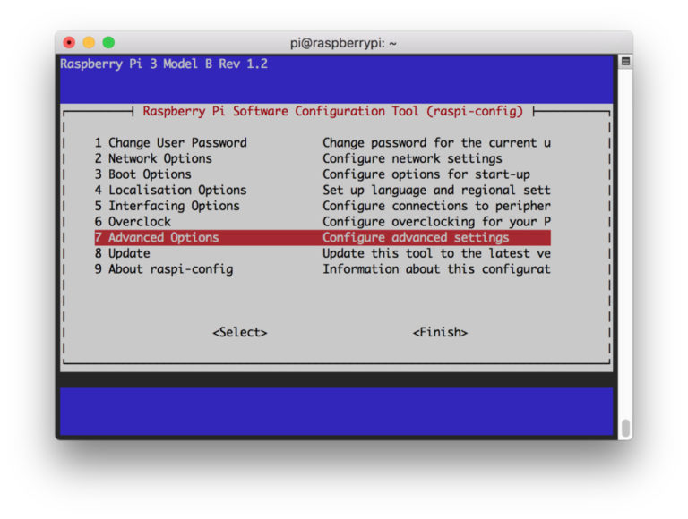
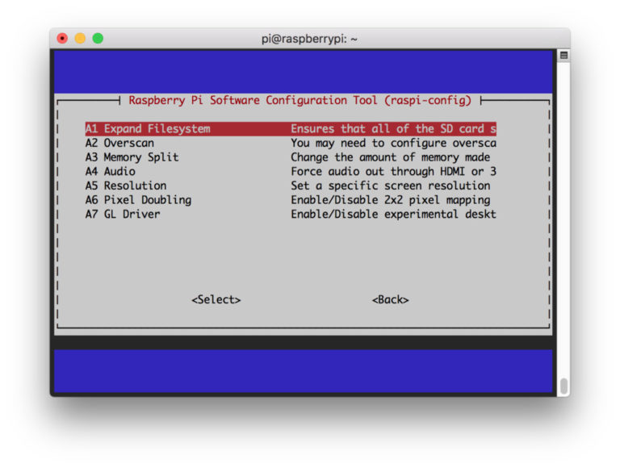
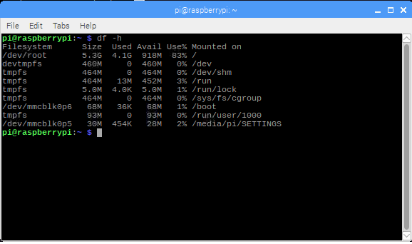

There are 7 steps in this installation, and a small project that include the raspberry camera, we will expand the file system and free some space removing some programs that we are not going to use.

## Step 1: Expanding filesystem on the Raspberry Pi

 The first thing will be expand the filesystem on the raspberry to make use of all the available space in the micro-sd card:

```
$ sudo rasp-config
```

we are going to access to the configuration, after the command a menu will be display and we can select the option "Advance Options"




next, we select the option "Expand filesystem"



once we select we option we can go t **<Finish>** and reboot the unit

```
$ sudo reboot
```
after the reboot the available space will expand, this can be verify using the command `df -h` 



This might not be enough, therefore we will proceed to remove libreOffice and Wolfram engine to make more room.

```
$ sudo apt-get purge wolfram-engine
$ sudo apt-get purge libreoffice*
$ sudo apt-get clean
$ sudo apt-get autoremove
```
> you can use dpkg-query -l to list all the programs installed, we can remove the following:   
* wolfram-engine.  
* bluej.  
* greenfoot.  
* nodered.  
* nuscratch.  
* scratch.  
* sonic-pi.  
* libreoffice.  
* claws-mail.  
* claws-mail-i18n.  
* minecraft-pi.  
* python-pygame.  

## Step 2: Installing OpenCV 4 dependencies on Raspberry pi

We start by updating and upgrading the system

```
$ sudo apt-get update && sudo apt-get upgrade
```
this process might take some time 

after this, we proceed to include the developer tools on [CMake](https://cmake.org/)

```
$ sudo apt-get install build-essential cmake unzip pkg-config
```

Next, we are going to install libraries to work with videos  and images

```
$ sudo apt-get install libjpeg-dev libpng-dev libtiff-dev
$ sudo apt-get install libavcodec-dev libavformat-dev libswscale-dev libv4l-dev
$ sudo apt-get install libxvidcore-dev libx264-dev
```
The next step will be Install GTK and GUI backend and install a package whihc reduce the GTK warnings

```
$ sudo apt-get install libgtk-3-dev
$ sudo apt-get install libcanberra-gtk*
```

now two more packages, one for numerical optimization other for python development headers

```
$ sudo apt-get install libatlas-base-dev gfortran
$ sudo apt-get install python3-dev
```

## Step 3: Download OpenCV 4 for Raspberry pi

There are two things to download, the `opencv` and the `opencv_contrib`, we are going to download them, unzip them and later rename the directories

```
$ cd ~
$ wget -O opencv.zip https://github.com/opencv/opencv/archive/4.0.0.zip
$ wget -O opencv_contrib.zip https://github.com/opencv/opencv_contrib/archive/4.0.0.zip
```


[Resource](https://www.pyimagesearch.com/2018/09/26/install-opencv-4-on-your-raspberry-pi/)