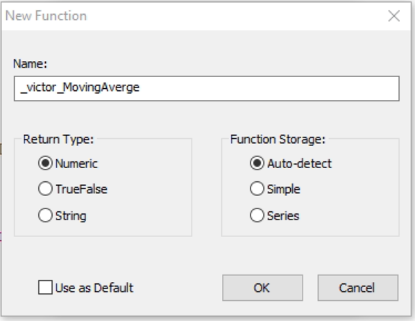

Functions on easylanguage are similar to functions in other languages, not in syntax but in concepts, these are use to encapsulate logic to easy debugging and to avoid repetition.

## Making a Function
to make a function we need to go to File -> New and select function:


the next screen will display the options for the name of the function, the return type and the function storage



### The name
like in other languages the function name should be descriptive and not contain special characters with the exception of underscore

### The return type
the return type like in other languages specify the  type of result that the function returns to the caller, if this return is a numeric value we need to select "**Numeric**", if the function returns a boolean value, we will need to choose "**TrueFalse**", finally if the function returns string we will choose "**String**"

### The function Storage
In this case the best option will be "**Auto-detect**", the reason is, that we will have lest problems if we decided to make significant changes to the function, the "**Simple**" it is use when inside the function we don't use previous bar's values, that means we don't use square baskets, if we decide to use square brackets the function storage option to select will be "**Series**"

## Functions Inputs

In the indicators you need to specify the default value of the inputs, in the functions code, you have to specify the type of each input, this tell the program what input value to expect while the code is running.

In most of the cases we will work with three type of input parameters:

* Numeric
* TrueFalse
* String

Each of these types have one or two subtypes, **series** and **simple**, A simple way to see this will be; If a particular input parameter is constant it is **Simple**, for example ins a Moving average the length value use to calculate it will be a subtype **Simple** in other words `NumericSimple`, but the price, since this change or vary all the time, it will be define as subtype **Series**, that is why the price input will be `NumericSeries`.

```
//Numeric Input Types

//a constant input value, example 10
ConstantValue               ( NumericSimple ),
//a Input that can change its value, like Close
PriceSeriesValue            ( NumericSeries ),

//TrueFalse Input Types

//a Simple true/false switch for example used to enable a certain functionality
CheckCondition              ( TrueFalseSimple ),
//Use for a true/false input that can change between true and false for a bar to bar
EntryCondition              ( TrueFalseSeries ),

//String Input Type

//a constant String - like email address
EmailAddress                ( StringSimple ),
//use for text that change bar to bar
EmailText                   ( StringSeries ),
```

## Function Outputs

We can also use Inputs to receive values from the function, these "in&out" inputs can refer values to the caller, in this way we can create a function that not just give a return value, but also a series of values related with he operation, as an example, The stochastic, it return 4 values additional to the return value, this values are; Slow %K, Slow %D, Fast %K and Fast %D.

to declare this reference input, we do it as a regular input with the difference that this will have "Ref" at the end of the type, It is important to mention that the convention in easylanguease is to name this type of reference inputs with a "o" at the beginning of the name, this will give more information and it will be easy to read.

```
//Output a numeric value - for example the result of a moving average
oAverageValue       ( NumericRef ),

//Output a boolean - this could be the true/false result of a condition check for example
oEntryCheck         ( TrueFalseRef ),

//output a String - for example a message that was created withing a function
oMessage            ( StringRef ),

```

## Return Value

Each function will need to give a value, even if this is a dummy value, this done assigning the value to return to the name of the function.
We can pass a reference array to and from the function, this is done with `NumericArray`, `NumericArrayRef`,`TrueFalseArray`,`TrueFalseArrayRef`,`StringArray`,`StringArrayRef`.

## An Example of a Function

We are going to make a function that will calculate the moving average so for that we need

### The Inputs

the inputs will be the `Price` and the `AverageLenght`

```
Inputs:
        Price               ( NumericSeries ),
        AverageLength       ( NumericSimple);
```


###  The variables

the variables to be use in the logic will be

```
variables:
            Counter             ( 0 ),
            CloseValueSum       ( 0 ),
            AverageValue        ( 0 );
```

### The logic

now we use the counter to go through all the values in previous bars ( Averagelength ) all this sum will be store in `CloseValueSum` and later the Average will be calculated

```
// Reset the variable
CloseValueSum = 0;

for Counter = 0 to AverageLength - 1
begin
    CloseValueSum =  CloseValueSum + Price[Counter];
end;

// calculate the average
if AverageLength <> 0  then
    AverageValue = CloseValueSum / AverageLength;
```

### The return

Now we need to store the result in the name of the function so we can use it in an indicator

```
_victor_movingAverge = AverageValue;
```

## Using the Function

now we can call this function from other indicator, and the code for this indicator will be

```
Inputs:
    Price           ( Close ),
    AverageLength       ( 10 );


variables:
    MovAvgResult        ( 0 );


//Call the function
MovAvgResult = _victor_movingAverge( Price, AverageLength);

//Plot
Plot1(MovAvgResult, "Average");
```
