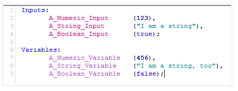

There are different type of data on Input and on Variables, these types are:

* a Numeric Value
* A String 
* A Boolean (true or False)

here an example:

[001. Power languages tutorial](https://www.abctradinggroup.com/powerlanguage-tutorials-lesson-01/)

[002. Free Forex API](https://www.freeforexapi.com/Home/Api)

[003. Fixer API](https://fixer.io/documentation)

[004. Knowledge base Multicharts](https://www.multicharts.com/support/base/)

[005. Trading station Help page](http://help.tradestation.com/09_01/tswebtrading/Subsystems/elanalysis_webtrading/elanalysis_webtrading.htm)

[book for reference](https://drive.google.com/file/d/0B_aFLJZIlhWvcHlLTU9wYndxVEU/view)