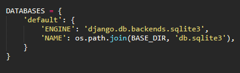

## Database Setup

By default Django use SQLite as a database, this will be created when is need it, therefore, if we are not going to use any other database, we won't need to do anything.

Now to see the configuration related with databases we can check **mysite/settings.py**, here we will find several configuration, one for those configuration is about the databases.


{: .center}


To change to a different database, we will need to change the key in **DATABASES 'default'** to match the setting of the other database:

* **ENGINE:** the default will be `django.db.backends.sqlite3` but we have `djando.db.backends.postgresql`,`django.db.backends.mysql` or `django.db.backends.oracle` 
* **NAME:** this is the name of the database, in the case of the SQLite this will be a file, and the **NAME** should be the absolute path to the file `os.path.join(BASE_DIR,'db.sqlite3')`

### Installed Apps

In the same document, **mysite/settings.py**, we have the `INSTALLED_APPS`, here Django holds the names of all Django applications that are activated in this Django instance. This apps can be reuse in more projects.

* `django.contrib.admin` admin site 
* `django.contrib.auth` an authentication system
* `django.contrib.contenttypes` a framework for content types
* `django.contrib.sessions` A sessions framework
* `django.contrib.messages` A messaging framework
* `django.contrib.staticfiles` A framework for managing static files


some of this apps make use of database tables, therefore we need to create the table for them, this can be done with: 

```
python manage.py migrate
```

the **migrate** command looks at the **INSTALLED_APPS** settings and create any necessary database table according to the database settings in the file *mysite/settings.py*

## Creating models

the models are the database layout, with additional metadata, using the example of the polls, we are going to create two models: **Questions** and **Choice**, **Question** will contain two fields *questions* and *publication date*. A **Choice** has two fields: the *text of the choice* and the *votes*, each choice is linked to a question.

all of this concept will be implement in a Python class, in the `polls/models.py` we have:

```python
from django.db import models


class Question(models.Model):
    question_text = models.CharField(max_length=200)
    pub_date = models.DateTimeField('date published')


class Choice(models.Model):
    question = models.ForeignKey(Question, on_delete=models.CASCADE)
    choice_text = models.CharField(max_length=200)
    votes = models.IntegerField(default=0)
```

Each model is represented by a class that subclass `django.db.models.Model` each model has a number of class variables, each of which represent a database field in the model.

Each field is represented by and instance for the Field class, for example `CharField` for characters fields and **DateTimeField** for datetimes, this tells Django what type of data each fields holds.

There is something to remark, in this case each field have two names,  one machine-friendly format, like **question_text** or **pub_date** and a human-friendly or human-readable, in this case `Question.pub_date` is the only one with this human-readable name (date published).

Some **Field** classes have required arguments, for example **CharField** that required **max_length** and others can use **default** to set the *default* value, like `Choice.votes`

Finally the relationship between both models is done using **ForeignKey**, that tells Django each **Choice** is related to a single **Question**, Django support the common database relationships; many-to-one, many-to-many and one-to-one.

## Activating the models 

The next step is to tell Django that polls ( or the app we are creating) is going to used this database, for that we are going to add something else to the file `mysite/setting.py` in the section `INSTALLED_APPS`, we are going to add the path to the `PollConfig` Class ( this calse is in **polls/app.py**)

```python 

INSTALLED_APPS = [
	'polls.app.PollsConvig',
	'django.contrib.admin',
    'django.contrib.auth',
    'django.contrib.contenttypes',
    'django.contrib.sessions',
    'django.contrib.messages',
    'django.contrib.staticfiles',
]
```

now Django will include the polls app, the next step is the following command:

```
$ python manage.py makemigrations polls
```
and we will have a result like this:


the command `makemigrations` tell Django that you've made some changes to your models(in this case we make a new one)

Migrations is how Django store changes to the models, you can reed the changes in the file **polls/migrations/001_initial.py**

to see the SQL the migration will run we can use

```
$ python manage.py sqlmigrate polls 0001
```

now we need to run the command **migrate** to create the models tables in the database:

```
$ python manage.py migrate
```

The **migrate** command takes all the migrations that haven’t been applied (Django tracks which ones are applied using a special table in your database called **django_migrations**) and runs them against your database - essentially, synchronizing the changes you made to your models with the schema in the database.

so there will be three steps:

* Change your models (in **models.py**)
* Run `python manage.py makemigrations` to create the migrations for those changes.
* Run `python manage.py migrate` to apply those changes to the database.

