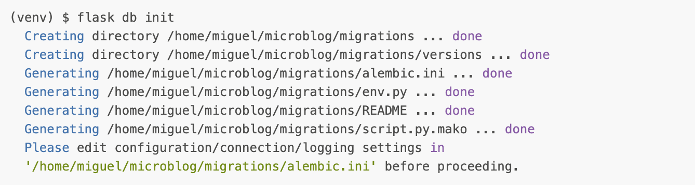
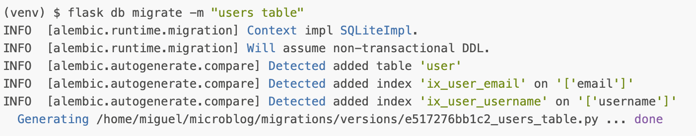
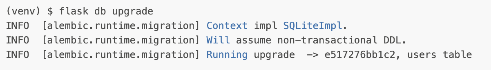

{: .center}

**Flask-Migrate** is an extension that handles SQLAlchemy database migrations for Flask applications using Alembic. The database operations are made available through the Flask command-line interface or through the Flask-Script extension.

This extension was explain in the previous notes **Databases - Flask-SQLAlchemy**

1. [Documentation](https://flask-migrate.readthedocs.io/en/latest/)
2. [Github](https://github.com/miguelgrinberg/flask-migrate)
3. [Pypi](https://pypi.org/project/Flask-Migrate/)

## Installation

```bash
pip install Flask-Migrate
```

## previous usage

In the previous notes we use this extension to do different things, we did:

> Remember this extension work with `flask` command

### Creating migration repository

```bash
flask db init
```
{: .center}

### First database migration

```bash
flask db migrate -m "users table"
```
{: .center}

### Apply changes to database

```bash
flask db upgrade
```
{: .center}
