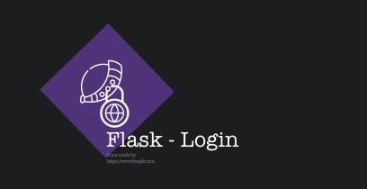
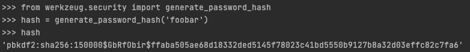
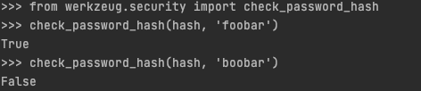
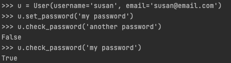

{: .center}

Flask-Login is Flask extension that provide user session management to flask app, it handle the most common task related with the login procedure, task such as Logging in, Logging out, Remember sessions (permanent of by a define amount of time).  

1. [Official documentation:](https://flask-login.readthedocs.io/en/latest/)
2. [PIP page:](https://pypi.org/project/Flask-Login/)
3. [Git:](https://github.com/maxcountryman/flask-login)

From the official documentation of Flask-Login: 

* Store the active user’s ID in the session, and let you log them in and out easily.
* Let you restrict views to logged-in (or logged-out) users.
* Handle the normally-tricky “remember me” functionality.
* Help protect your users’ sessions from being stolen by cookie thieves.
* Possibly integrate with Flask-Principal or other authorization extensions later on.

### Installation
```bash
pip install Flask-Login
```
## Password Hashing

Flask Has a dependency that can handle the hashing of passwords, this dependency is called [Werkzeug](https://werkzeug.palletsprojects.com/en/1.0.x/), this is an example of a password hash using `generate_password_hash()`

{: .center}

Now to verify the hashed password we can use the function `check_password_hash()`

{: .center}

In this case the `check_password_hash()` will return `True` if the hash password matches, and `False` when they don't matches.

### Password hashing and verification

The whole password hashing logic can be implemented as two new methods in the user model

**app/models.py**
```python
from werkzeug.security import generate_password_hash, check_password_hash

#...

class User(db.Model):
	#...

	def set_password(self, password):
		self.password_hash = generate_password_hash(password)

	def check_password(self, password):
		return check_password_hash(self.password_hash, password)
```

we can check if this is working with the flask shell

{: .center}

## Introduction to Flask-login

Flask-login help us to handle the logged-in state, in other words "remembers" the state, so the user can navigate the site and maintain the session state.

As other Flask extensions we need to register it, for that we need to modify the `__init__.py`

**application/__init__.py**
```python

#...

from flask_login import LoginManager

app = Flask(__name__)

#...
login = LoginManager(app)

```

## Preparing The User Model for Flask-login

Flask-login extension work with any model and multiple databases the only requirements is the implementation of four items:

* `is_autheticated`:  Property is `True` if the user is valid, `false` if is not.    
* `is_active`: Property is `True` if the user is active and `False` otherwise.  
* `is_anonymous`: Property is `False` if the user is a regular user, `True` if is special anonymous user.  
* `get_id()`: it returned a unique identifier for the user as a string.


Although Flask-login provided a *mixin* class called `UserMixin` that include the generic implementation that are appropriate for most user model classes.

**application/models.py**
```python
#...

from flask_login import UserMixin

class User(UserMixin, db.Model):
	#...
```

## User Loader Function

This extension track the logged user by storing the user identifier  in a Flask's user sessions, each time the logged-in user navigate to a new page, the extension retries the Id of the user from the session, and the loads the user into memory.

Flask-Login need some help to load the user, in that case we need to create a new function.

**application/models.py**
```python
from application import login

# ...

@login.user_loader
def load_user(id):
	return User.query.get(int(id))
```

Now, we need to register the **User loader** to the extension, in this case we register the **user loader** to the Flask-login with the decorator `@login.user_loader`, if we check in detail, there is a cast from string to Integer, that is because the ID of the user Flask-login pass is a string

## Logging User In

With the database in place, with the *user loader* done and with the modification in the User model we can make a modification of the view function handling the login.

**application/routes.py**
```python
#...

from flask_login import current_user, login_user
from application.models import User

#...

@app.route('/login', methods=['GET','POST'])
def login():
	if current_user.is_authenticated:
		return redirect(url_for('index'))
	form = LoginForm()
	if form.validate_on_submit():
		user = User.query.filter_by(username=form.username.date).first()
		if user is None or not user.check_password(form.password.data):
			flash('Invalid username or password')
			return redirect(url_for('login'))
		login_user(user, remember=form.remember_me.data)
		return redirect(url_for('index'))
	return render_template('login.html', title='Sign In', form=form)

```

From the previous code we have:

1. The first two lines have two important items, the first `current_user` this variable contain the user, and the parameter `is_authenticated`, if the user is already log in the parameter `is_authenticated` will be `True`, and them the user is redirect to the index.
2. we get back the user from the database if hte user is not already log in, in this case we use the `query.filter_by` and the method `first()` to filter the records by user name and get back the first record found.
3. Now we verify the password, in this case we need to remember that the password is hash so we use the method `check_password()`, the there is no match we will use the `flash()` method to display the error and redirect to login page.
4. if the user and password are correct, we call the method `login_user()`, this function comes from Flask-login, this function will register the user as logged in , so that means that any future pages the user navigates will the variable `current_user` set to that user.
5. last step is to redirect the newly logged user to the index page.

## Logging Users Out


## Requiring User To Login

## Showing The Logged In User in Templates

## User Registration


