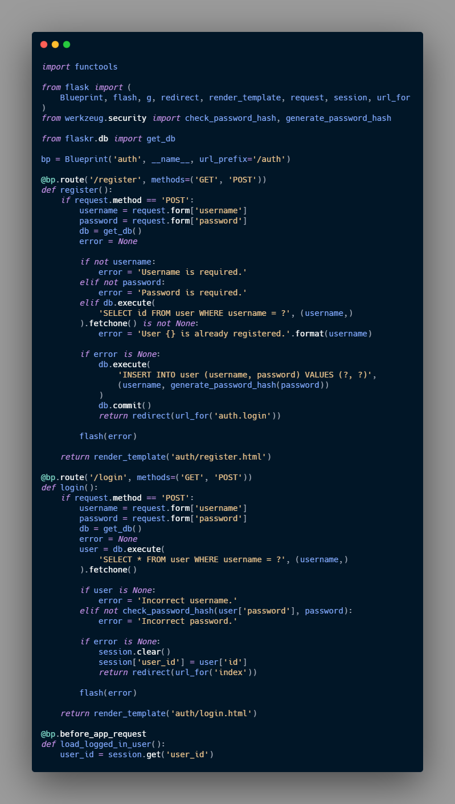

## Blueprints and Views

With the Blueprints[^3], we can organize a group of related views and other part of the code, this views and code are not register to the Application, instead the are register to the Blueprint, then the blueprint is registered with the application when it is available in the factory function.

In this example I will use the same two blue prints use in the documentation example, one for the authentication functions and other for the blog posts itself. These blueprints are going to be in two separate modules.

### Creating a Blueprint

Authentication go first:

**flaskr/auth.py**
```python 
import functools

from flask import ( 
	Blueprint, flask, g, render_template, request, sessions, url_for
)
from werkzeug.security import check_password_hash, generate_password_hash
from flaskr.db import get_db

bp = Blueprint('auth', __name__, url_prefix='/auth')
``` 

1. We create a blueprint called `auth`.
2. we provide a location for the blueprint `__name__`.
3. `url_prefix` will be prepended to all the URL associated with the blueprint.

Now we need to import and register from the factory 

**flaskr/__init__.py**
```python 
def create_app():
	app = ...
	# existing code

	from . import auth
	app.register_blueprint(auth.bp)

	return app
``` 

1. `app.register_blueprint()` use to register the blueprint with the application

### Views (auth module)

Now we need to do the views, these views will have to parts, the templates ( the jinja2 templates) and the functions binded to them.

#### Register View

This view will take care of the registration of a new user, so any user visiting `/auth/register` URL will receive a HTML as a response, this response will be deliver by the `register` view.

**flaskr/auth.py**
```python 
@bp.route('/register', methods=('GET','POST'))
def register():
	""" this is the register view"""
	if request.method == 'POST':
		username = request.form['username']
		password = request.form['password']
		db = get_db()
		error = None

		if not username:
			error = 'Username is required.'
		elif not password:
			error = 'password is required.'
		elif db.execute(
				'SELECT id FROM user WHERE user = ?',(username,)
			).fetchone() is not None:
				error = 'User {} is already register.'.format(username)

		if error is None:
			db.execute(
				'INSERT INTO user (user, password) VALUES (?, ?)',
				(username, generate_password_hash(password))
			)
			db.commit()
			return redirect(url_for('auth.login'))
		
		flash(error)

	return render_template('auth/register.html')
``` 
Now a description of the code:

1. `@bp.route` this is a decorator that associate the URL `/register` with the register view function, so if flash receives a request to `/auth/register`, it will call `register` and return a value as response.  

2. We check if the request was made by `POST`, if yes, we validate the input.

3. `request.form` it is a special `dict` it will store the key and values of the information submitted on a html form, in this case username and password. Validate if the username and password are not empty.  

4. Validate `username` doesnt exist already on the database, `fetchone()` give back the first row in the result, if thre are not result it return `None`.

5. Password shouldnt be store in plain text on the database, instead we use `generate_password_hash()` to hash the password and store the hash, after this modification we commit to the database `db.commit()`

6. After commit to the database the user is redirect to the login page.  

7. If there is any error `flash()` stores messages that can be retrieved when rendering the template.  

8. When the user initially navigates to `auth/register`, or there was a validation error, an HTML page with the registration form should be shown. `render_template()` will render a template containing the HTML.  


#### Login View

Following similar pattern of `register` view here the login view:

**flaskr/auth.py**
```python 
@bp.route('/login', methods=('GET', 'POST'))
def login():
	if request.method == 'POST':
		username = request.form['username']
		password = request.form['password']
		db = get_db()
		user = db.execute(
				'SELECT * FROM user WHERE username = ?' (username,)
			).fetchone()

		if user is None:
			error = 'Incorrect username.'
		elif not check_password_hash(user['password'], password):
			error = 'Incorrect password.'

		if error is None:
			session.clear()
			session['user_id'] = user['id']
			return redirect(url_for('index'))

		flash(error)

	return render_template('auth/login.html')

``` 

1. The user is queried first and later store in a variable for later use.
2. `check_password_hash()` hashes the submitted password in the same way as the stored hash and securely compares them. If they match, the password is valid.
3. `session` is a dictionary that stores data across requests. When validation succeeds, the user’s `id` is stored in a new session. The data is stored in a cookie that is sent to the browser, and the browser then sends it back with subsequent requests. Flask securely signs the data so that it can’t be tampered with.

**flaaskr/auth.py**
```python 
@bp.before_app_request
def load_logged_in_user():
	user_id = session.get('user_id')

	if user_id is None:
		g.user = None
	else:
		g.user = get.db().execute(
				'SELECT * FROM user WHERE id = ?', (user_id,)
				).fetchone()
``` 

1. `bp.before_app_request()` no matter what URL was requested, the decorator will make the function `load_logged_in_user` run before the view function. This function will check if the session contain the user id, it will later store it on `g.user`, which will last for the length of the request.

#### Logout

First we need to remove the user id from `session` so `load_logged_in_user` wont load the user for the subsequent request.

**flaskr/auth.py**
```python 
@bp.route('/logout')
def logout():
	session.clear()
	return redirect(url_for('index'))
``` 

### Required Authentication in Other Views

In this case we will create a decorator that will be use in other parts of the application or other blueprints, for example to create, edit or delete blog post.

**flaskr/auth.py**

```python 
def login_required(view):
 	@functools.wraps(view)
 	def wrapped_view(**kwargs):
 		if g.user is None:
 			return redirect(url_for('auth.login'))

 		return view(**kwargs)
 	return wrapped_view
``` 

This decorator will wrap the view that is apply to, and it will check if `g.user` exist, if not, it will redirect to the authentication view, otherwise it will continue with the original view.

Now the **flaskr/auth.py** file will be: 




## Endpoint and URLs

We use the function [`url_for()`](https://flask.palletsprojects.com/en/1.1.x/api/#flask.url_for), this function generate a URL based on a name and arguments. The name is also called **endpoint** and by default is the same name of the view function.

For example, for the first view, the `hello world` the name will be `hello` because the view is `hello()`, in the case of blueprints the blue print is prepended to the name of the function> For the `login` view that is part of the blueprint `auth` we will write `auth.login` and the `url_for()` will be `url_for(auth.login)`


[^3]: A blueprint is an object that allows defining application functions without requiring an application object ahead of time. It uses the same decorators as Flask, but defers the need for an application by recording them for later registration