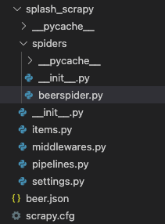
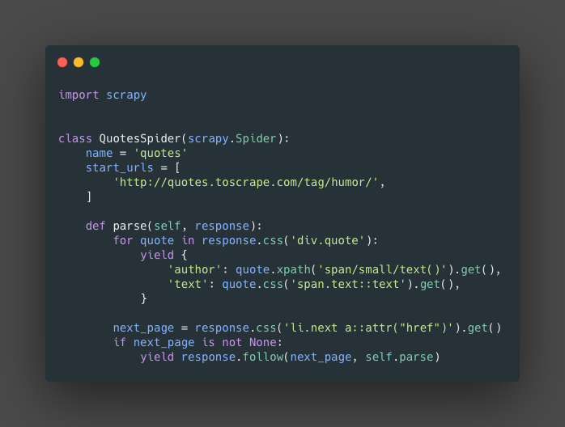
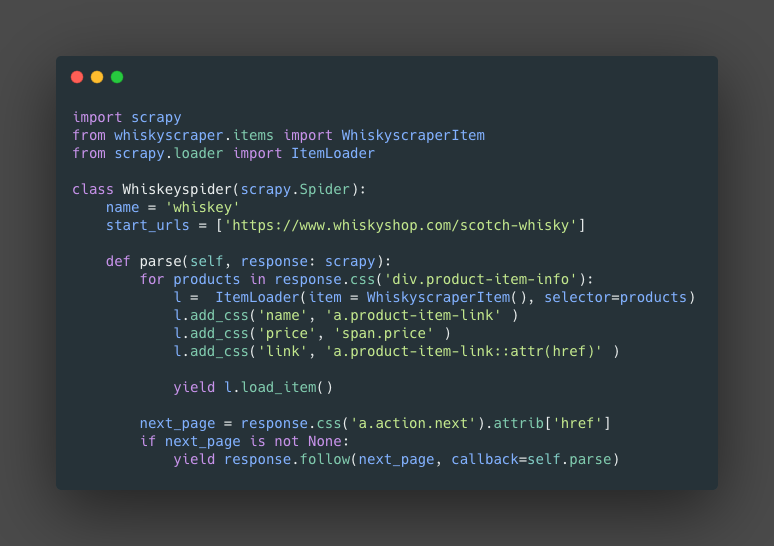
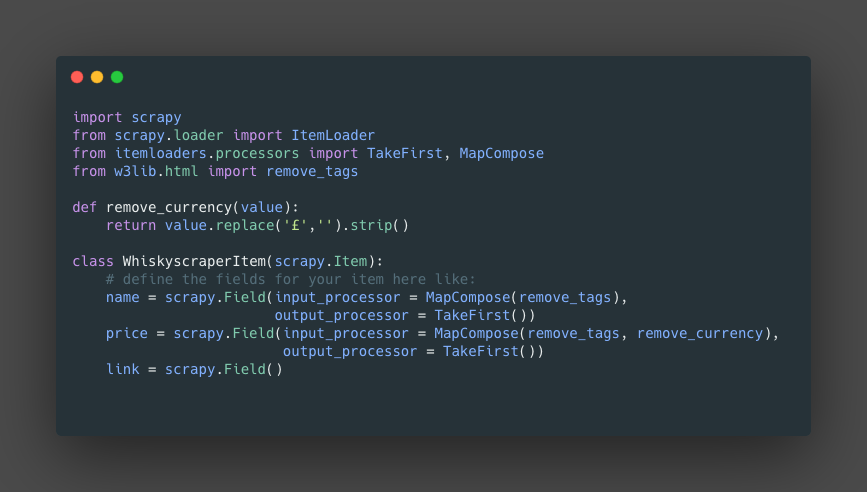

{: .center}

> An open source and collaborative framework for extracting the data you need from websites.
In a fast, simple, yet extensible way.

1. [Official page](https://scrapy.org/)
2. [Pypi page](https://pypi.org/project/Scrapy/)
3. [Documentation](https://docs.scrapy.org/en/latest/)

## Install

We can install it using pi
```
pip install Scrapy
```

## Project structure

{: .center}

From here there are 3 important items

###Spiders

In this folder we will create the specific class that represent the spiders.

{: .center}

1. `name` this is the specific name of the spider.
2. `start_urls` this is the list of starting URLs to be crawl.
3. `parse()` this is the main function that will get the items from the response object that contain the webpages.
4. The next part is to handle the pagination of some pages. First create `next_page` is a variable storing the selector for the button for the next page. the second part is a conditional that will check if there is a next page. the third, Use the function `follow()` this will received the selector `next_page` and a callback function, in this case `parse()`.

### items

This script will hold the `items` and the `itemloaders`.
The items will hold the information that we scrap, after the `Itemloaders` clean them. there will be some changes in the spiders and in the `items.py` files.
Bellow some examples

**project/spider/whiskyspider.py**
{: .center}

1. **Imports**: We need to import, First, the item class for the specific spider `from whiskyscraper.items import WhiskyscraperItem`. Second, we import the scrapy item loader `from scrapy.loader import ItemLoader`.
2. **parse()**: We need to create an instance of the `ItemLoader` this will received two parameters, first the item class, in this case `WhiskyscraperItem()` and a selector. `l =  ItemLoader(item = WhiskyscraperItem(), selector=products)` where products `for products in response.css('div.product-item-info'):`.
3. Finally we `yield` the `l.load_item()` (Basically load the clean information on the item).

**project/items.py**
{: .center}

1. `from scrapy.loader import ItemLoader`: we will import the IteamLoader, this will allow use to access processors and functions to clean the data.
2. `from itemloaders.processors import TakeFirst, MapCompose`: This are two functions that we will use in the `input_processor` and `out_processor`. `MapCompose()` allow me to run several functions on the incoming data.
3. `from w3lib.html import remove_tags`: with `remove_tags()` will help use to remove the html tags from the information.
4. `remove_currency()`: this is an example of a custom function that we will use to clean the information and later will be use in `MapCompose()`.
5. `Field()`: Here we will use the `input_processor` and `output_processor` to clean the information.

## Commands

**Create the project**
```
scrapy startproject [name of the project]
```

**Create the spider**
```
scrapy genspider [name of spider] [starting urls]
```


## Data flow
> This information was extracted fro  the official website and all the rights belong to then. I copy part of the information since it is relevant to understand how scrapy handle the data flow.

{: .center}

1. The Engine gets the initial Requests to crawl from the Spider.
2. The Engine schedules the Requests in the Scheduler and asks for the next Requests to crawl.
3. The Scheduler returns the next Requests to the Engine.
4. The Engine sends the Requests to the Downloader, passing through the Downloader Middlewares (`process_request()`).
5. Once the page finishes downloading the Downloader generates a Response (with that page) and sends it to the Engine, passing through the Downloader Middlewares (`process_response()`).
6. The Engine receives the Response from the Downloader and sends it to the Spider for processing, passing through the Spider Middleware (`process_spider_input()`).
7. The Spider processes the Response and returns scraped items and new Requests (to follow) to the Engine, passing through the Spider Middleware (`process_spider_output()`).
8. The Engine sends processed items to Item Pipelines, then send processed Requests to the Scheduler and asks for possible next Requests to crawl.
9. The process repeats (from step 1) until there are no more requests from the Scheduler.


### Components

#### Scrapy Engine
Responsible to control the data flow  between all components.

#### Scheduler
The scheduler receive the original request from the engine from the engine and enqueue so it can be use later, when the engine want it.

#### Downloader
This component is the responsible to fetch the web pages and feeding them to the engine, who will feed it to the spiders.

#### Spider
This are the custom classes use to parse the response and extract the items form it.

#### Item pipeline
This will take care of cleaning the information that the spider extracted.

#### Downloader Middlewares
> from the original documentation
Downloader middlewares are specific hooks that sit between the Engine and the Downloader and process requests when they pass from the Engine to the Downloader, and responses that pass from Downloader to the Engine.

#### Spider Middlewares
> from the original documentation
Spider middlewares are specific hooks that sit between the Engine and the Spiders and are able to process spider input (responses) and output (items and requests).


## Scrapy Shell

Scrapy provide an interactive Shell that we can use to test or gather information of the website we will scrap.

to start:
```
scrapy shell
```

Here in the shell we can use the  function `fetch()` passing the URL, this will download the page, and we will be able to interact with it using the `response` object and then we can use selectors to scrap the information, example `response.css('a.product')`
