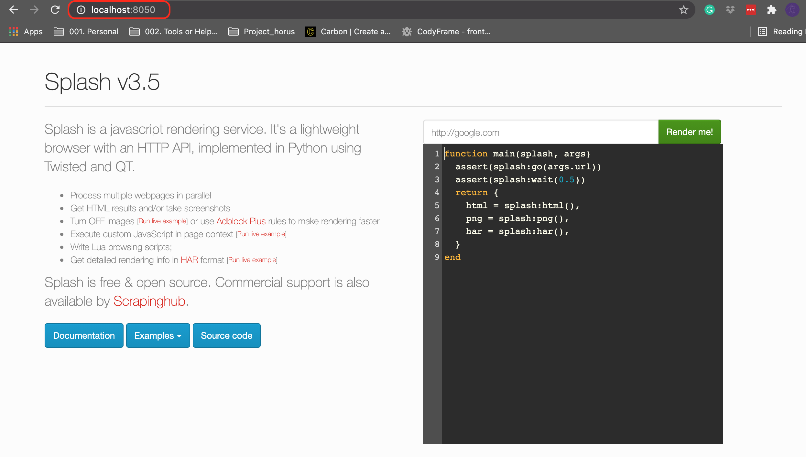
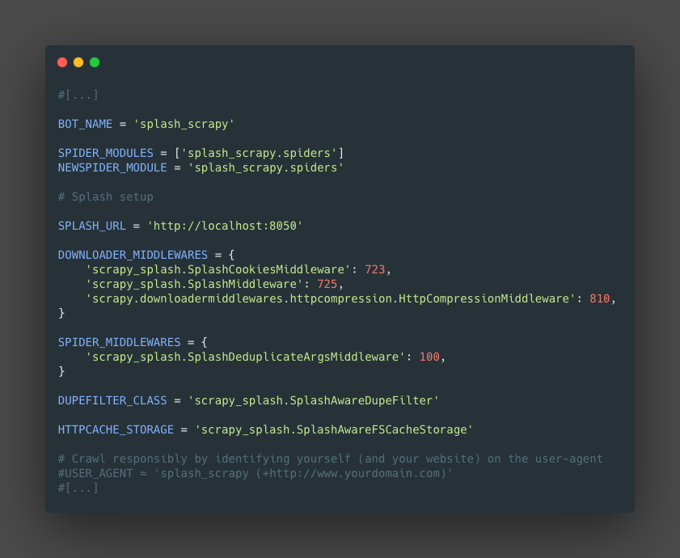

{: .center}

>Splash is a javascript rendering service with an HTTP API. It’s a lightweight browser with an HTTP API, implemented in Python 3 using Twisted and QT5.

1. [Github Splash](https://github.com/scrapinghub/splash)
2. [Github scrapy-splash](https://github.com/scrapy-plugins/scrapy-splash)
3. [Document](https://splash.readthedocs.io/en/stable/index.html)

## Installation 

First we need to install and luch docker in order to use splash, the exact steps can be found in the documentation [here](https://splash.readthedocs.io/en/latest/install.html)

Once the docker is running in the host we can access the server and check if it is working, in this case we can go to "localhost:8050"

{: .center}

```
pip install scrapy-splash
```

## Configuration

We need to make some changes on the project settings **settings.py**

#### 1. Adding the splash server to the project

**settings.py**
```python
SPLASH_URL = 'http://192.168.59.103:8050'
```

#### 2. Add and Enable the splash middleware

**settings.py**
```python
DOWNLOADER_MIDDLEWARES = {
    'scrapy_splash.SplashCookiesMiddleware': 723,
    'scrapy_splash.SplashMiddleware': 725,
    'scrapy.downloadermiddlewares.httpcompression.HttpCompressionMiddleware': 810,
}
```
#### 3. Add and Enable the spider middleware

**settings.py**
```python
SPIDER_MIDDLEWARES = {
    'scrapy_splash.SplashDeduplicateArgsMiddleware': 100,
}
```
#### 4. Set the custome `DUPEFILTER_CLASS`

**settings.py**
```python
DUPEFILTER_CLASS = 'scrapy_splash.SplashAwareDupeFilter'
```

#### 5. Set the `HTTPCACHE_STORAGE`

**settings.py**
```python
HTTPCACHE_STORAGE = 'scrapy_splash.SplashAwareFSCacheStorage'
```

>Steps (4) and (5) are necessary because Scrapy doesn't provide a way to override request fingerprints calculation algorithm globally; this could change in future.

{: .center}

## Example

```python 
import scrapy
from scrapy_splash import SplashRequest

class MySpider(scrapy.Spider):
    start_urls = ["http://example.com", "http://example.com/foo"]

    def start_requests(self):
        for url in self.start_urls:
            yield SplashRequest(url, self.parse, args={'wait': 0.5})

    def parse(self, response):
        # response.body is a result of render.html call; it
        # contains HTML processed by a browser.
        # ...
```


