# Introduction

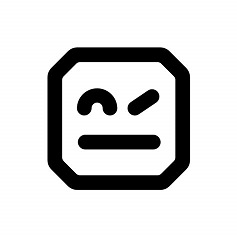{: .center}
[Robot Framework](https://robotframework.org/)

Robot Framework has an easy syntax, utilizing human-readable keywords. Its capabilities can be extended by libraries
implemented with Python, Java, or any other programming language.

1. [Official page](https://robotframework.org/)
2. [Pypi page](https://pypi.org/project/robotframework/)
3. [API Documentation](https://robot-framework.readthedocs.io/en/stable/)
4. [General Documentation](https://robotframework.org/robotframework/#user-guide)
5. [Standard libraries](http://robotframework.org/robotframework/#standard-libraries)

<aside>Installation by pip
   <code>pip install robotframework</code>
</aside>

## What are keywords in RobotFramework?

Robot framework uses the concept of keywords, these are words or sentences that tell the platform to perform specific
actions, for example, `Open browser` is a keyword that tells Robot Framework to open a new browser.

Now if we pair this keyword with a value that must be separated from the keyword by at least 2 spaces,
we are telling the framework to execute the keyword using the parameter passed

```
Open browser     https://www.google.come
```

In this case, we are telling the framework to open a new browser and go to `http://www.google.com`

### But how many keywords?

The framework has some built-in keywords that are already available and can be used without any extra steps, however in
some cases, we will need some special keywords, this can be made or imported by using libraries, for example,
`SeleniumLibrary` allows the user to interact with the web UI, and provide several keywords that facilitate that
interaction.

Now for where to find the keywords, The documentation will be the first palace to go, although some IDE will provide
some autocompletion in most cases search in the documentation will be more accurate.

[Robot Framework](https://robotframework.org/#resources)

The main files in the framework are called test cases, and it is divided into sections.

## Section Description.

The section names will be surrounded by the `***`

The sections are:

- `*** Settings ***` This section can contain documentation about the test suite, Libraries use during the test,
Resources to be used, and the setup and teardown of the test and test suite.
- `*** Variables ***` Any variable to be used in the script
- `*** Test Cases ***` define the documentation for the test and the test steps.
- `*** Keywords **` this is optional, in most cases this will be in a separate file, and they will be imported into the
`*** Settings ***` section.

<aside>
☝🏾 On Pycharm in the file `.robot` we don't need to input the `***` we just need to put the beginning of the word and
the autocomplete function will give us the option to add the section

</aside>

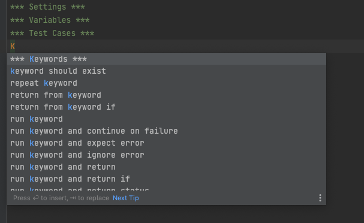

### `*** Settings ***`

The way to add things to this section is by adding the keyword, for example, `Library` follow by **two spaces** and
finally the value in this case `SeleniumLibrary`

Things to add in this section will be:

- Libraries
- Resources

We can see this section as the space to import all the tools need it to work with robot framework, and it is one of the
two that only required sections to create a test case.

### `*** Variable ***`

Here we can store a variable to be used in the test case, it follows similar syntax, there should be two spaces between
the name of the variable and the value.

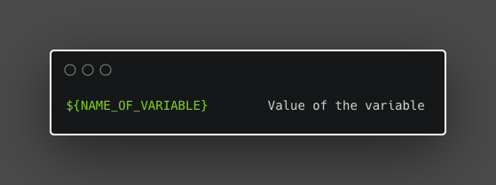

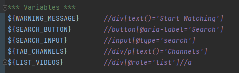

### `*** Keywords ***`

Here we can create subroutines or steps that will be called using a specific keyword, it helps to keep the Test cases
body smaller. Additionally, I can provide the opportunity to abstract complexity.

1. Without indentation, we can set the keyword, a keyword can be a word or a sentence.
2. With Indentation, we define the different steps, here we can use any keyword that we will normally use in the
TestCase.

```
Search for keyword
    Wait Until Element Is Visible  ${SEARCH_INPUT}
    input text  ${SEARCH_INPUT}  monster hunter: world
    press keys  ${SEARCH_INPUT}  ENTER
```

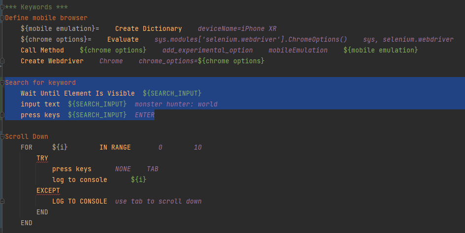

if we have keywords that can be used in several tests or several test suites we can consider creating a resources file
and to keep everything organized those reusable keywords will be stored in the keyword section of the resource file

<aside>
☝🏾 A resource file is another .robot file, these files are normally stored in a folder called *Resources* and they are
used to store keywords that are common in several test cases or suites.
</aside>

### `*** Test Case ***`

Here we provide the details from the test case, this will use keywords to define the steps, these keywords are defined
by de firmware, the different libraries, or resources.

<aside>
🔥 There are built-in libraries, third-party libraries, and customer libraries, the latter meaning that we can build our
own libraries to expand the reach of the Robot framework.

</aside>

1. **The first line non-indented will be the test name**. we can have several tests in a single `.robot` file if
their names are not indented and other subsequent steps are.
2. **The next line must be indented** and will contain the steps for the test case, here we can use the keyword store
in resources or defined on the section `** Keywords ***` of the same file.

```
Twitch test with scrolling
    Define mobile browser
    Go To                           https://twitch.tv
    Wait Until Element Is Visible   ${SEARCH_BUTTON}
    click button                    ${SEARCH_BUTTON}
    Search for keyword
    click element                   ${TAB_CHANNELS}
    Wait Until Element Is Visible   ${LIST_VIDEOS}
    Scroll Down
    Capture page Screenshot
    Try specific channel
    Close lightweight model message
    Check for content warning
    Sleep  5 secs
    Capture page screenshot
    [teardown]  close browser
```

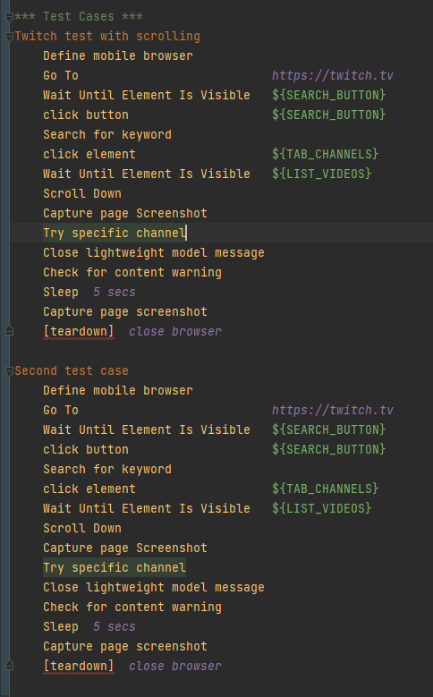

## Structure of the project

RobotFramework is flexible with the structure, but there is a suggested structure, below implementation of that
suggested structure:

- **Libraries:** Here we store any third-party libraries designed or used in the project.
- **Resources:** This directory will contain the resources to be used in the test, this resource can be page objects
describing the screen or target of the test, or extra functions that will help in the execution of the test.
- **Result:** It will contain the results of the test
- **Tests**: This directory is where we will have more flexibility, we can divide the test by the products, but the type
of test (performance test, sanity test, functional test, etc.) or we can divide it in a way specific to the team using
the test

As an alternative, we can have a directory or folder called **TestSuite** that will contain the test suites for the
projects. Test suites have been a group of these cases that are related in a way, for example, test focus on a specific
feature or specific section of the target.

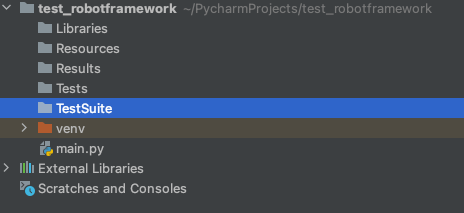

> We can use a structure like `<Tests>/<Website>/<type of test>` to organize the different types of tests.
>

`.robot`

The file with the extension `.robot` is a special file for robot framework this will contain a description of the test,
and it follows a specific structure

## Installation

### Pre-requisites

1. Python
2. Pip

#### Using PIP

1. install Robot framework

```commandline
pip3 install robotframework
```

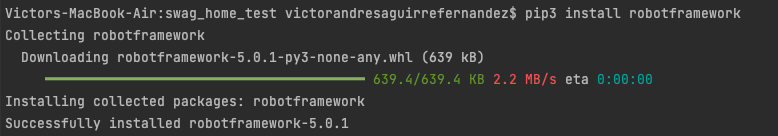

### (Optional) Install  Selenium libraries for WebUI and mobile automation.

```commandline
pip install robotframework-seleniumlibrary
```

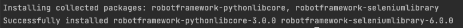

### (optional) Install the intellibot plugin

<aside>
🔥 For this, we need to have Pycharm already installed.

</aside>

We need to go to the marketplace.

One way to go is by clicking in the lower-left corner of the IDE where the version of python is displayed, and selecting
interpreter settings

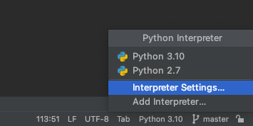

Then we select the plugins section.

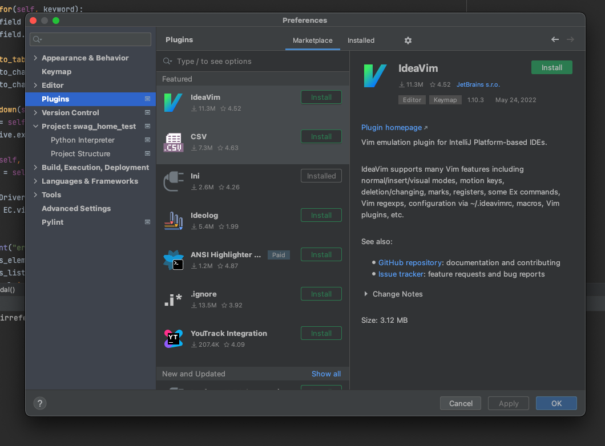

now we can search for `intellibot`

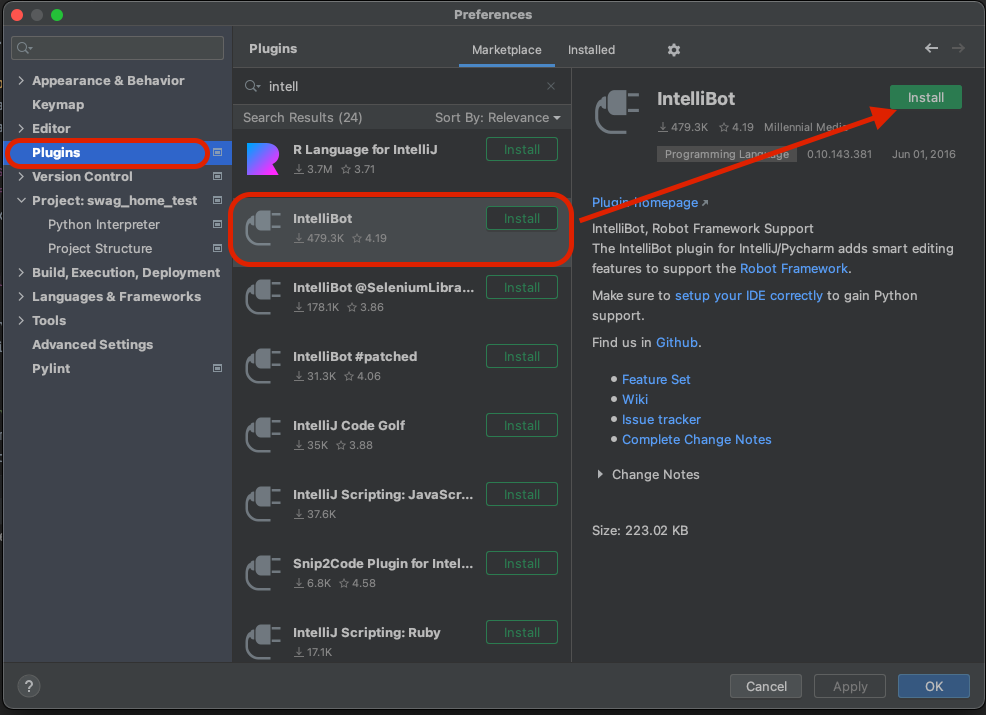

After the installation, we need to restart the IDE

#### Troubleshooting

<aside>
🔥 I had some issues with the syntax highlighting when I launch the IDE, I got some reports of errors.

</aside>

I found the following:

1. My plugin was version IntelliBot 0.***10***.143.381 (Pycharm plugin marketplace)
2. On Intellibot GitHub the latest version is 0.***13***.191.8026

**So, how to solve it**

1. I uninstall the old plugin.
2. Download the release version on Github
[https://github.com/lte2000/intellibot/releases/tag/v0.13.191.8026](https://github.com/lte2000/intellibot/releases/tag/v0.13.191.8026)
3. Install the new version

Now everything is working, no more error notifications and no more problems with the syntax highlight.

## How to write a Test

### An Example

As an example we have a basic test case:

<aside>
☝🏾 Open a specific URL and later proceed to close it

</aside>

so we can say the steps for the test case will be:

1. Open the URL on the browser
2. Close the browser

now what we need:

- We are talking about web UI and navigation, so we need a library for that, in this case, we will use the
`SeleniumLibrary`
- We will need 2 steps, one to open the browser and the other to close it.
- (Optional) we can store the URL of the website in a variable.

### The implementation

1. Create the `.robot` file with the following sessions
    1. Settings
    2. Variables
    3. Test Case

```
*** Settings ***

*** Variables ***

*** Test Cases ***

```

1. Import the libraries and create the variable

```
*** Settings ***
Library SeleniumLibrary

*** Variables ***
${URL}        https://www.google.com

*** Test Cases ***

```

1. Name the test case

```
*** Settings ***
Library SeleniumLibrary

*** Variables ***
${URL}        https://www.google.com

*** Test Cases ***
Open a new website
```

1. Now bellow the test case name and indented create the test case steps.

```
*** Settings ***
Library SeleniumLibrary

*** Variables ***
${URL}        https://www.google.com

*** Test Cases ***
Open a new website
	Open browser    ${URL}
	[Teardown]      close browser
```

### How to run it

RobotFramework provides a very useful command to run the test cases, in the most basic of the version we have

```commandline
robot PATH_TO_TEST_SUITE
```

This will run all the `.robot` files in that folder and output the results at the root of the folder. it can be fast but
can get messy.

**Set a result folder**

The best way to organize the results is to send them to a specific folder and the robot framework allows us to do just
that.

1. Create a new folder, you can set any name, for this case `Results`
2. We add the flag `-d` to the command followed by the location of the folder.

```commandline
robot -d LOCATION_OF_RESULT_FOLDER PATH_TO_TEST_SUITE
```

and example:

```commandline
robot -d results Tests/twitch/FunctionalTestSuite
```

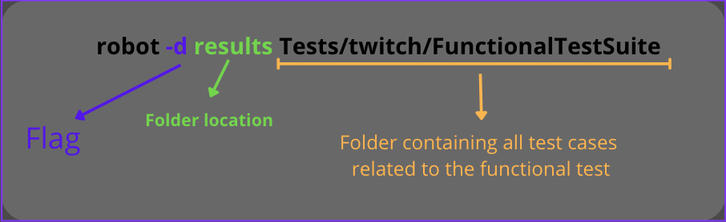

**How to run just one test case**

To run one single `.robot` file we just need to provide the direction to that file.

```commandline
robot -d results Tests/twitch/FunctionalTestSuite/VideoSearch_Android.robot
```

With this command, just the test case `VideoSearch_Android.robot` will be executed.

## Tips

### Good case practice: Folder and Files need it for the project.

This is an extra section, although the robot framework does not enforce a specific folder structure there is several
good case practice that can be fallow to achieve what is called a reusable and easy-to-maintain acceptance test.

> “The need to change test comes from two directions: Change in requirements and change in the system’s implementations.
> […] We must change the test to adapt to the new requirements or the new implementation.“ *Writing Maintainable
> Automated Acceptance Test* **by** Dale H.Emery
>

From the article **how to Structure a Scalable and Maintainable Acceptance Test Suite** by Andreas Ebbert-Karroum we can
say that each component system can be loosely divided into **Stable parts** and **Variable parts.**

- **Stable parts:** are those that do not change during the testing process, some examples can be the test framework
(this case Robotframework) some libraries ( selenium for the web testing), and the test cases, the latter can be
confusing but if we think test cases as the step to follow to achieve goals, they do not change really often, what it
changes is the implementation of how we do those steps.
- **Variable parts:** These are where we need to focus our energy, these are the parts that can break due to changes in
the application, however, if we create a robust adaptable structure we can minimize the risk of breaking or costly
maintenance


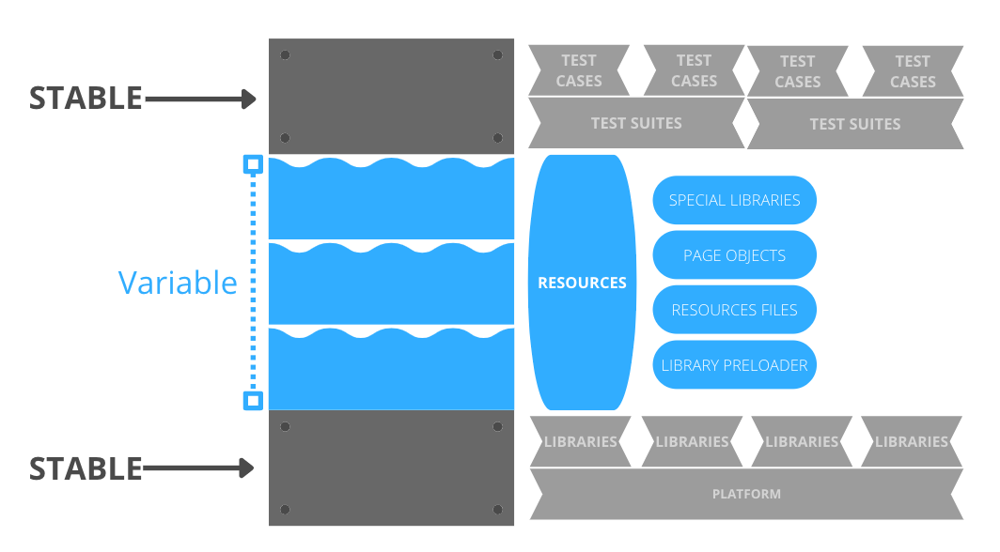

#### Stable parts

1. **Platform:** During the run of a project we don't spect to change the platform to use, so we can assume this is
part of the stable elements.
2. **Libraries:** These are normally a defined set, and they don't change often, some are updated or replaced for an
answer and a better library but this doesn't happen in short periods of time there for we can say they are stable.
Now how we load it to the test case is where we can implement a variable approach using a pre-loader.
3. **Test Suite: T**hey are defined during the ideation of the project or early on in the development and are basically
a container for test cases that test the same domain or the same function of the project. Although they change they
don't do it fast, so we can be sure that at least for several iterations of the cycle of development they remain constant.
4. **Test Cases:** if we see them as the steps to achieve a goal, the goal to test in behavior happens as we expected or
a fail state happens when the conditions are correct. We can say that these steps do not change instead is the
implementation of the steps that will change. keywords can remain the same the logic within them is the one that will
change.

#### Variable parts

1. **Resources:** These will be the files that contain the implementation of the keywords to be used in the test cases,
as we mentioned previously, the need for a change in the test cases will be due to a change of logic or implementation
on the project, so here is where the changes might need to be reflected, example a location for a bottom change here is
where we load an updated variable that contains the new locator, so the test case step of clicking or interacting with
that object didn't change just the implementation.
2. **Page Objects:** let's say we have a file that contains all the locators and all of them are mapped to words that
can be more readable `${WARNING_MESSAGE} *//div[text()='Start Watching']` the locators might change, so we can update
this page object and the variables and none of the test case step will be affected.*
3. **Special libraries**: these are libraries created just for the project and in some cases, they might need to be
refactored or changed due to changes in the project, these changes will be reflected in the code of the special library
but not in the keywords used in the test case.
4. **Library Pre-loaders:** these can vary on implementation but the idea behind is to avoid loading the library twice
if that does not need it.

### How to write a click keyword that doesn't fail

How to ensure that a click or an actual will succeed

1. Use the keyword `wait until keyword succeeds`
2. `${keyword}` is the keyword we are going to wait for
3. `${keywords_arg}` is the arguments for that action

```
Wait until the action success
    [Arguments]    ${keyword}       ${keyword_arg}
    wait until keyword succeeds    10s      1s      ${keyword}      ${keyword_arg}
```

## Errors

I ran into issues running this framework

1. Error with the geckodriver, I got a  message which said  geckodriver is not installed, I try to add to the PATH, but
it didn't work so what I did is to put the binaries to the python script folder

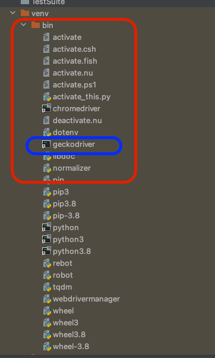

1. SessionNotCreatedException: Message: Expected browser binary location, but unable to find binary in the default
location, no 'moz:firefoxOptions.binary' for this error I just need to install firefox
