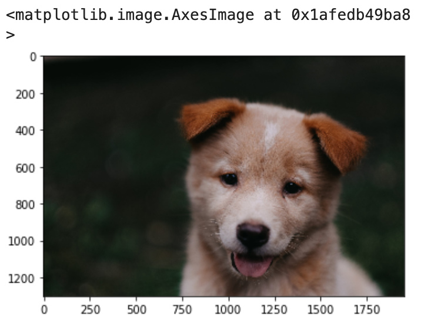
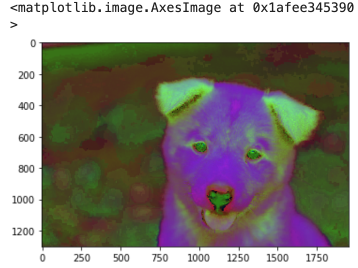
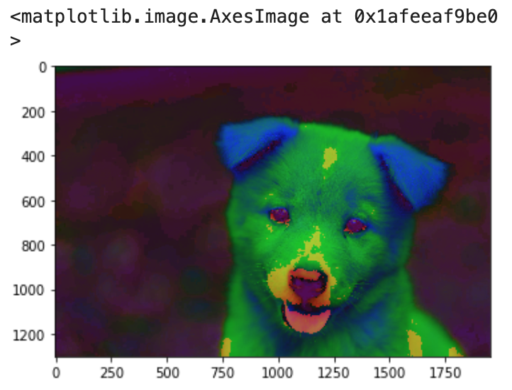

With OpenCV we can use different colorspaces other than RGB, this is the case of HSL and HSV, that stand for Hue-saturation-lightness and hue-saturation-value.

Here how HSL will look like


and here how HSV will look like


Now in in openCV we can transform or convert the different pictures to a different colorspace.

## Import Libraries

First the imports

```python
import cv2
import matplotlib.pyplot as plt
import numpy as np
%matplotlib inline # this line is  just for jypiter lab or notebooks
```

now with the imports we read or get the image we are going to use to work with

```python
img = cv2.imread('../DATA/00-puppy.jpg')
```

## Converting to Different Colorspaces

now, we did this before, we convert from BGR to RGB

```python
img = cv2.ctvColor(img, cv2.COLOR_BGR2RGB)
plt.imshow(img)
```


### Convert to HSV

now, first HSV

```python
img = cv2.cvtColor(img, cv2.COLOR_BGR2HSV)
plt.imshow(img)
```



### Convert to HSL
the next one will be HSL

```python
img = cv2.imread('../DATA/00-puppy.jpg')
img = cv2.cvtColor(img, cv2.COLOR_BGR2HLS)
plt.imshow(img)
```


