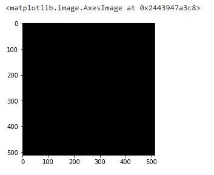
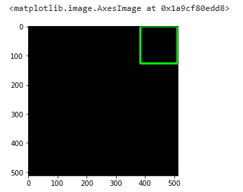
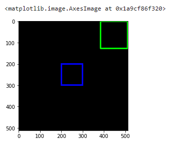
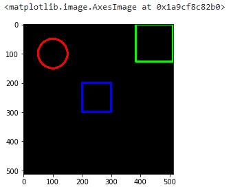
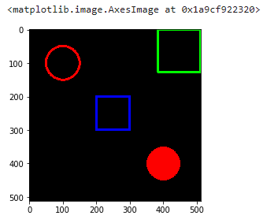
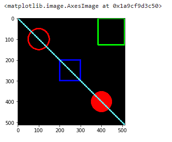
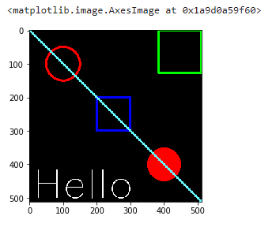
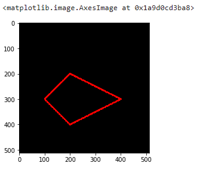

We can draw different things on the images, we can draw basic forms such as circle and rectangles, etc, we can put text and more complex figures all using `cv2`

First we will need the imports

```python
import numpy as np
import matplotlib.pyplot as plt
# this parts is jut for jupyter lab
%matplotlib inline
import cv2
```

## Create the 'Canvas' for drawing

We can draw in any images, but in this case we will use a black canvas so it will be easy

```python
black_img = np.zeros(shape=(512,512,3),dtype=np.int16)
black_img.shape
# (512,512,3)
plt.imshow(black_img)
```




we are using the Numpy function to create an array of zeros, and since the shape is 512x512x3 this means that is an image of 512x512 with 3 channels of color, and all this colors are $0$, so if we display it will be a black image of 512x512.

## Shapes

### Rectangles

the `rectangle` function will have some parameters:

* img: the image where we are going to draw
* pt1: the vertex of the rectangle, basically the top left corner
* pt2: the vertex opposite to pt1, means the lower right corner
* Color of rectangle: the color or brightness(in case of grayscale img) RGB format
* thickness: the thickness of the lines that make up the rectangle ( if you want to fill all the rectangle or figure you can use `-1` as value)
* the are two parameters more, the linetype, and shift that we are not going to address here.

```python
#pt1 top left , pt2 lower right corner
cv2.rectangle(img=black_img,pt1=(384,0),pt2=(510,128),color=(0,255,0),thickness=5)
```

if we check the previous statement we will have a Numpy array, but if we use `imshow` we will have the image with the rectangle in the points we set up

```python
cv2.imshow(black_img)
```



now one in the center of the canvas

```python
cv2.rectangle(black_img,pt1=(200,200),pt2=(300,300),color=(0,0,255),thickness=5)
plt.imshow(black_img)
```



### Circle

For the circle the parameter change from vertex to center point and radius, so to draw a circle

```python
cv2.circle(img=black_img, center=(100,100), radius=50, color=(255,0,0), thickness=5)
plt.imshow(black_img)
```



now let's change the value of thickness to $-1$ so we filled in the circle

```python
cv2.circle(img=black_img,center=(400,400), radius=50,color=(255,0,0), thickness=-1)
```



### Lines

We can create lines in a similar way we create the rectangle, in this case pt1 and pt2 are starting and ending point instead of vertex.

```python
cv2.line(black_img,pt1=(0,0),pt2=(511,511),color=(102,255,255), thickness=5)
plt.imshow(black_img)
```



## Text

now for the text we need first to select the font we are going to use, in this case we are limited for the fonts already in `cv2` we have other arguments:

* text:  the text we want to display
* org:  the origin point, where the text will start
* fontFace: the font we are going to use
* fontScale: the size of the font
* linetype, for now we are going to use `cv2.LINE_AA`

```python
font = cv2.FONT_HERSHEY_SIMPLEX
cv2.putText(balck_img,text='Hello',org=(10,500), fontFace=font, fontScale=4,color=(255,255,255),thickness=2,lineType=cv2.LINE_AA)
plt.imshow(black_img)
```



## Polygons
For the polygons we will have some changes, first we will need to create an array with the vertex and later reshape this array to ROWSx1X2 and this should be a `int32` array.

the new parameter will be `isClosed` that we need to set as `True` to close the figure

```python
black_img = np.zeros(shape=(512,512,3),dtype=np.int32)
vertices = np.array([[100,300],[200,200],[400,300],[200,400]],np.int32)
pts = vertices.reshape((-1,1,2))
cv2.polylines(black_img,[pts],isClosed=True,color=(255,0,0), thickness=5)
plt.imshow(black_img)
```


