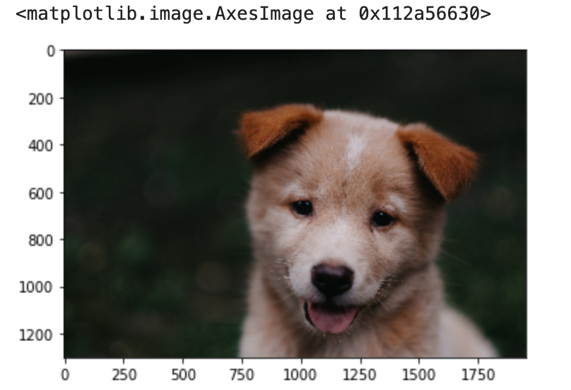
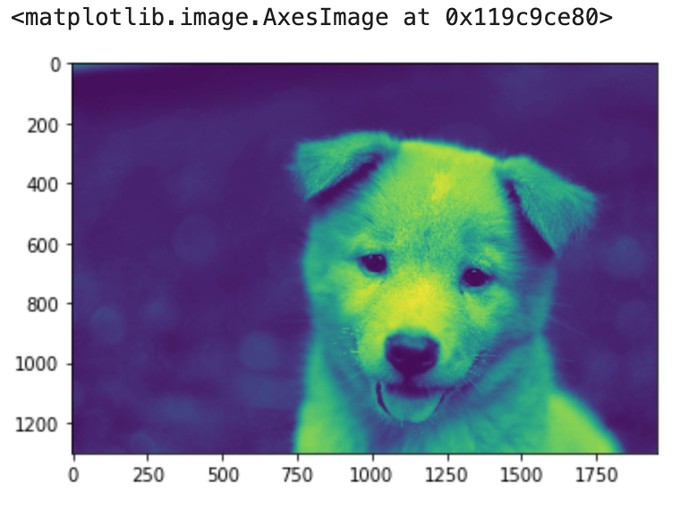
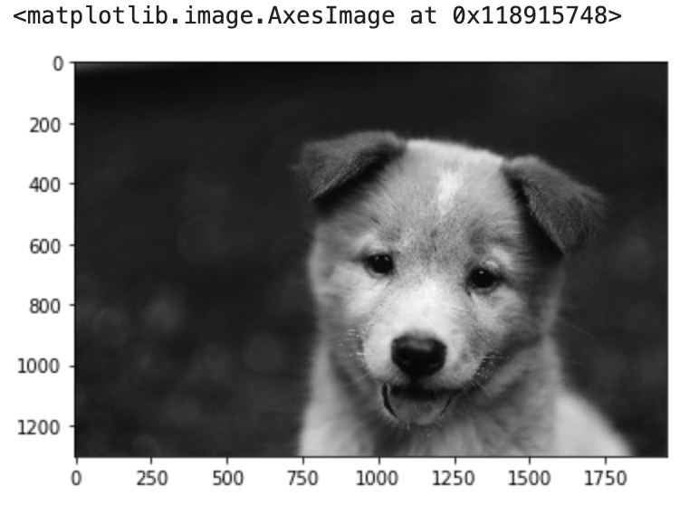
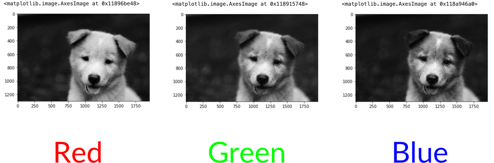

> in this case i will use Jupyter lab for the code, so the code in this document will have some parts specific for Jupyter lab, additionally the course gave me some images that i will use, so i will refer to those images too.

First we need to remember that python alone is not able to handle the images, it needs a library to do so, in this case we are going to use [`PLI` or `pillow`](https://pillow.readthedocs.io/en/stable/installation.html)

## Get the image with Python

so in this case we are going to use the function `open()` to get the image, in the next step we will transfor the image in a Numpy array

```python
import numpy as np
import mathplotlib.pyplot as plt
%matplotlib inline #--> this line is just for Jupyter Lab, in order to disply images
```
We imported the mathplotlib in order to display the image in the Jypyter lab, now we are going to import `Image` from `PIL`

```python
from PIL import Image
```
 next, we need to load the image

```python
import numpy as np
import mathplotlib.pyplot as plt
%matplotlib inline #--> this line is just for Jupyter Lab, in order to display images
from PIL import Image

pic = Image.open('path-to/the-image.jpg')

```
## Transform the image to a Numpy array

At this point the image is load but it

```python
pic = Image.open('Computer-Vision-with-Python/DATA/00-puppy.jpg')
type(pic)
# PIL.JpegImagePlugin.JpegImageFile
```

in this case we have a Jpeg Image file, now we need to transform it to Numpy array

```python
pic_arr = np.asarray(pic)
type(pic_arr)
# numpy.ndarray
```

with the function called `asarray` we transform this image field to a Numpy array.

##  Display the image with `imshow`

```python
pic_arr.shape
(1300, 1950, 3)
```
 in this case we have an array with 1300x1950 with 3 channels, this means, that the image is a color image, so, now lest display this array as an image

```python
 plt.imshow(pic_arr)
```
you will get 



`plt.imshow(image_numpy_array)` the *plt.imshow* is a special function from  *matplotlib* use to display images that are in a Numpy array format.

### Color mapping one channel to grayscale

We know that the image is a color image, that means, it has 3 channels, and we confirm this when we ask for its shape (pic_arr.shape) which result was (1300, 1950, 3), so first we are going to make a copy and later slice the one of the channels

```python
pic_red = pic_arr.copy()
pic_red = pic_red[:,:,0]
plt.imshow(pic_red)
```
the result will be 



```python
pic_red.shape
# (1300, 1950)
```

how it looks is due to how , matplotlib handle the colors, in this case is displaying the image in a format that will be special for people with an specific color blindness.

We can display the image in gray scale, but the question will be, Gray?, we are going to map the color red to a gray-scale

```python
plt.imshow(pic_red, cmap='gray')
``` 


we can see the difference when we get the other colors, green and blue

**Blue**
```python
pic_green = pic_arr.copy()
pic_green = pic_green[:,:,1]
plt.imshow(pic_green, cmap = 'gray')
```

**Green**

```python
pic_blue = pic_arr.copy()
pic_blue = pic_blue[:,:,2]
plt.imshow(pic_blue, cmap = 'gray')
```


now comparing the 3 images



Then we can say that in each channel, the closest is the pixel to the color of the channel, closest to 255, and closest to white, for example, in the image of the red channel, the parts of the picture that are more white means that they contain more red, and those that are black means that contain no red. This is mapping the color to a gray scale, but we are not removing the contribution of the colors.

### Removing contribution of the channels 

In this part we are going to remove the contribution of the channels Blue and Green so we can have an image with the tree channels but with 0 contribution in two of those channels.

```python
pic_red_real= pic_arr.copy()
pic_red_real[:,:,1] = 0
pic_red_real[:,:,2] = 0
plt.imshow(pic_red_real)
```


and if we check the shape

```python
pic_red_real.shape
# (1300, 1950, 3)
```


