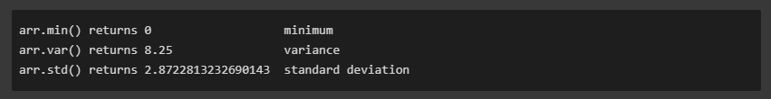

This notes  are notes for the Numpy crash course.

Numpy is a linear library for Python, it is an essential building block for other PyData ecosystem ( Pandas, scipy, scikit-lean, etc)

## Using NumPy

Normally numpy is import as `np`

```python
import numpy as np
```

## NumPy Arrays

NumPy came in vector and matrices, Vectors are 1 dimension, matrix are 2D dimensions.

### Create NumPy Arrays

we can create an array from a python list

```python
my_list = [1,2,3]
np.array(my_list)
# array([1, 2, 3])
```

and can be a list of list as well

```python
my_matrix = [[1,2,3],[4,5,6],[7,8,9]]
np.array(my_matrix)
#array([[1, 2, 3],
#       [4, 5, 6],
#       [7, 8, 9]])
```

## Build-in Methods

### `arange`

Return evenly spaced value within a given interval

```python
np.arange(0,10)
# array([0,1,2,3,4,5,6,7,8,9])
np.arange(0,11,2)
# array([0, 2, 4, 6, 8, 10])
```

### `zeros` and `ones`

Generate vectors or matrix of zeros or ones

```python
np.zero(3)
# array([0. , 0. , 0.])

np.zero((5,5))
# array([[0., 0., 0., 0., 0.],
#        [0., 0., 0., 0., 0.],
#        [0., 0., 0., 0., 0.],
#        [0., 0., 0., 0., 0.],
#        [0., 0., 0., 0., 0.]])

np.ones(3)
# array([1., 1., 1.])

np.ones((3,3))
# array([[1., 1., 1.],
#       [1., 1., 1.],
#       [1., 1., 1.]])

```
### `linspace`

Return evenly spaced numbers over a specific interval

```python
np.linspace(0,10,3)
# array([0., 5., 10.])

np.linspace(0,5,20)
# array([0.        , 0.26315789, 0.52631579, 0.78947368, 1.05263158,
#       1.31578947, 1.57894737, 1.84210526, 2.10526316, 2.36842105,
#       2.63157895, 2.89473684, 3.15789474, 3.42105263, 3.68421053,
#       3.94736842, 4.21052632, 4.47368421, 4.73684211, 5.        ])

#Note that .linspace() includes the stop value. To obtain an array of common fractions, increase the number of items:

np.linspace(0,5,21)
# array([0.  , 0.25, 0.5 , 0.75, 1.  , 1.25, 1.5 , 1.75, 2.  , 2.25, 2.5 ,
#       2.75, 3.  , 3.25, 3.5 , 3.75, 4.  , 4.25, 4.5 , 4.75, 5.  ])

```

### `eye` identity matrix

Create a identity matrix

```python
np.eye(4)
# array([[1., 0., 0., 0.],
#       [0., 1., 0., 0.],
#       [0., 0., 1., 0.],
#       [0., 0., 0., 1.]])
```

## Random

Here some of the ways we can create random numbers

### `rand`

Creates an array of the given shape with random uniform distribution over `[0,1)`

```python
np.random.rand(2)
# array([0.37065108, 0.89813878])
np.random.rand(5,5)
# array([[0.03932992, 0.80719137, 0.50145497, 0.68816102, 0.1216304 ],
#       [0.44966851, 0.92572848, 0.70802042, 0.10461719, 0.53768331],
#       [0.12201904, 0.5940684 , 0.89979774, 0.3424078 , 0.77421593],
#       [0.53191409, 0.0112285 , 0.3989947 , 0.8946967 , 0.2497392 ],
#       [0.5814085 , 0.37563686, 0.15266028, 0.42948309, 0.26434141]])

```

### `randint`

This generate a integer from low (inclusive) to high (exclusive)

```python
np.random.randint(1,100)
#61
np.random.randint(1,100,10)
# array([39, 50, 72, 18,27, 59, 15, 97, 11, 14])
```

### `seed`

It is use to create a random state that can be reproducible, i means, the result will be the same everything we use the same seed

```python
np.random.seed(42)
np.random.rand(4)
# array([0.37454012, 0.95071431, 0.73199394, 0.59865848])

np.random.seed(42)
np.random.rand(4)
# array([0.37454012, 0.95071431, 0.73199394, 0.59865848])
```

## Array Attributes and Methods

To explain the attributes and methods we need to create a vector and matrix

```python
arr = np.arange(25)
# array([ 0,  1,  2,  3,  4,  5,  6,  7,  8,  9, 10, 11, 12, 13, 14, 15, 16,
#       17, 18, 19, 20, 21, 22, 23, 24])
ranarr = np.random.randint(0,50,10)
# array([38, 18, 22, 10, 10, 23, 35, 39, 23,  2])
```

### Reshape - `reshape`

Return the same data of the vector or matrix but in a different shape

```python
arr.reshape(5,5)
# array([[ 0,  1,  2,  3,  4],
#       [ 5,  6,  7,  8,  9],
#       [10, 11, 12, 13, 14],
#       [15, 16, 17, 18, 19],
#       [20, 21, 22, 23, 24]])
```
### max, min, argmax, argmin - `max`,`min`,`argmax`,`argmin`

Let start with `ranarr`
```python
ranarr = np.random.randint(0,50,10)
# array([38, 18, 22, 10, 10, 23, 35, 39, 23,  2])
```

the maximum number in the array
```python
ranarr.max()
# 39
```
the index of this maximum number
```python
ranarr.argmax()
# 7
```
now for the minimum
```python
ranarr.min()
# 2
ranarr.argmin()
# 9
```

### Shape - `shape`

shape is an attribute and not a method

```python
# Vector
arr.shape
#(25,)

# Notice the two sets of brackets
arr.reshape(1,25)
# array([[ 0,  1,  2,  3,  4,  5,  6,  7,  8,  9, 10, 11, 12, 13, 14, 15,
#        16, 17, 18, 19, 20, 21, 22, 23, 24]])

arr.reshape(1,25).shape
# (1, 25)

arr.reshape(25,1)
#array([[ 0],
#       [ 1],
#       [ 2],
#       [ 3],
#       [ 4],
#       [ 5],
#       [ 6],
#       [ 7],
#       [ 8],
#       [ 9],
#       [10],
#       [11],
#       [12],
#       [13],
#       [14],
#       [15],
#       [16],
#       [17],
#       [18],
#       [19],
#       [20],
#       [21],
#       [22],
#       [23],
#       [24]])

arr.reshape(25,1).shape
# (25, 1)
```

## 	`dtype`

In order to know the data type of the object

```python
arr.dtype
# dtype('int32')

arr2 = np.array([1.2, 3.4, 5.6])
arr2.dtype

#dtype('float64')
```

## Numpy Indexing and Selection
To select an item in the array we can use a syntax similar to the one use to pick up elements of a list, in the following example we will:

####1. Create an array
```python
import numpy as np#create an array
arr = np.arange(0,11)
```

####2. Select a single element
```python
arr[7]
#7
```

####3. Select a range of elements
```python
arr[0:5]
#array([0,1,2,3,4])\
```

### Broadcasting

The differences between Python list and Numpy arrays can be simplify as; python list you can **only reassign values** to part of the list with the same size and shape, if you want to replace X number of elements you will need to pass in a new x element list, this is explain better with an example.

In the example:
1. Create an array.
2. Slice part of the array.
3. We will change the sliced array.
4. Display the original array.

Notice the elements of the array, that belong to the sliced array, were change. This is because the data is not copied in order to avoid memory problems.


```python
import numpy as np
#create an array
arr= np.arange(0,10)
#slice the array
sliced_arr = arr[0:6]
#change the values in the slice
sliced_arr[:] = 100
# print the original array to show the changes
print(arr)
#array([100, 100, 100, 100, 100, 100,   6,   7,   8,   9])
```

> If you want to make a copy of the array you can use `copy()` like `new_arr = arr.copy()`

### Indexing 2d arrays (matrices)

The syntax will be **arr_2d[row][col]** or **arr_2d[row,col]**, the latter the most common used.

####1. Create the matrix
```python
import numpy as np
arr_2d = np.arange([5,10,15],[20,25,30],[35,40,45])
```
####2. Select base in index
a row
```python
arr_2d[1]
#array([20,25,30])
```
a value
```python
arr_2d[1][0]
#20
```
####3. select a matrix inside the matrix
```python
arr_2d[:2,1:] # top right corner
# array([25,30],
#		[40,45])

```

### Conditional selection

We can select elements of the arrays base in a condition, let say we want to know what elements are bigger than 4.

```python
import numpy as np
arr = np.arange(0,10)
print(arr>4)
#array([False, False, False, False,  True,  True,  True,  True,  True,
#        True])
```
we can save this array of boolean values and use it to slice or select elements of the original array base in this condition

```python
bool_arr = arr>4
arr[bool_arr]
# array([ 5,  6,  7,  8,  9, 10])
arr[arr>4]
# array([ 5,  6,  7,  8,  9, 10])
```

## Operations

### Arithmetic

Numpy allows operation including matrix with matrix and scalar with matrix.


####1. Addition, multiplication , subtraction and division

```python
import numpy as np

arr = np.arange(0,10)
arr
#array([0, 1, 2, 3, 4, 5, 6, 7, 8, 9])

#addition
arr + arr
#array([ 0,  2,  4,  6,  8, 10, 12, 14, 16, 18])

# Multiplication
arr * arr
#array([ 0,  1,  4,  9, 16, 25, 36, 49, 64, 81])

#Subtraction
arr - arr
#array([0, 0, 0, 0, 0, 0, 0, 0, 0, 0])

#Division
arr/arr
#array([nan,  1.,  1.,  1.,  1.,  1.,  1.,  1.,  1.,  1.])
```

numpy will notify us when the division is not possible or the division by 0

```python
1/arr
#array([       inf, 1.        , 0.5       , 0.33333333, 0.25      ,
#       0.2       , 0.16666667, 0.14285714, 0.125     , 0.11111111])
```

and we have the exponential as well

```python
arr**3
#array([  0,   1,   8,  27,  64, 125, 216, 343, 512, 729])
```

### Universal Array function

With Numpy we can perform different function to the matrices, square root, logarithmic and geometric functions.

```python
 np.sqrt(arr)
 #array([0.        , 1.        , 1.41421356, 1.73205081, 2.        ,
 #      2.23606798, 2.44948974, 2.64575131, 2.82842712, 3.        ])

# Exponential (e^)
np.exp(arr)
#array([1.00000000e+00, 2.71828183e+00, 7.38905610e+00, 2.00855369e+01,
#       5.45981500e+01, 1.48413159e+02, 4.03428793e+02, 1.09663316e+03,
#       2.98095799e+03, 8.10308393e+03])

#Trigonometric
np.sin(arr)
#array([ 0.        ,  0.84147098,  0.90929743,  0.14112001, -0.7568025 ,
#       -0.95892427, -0.2794155 ,  0.6569866 ,  0.98935825,  0.41211849])

#Natural Logarithm
np.log(arr)
#array([      -inf, 0.        , 0.69314718, 1.09861229, 1.38629436,
#       1.60943791, 1.79175947, 1.94591015, 2.07944154, 2.19722458])
```

### Statistics

as an example of the statistic function that can be perform in numpy we have sum, mean and max

```python
arr = np.arange(0,10)

arr.sum()
#45

arr.mean()
#4.5

arr.max()
#9
```

and other examples of statistic functions



### Axis Logic

Wen we work with 2D arrays (Matrix) the array term , axis 0 is the vertical axis ( rows ), and axis 1 is the horizontal ( columns )

so let do sum on the 0 axis, basically sum all the elements vertically, it make sense after the code.

```python
arr_2d = np.array([[1,2,3,4],[5,6,7,8],[9,10,11,12]])
arr_2d
#array([[ 1,  2,  3,  4],
#       [ 5,  6,  7,  8],
#       [ 9, 10, 11, 12]])

arr_2d.sum(axis=0)
#array([15, 18, 21, 24])
#[(1+5+9), (2+6+10), (3+7+11), (4+8+12)]

arr_2d.sum(axis=1)
#array([10, 26, 42])
```
