#pyTelegramBot

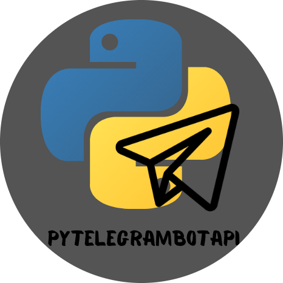{:.center}

1. [Pypi page](https://pypi.org/project/pyTelegramBotAPI/)
2. [GitHub Repository](https://github.com/eternnoir/pyTelegramBotAPI)
3. [Official Documentation](https://pytba.readthedocs.io/en/latest/index.html)

##Installation

```python
pip install pyTelegramBotAPI
```

# Synchronous and Asynchronous Bot.

The API provide two type of bots a synchronous and Asynchronous both with small difference
on the implementation

### Synchronous bot example

```python
import telebot

API_TOKEN = '<api_token>'

bot = telebot.TeleBot(API_TOKEN)


# Handle '/start' and '/help'
@bot.message_handler(commands=['help', 'start'])
def send_welcome(message):
    bot.reply_to(message, """\
Hi there, I am EchoBot.
I am here to echo your kind words back to you. Just say anything nice and I'll say the exact same thing to you!\
""")


# Handle all other messages with content_type 'text' (content_types defaults to ['text'])
@bot.message_handler(func=lambda message: True)
def echo_message(message):
    bot.reply_to(message, message.text)


bot.infinity_polling()
```

### Asynchronous bot example

```python
from telebot.async_telebot import AsyncTeleBot
bot = AsyncTeleBot('TOKEN')

# Handle '/start' and '/help'
@bot.message_handler(commands=['help', 'start'])
async def send_welcome(message):
    await bot.reply_to(message, """\
Hi there, I am EchoBot.
I am here to echo your kind words back to you. Just say anything nice and I'll say the exact same thing to you!\
""")

# Handle all other messages with content_type 'text' (content_types defaults to ['text'])
@bot.message_handler(func=lambda message: True)
async def echo_message(message):
    await bot.reply_to(message, message.text)


import asyncio
asyncio.run(bot.polling())
```

<aside>
Notice that they call different classes synchronous calls telebot.Telebot meanwhile Asynchronous
calls telebot.async_telebot.AsyncTelebot.
They also use different polling methods `bot.infinity_polling()` versus `bot.polling()`
</aside>

##The steps to create the bot will be:

1. Search for BotFather 👴🏽.
2. BotFather will provide some instructions. From those instructions, I need to use /newbot.
3. I give a name to the bot `no_my_first`.
4. I give a username to the bot with the postfix bot, `no_my_first_bot`.
5. After assigning the username BotFather will provide the Bot API key.

{:.center}

The response of the Bot father will be something like this:

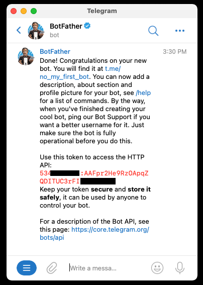{:.center}

## Up, running, and listening.
The package pyTelegramBotAPI encapsulates the telegram API,
with this package I can send messages and documents and several ways to parse or listen to incoming messages.

1. Create an instance of the TeleBot() using the API key.
2. Define Message handler.
3. Keep the bot running.

## Create an instance of the TeleBot() using the API key.
First, I need to install the module.
```python
pip install pyTelegramBotAPI
```
Second, I need to create an instance of the TeleBot class.

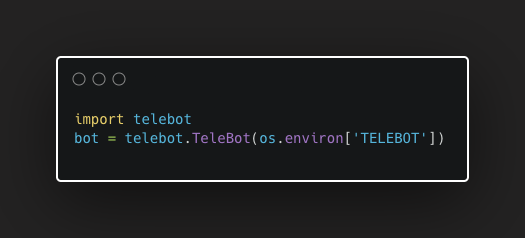{:.center}


## Define Message handler.
To create a message handler, I will use the decorator `@bot.message_handler()`.
The function decorated with this handler can have any name.

The only requirement is a single parameter, the message itself.

<aside>
All handlers are tested in the order in which they are declared — PyTelegramBotAPI Documentation
</aside>

### Handler with commands

This handler will handle or react to messages that include a command. Commands are words prefixed with / the list of commands handled by a handler is defined in the decorator as a list after the parameter commands this without /.

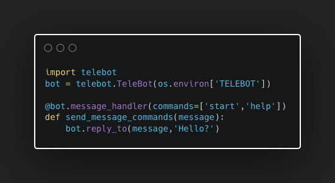{:.center}
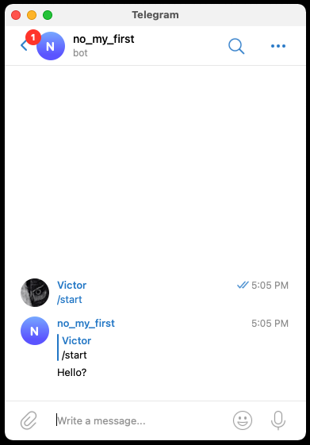{:.center}

### Handler with function

This handler will handle the message if the result of a function is true.

Here is an example of a function that will return always true, so the handler will echo each message that is not a command.

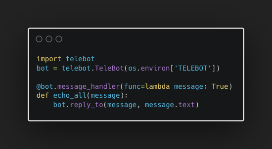{:.center}
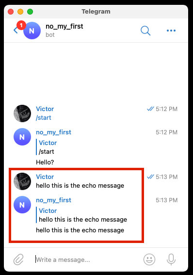{:.center}

### ⚠️ Handler with a Function that expects a keyword

I can create a different function without a decorator that will track the presence of a specific word.

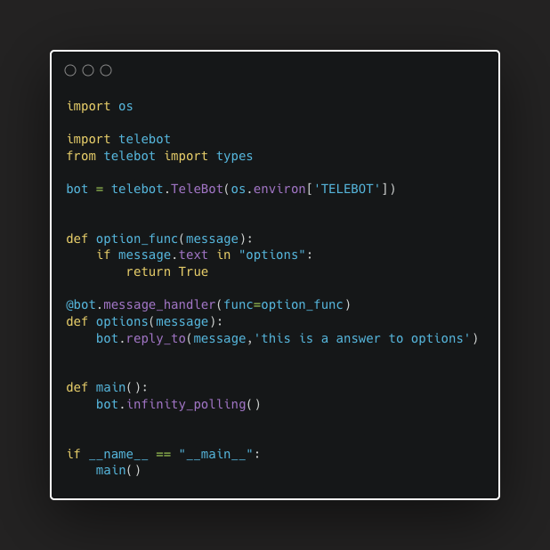{:.center}
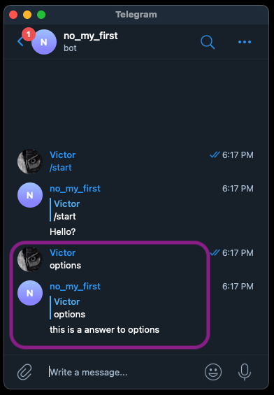{:.center}

### Keep the bot running
To keep the bot running I need to add one command to the source file `bot.infinity_polling()`.

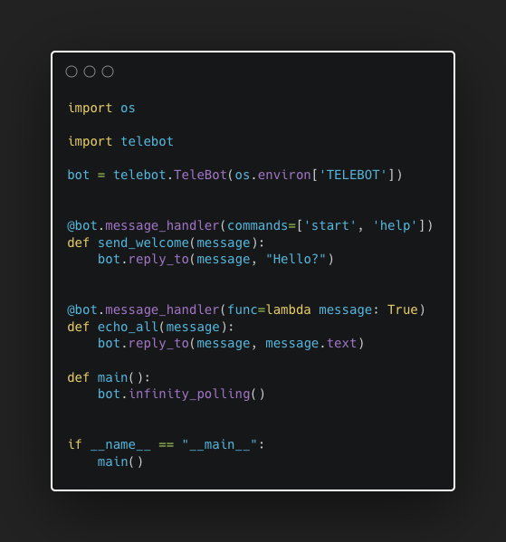{:.center}

## Advance Bot replies.

The documentation provides extensive information about the telegram API,
but what I’m interested in are the types and something callReply markup,
this will allow me to provide different types of responses like audio,
videos, and keyboard options.

Each function `send_xyz` contains an argument `reply_markup`.
This argument receives an instance of `ReplyKeyboardMarkup`, `ReplyKeyboardRemove`
or `ForceReply`.

Here is an example of what I what to do.

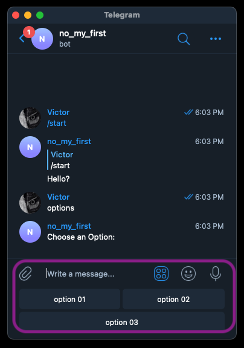{:.center}

The Bot will reply with a custom keyword

1. Create an instance of `ReplyKeyboardMarkup`. The instance will have 2 rows `row_width=2`.
2. Create the Buttons `types.KeyboardButton(“option”)`.
3. Add to the markup object.
4. Add the keyboard to the message.

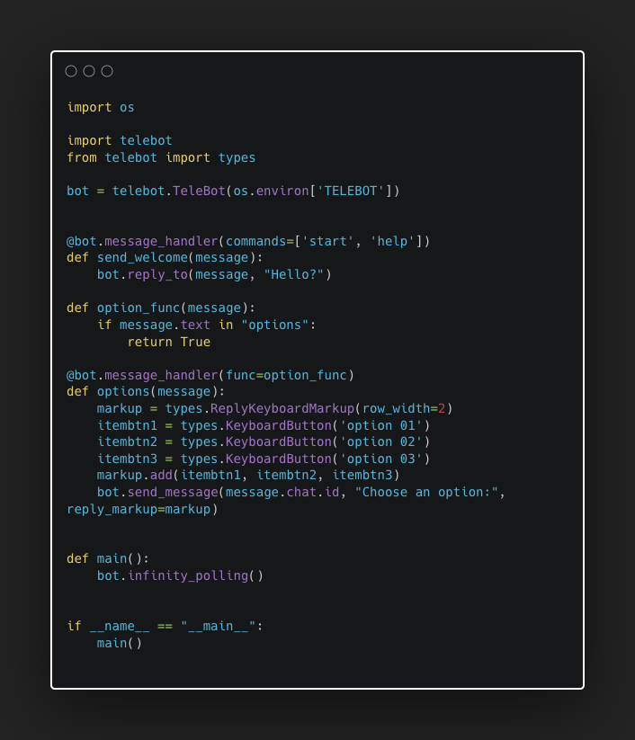{:.center}
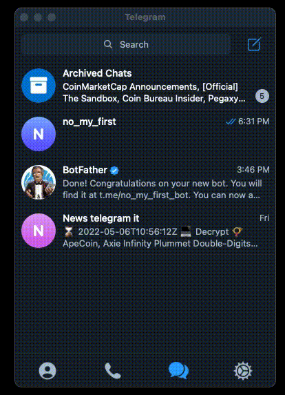{:.center}
