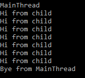
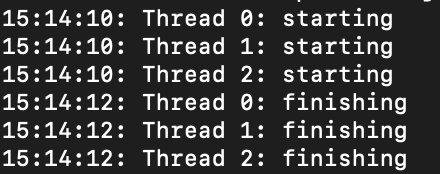

Here we will have some information about thread and processes.

##How to choose?

A simple way to know when to use processes and when to use threads will be to think in terms of task CPU-bound or External-bound ( like API calls), When the task we are executing depends of the CPU, it might be a good idea to use processes, but when the task depends of an external response, example; API calls, the best options, in most cases, will be Threads.

## What is a thread
A thread is a separate flow of execution. Threads share memory and then can exchange information, simple way to see it, is use any word processing program, the program will be the process and inside this process we will have different threads, on to process the keystrokes, one to display the letters in the screen, one to auto-save and other to highlight spelling mistakes.

Because of the way CPython implementation of Python works, threading may not speed up all tasks. This is due to interactions with the GIL that essentially limit one Python thread to run at a time, but still in some cases this will speed up the execution.

### How to create Threads in python?

there are several ways to create the threads and there are even more ways to control them, for now we will check 3 basic ways:

1. As instance of the class Thread
2. By Extending the Thread class
3. with a class but without extending the Thread Class

#### As instance of the class Thread

```python
import threading as th

print(th.current_thread().getName())

def mt():
		print('child Thread')

child = th.Thread(target=mt)
child.start()
print("Executing thread name :", th.current_thread().getName())
```

**Output**

{: .center}

#### By Extending the Thread class

When a child class is created by extending the Thread class, the child class represents that a new thread is executing some task. When extending the Thread class, the child class can override only two methods i.e. the `__init__()` method and the `run()` method.

```python
import threading
import time

class myThread(threading.Thread):
	"""docstring for ClassName"""
	def run(self):
		for x in range(7):
			print('Hi from child')

print(threading.current_thread().getName())
a = myThread()
a.start()
a.join()
print("Bye from",threading.current_thread().getName())
```

**Output**
{: .center}

The output shows that the child thread executes the `run()` method and the main thread waits for the child execution to complete. To tell one thread to wait for another thread to finish, you call `.join()` in this case the child thread is telling theMaind thread that the execute has finished.

#### Deamon Threads

In computer science, a `daemon` is a process that runs in the background.

Python threading has a more specific meaning for `daemon`. A `daemon` thread will shut down immediately when the program exits. One way to think about these definitions is to consider the `daemon` thread a thread that runs in the background without worrying about shutting it down.

If a program is running Threads that are not daemons, then the program will wait for those threads to complete before it terminates. Threads that are daemons, however, are just killed wherever they are when the program is exiting.

```python
import threading as th

print(th.current_thread().getName())

def mt():
		print('child Thread')

child = th.Thread(target=mt, deamon=True)
child.start()
print("Executing thread name :", th.current_thread().getName())
```

#### `.join()`

`.jpin()` tell one thread to wait for another thread to finish

```python
import threading
import time

class myThread(threading.Thread):
	"""docstring for ClassName"""
	def run(self):
		for x in range(7):
			print('Hi from child')

print(threading.current_thread().getName())
a = myThread()
a.start()
a.join()
print("Bye from",threading.current_thread().getName())
```
in this case the line

```python
a.join()
```
tell the main thread to wait until the thread a finish.

## `ThreadPoolExecutor()` Another way to work with threads

There is another way to work with threads and that is using `ThreadPoolExecutor`, this is part of the library `concurrent.future`, the best way to work with `ThreadPoolExecutor` will be by using the context manager, using `with` statement to manage and destruction of the pool

Here an example using `ThreadPoolExecutor`

```Python
import logging
import time
import concurrent.futures

def thread_function(name):
	logging.info("Thread %s: starting", name)
	time.sleep(2)
	logging.info("Thread %s: finishing", name)

if __name__ == "__main__":
    format = "%(asctime)s: %(message)s"
    logging.basicConfig(format=format, level=logging.INFO,
                        datefmt="%H:%M:%S")

    with concurrent.futures.ThreadPoolExecutor(max_workers=3) as executor:
        executor.map(thread_function, range(3))

```

the code create a `ThreadPoolExecutor` as a context manager  telling how many working it wants on the pool, then use the function `map()` to step through an iterable of things, in this case a `range(3)`. The `.join()` is not necessary since the context manager will take care of it.

{: .center}
