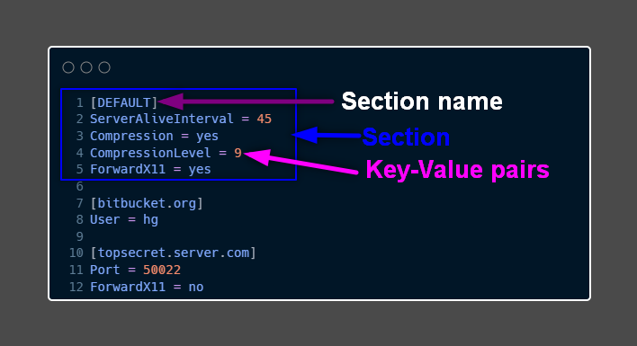
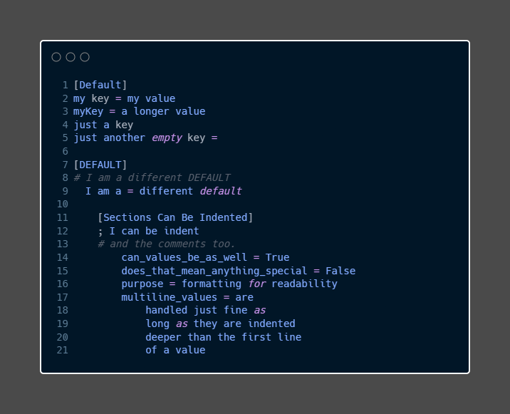
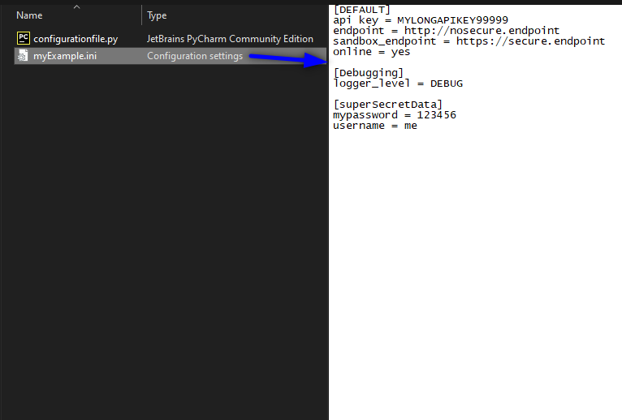
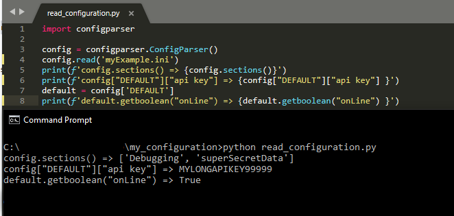

# Configuration Files in Python


1. Quick Overview (Basic configuration file).
2. How to make it.
3. How to access them.
4. How to update it.
5. Real Example.


## Quick Overview (Basic Configuration File)

- The Files consist of sections.
- Name of the section is withing `[]` , Example: `[DEFAULT]` or `[testing]`.
- Each section will contain keys with values
- The extension of the file is `.ini`




### Supported structure

- Section names are case-sensitive `[Default]` is different than `[default]`.
- Spaces are allowed in the keys and the values, `my key = my value`
- `=` or `:` can be used to separate keys and values.
- keys with no values can omit `=` or it can be used if is not followed by any character, `my key without value` or `my key without value =` are correct.
- Comments can be added with `#` or `;` like `# I am a comment` and `; me too`.
- A section can be indented.



## How to make it

I can make a config file in two ways:

1. Creating the file and saving it with a .ini extension.
2. Creating the file programmatically.

Creating a file programmatically can be done using a code similar to this:

```python
import configparser

config = configparser.ConfigParser()
config['DEFAULT'] = {'API key': 'MYLONGAPIKEY99999',
                      'endpoint': 'http://nosecure.endpoint',
                      'sandbox_endpoint': 'https://secure.endpoint'}

# creating an empty section
config['Debugging'] = {}
config['Debugging']['logger_level'] = 'DEBUG'

config['superSecretData'] = {}
#assigning section to a variable
supersecret = config['superSecretData']
supersecret ['myPassword'] = '123456'
supersecret ['username'] = 'me'

#adding to an existing section
config['DEFAULT']['onLine'] = 'yes'

with open('myExample.ini', 'w') as configfile:
	config.write(configfile)
```



<aside>
🔥 Section names are case-sensitive but keys are not.

</aside>

All the values store`d` in the keys are strings, however`,` there is one method I can use to get a boolean value for keys holding strings like `yes`, `no` `'on'`,`'off'`,`'true'`,`'false'`,`'1'`,`'0'`.

## How to access them

ConfigParser class provides methods to interact with the configuration file.

**`read()`**

Allow me to read the .ini file

**`sections()`**

returns the section names present in the config file.

**`getboolean()`**

will return a Boolean value depending on the value store in the key, values most be `'yes'/'no'`, `'on'/'off`', `'true'/'false'` and `'1'/'0'`.

Here are some examples of interactions with a config file. 

```python
import configparser

config = configparser.ConfigParser()
config.read('myExample.ini')
print(f'config.sections() => {config.sections()}')
print(f'config["DEFAULT"]["API key"] => {config["DEFAULT"]["API key"] }')
default = config['DEFAULT'] 
print(f'default["onLine"]  => {default["onLine"] }')
```



Like the dictionaries I can provide a Fallback value, that is when the key doesn't I can create it and give it a value.

```python
>>> default.get('last_name','Fernandez')
Fernandez
```

## How to update it.

To update it  I can use the following methods:

`add_section()` to add a new section. 

`set(’my_section’,’my_new_key’,’my_new_value’)` To add a new key-value pair to an specific session.

```python
import configparser

config = configparser.ConfigParser()
config.read('myExample.ini')
print(f'current sections: {config.sections()}')

#adding new section and key-value
config.add_section('new_section')
config.set(section='new_section', option='new_key', value='new_value')

with open('myExample.ini', 'w') as configfile:
	config.write(configfile)
```

Notice I need to “save the changes” by writing the configuration file one more time.
