# Logging in Python

<aside> <strong>Why should I use it:</strong>
The module Logging will allow me to get an overview of errors or the data flow in specific code. For small projects, a simple print will help to check results or errors in specific statements. But in a more complex project, where I have several functions and modules, logging is a better and more organized option.
The configuration of the logger can get complicated however it is worth it.
</aside>


## The Basics:
The Logging module is a built-in module, so installation is not necessary.
I only need to import it.
```python
import logging
```

There are several elements in the logging, but the most important are:
* Logging levels.
* Handler.
* Formatter.

## Logging Levels
Logging levels will allow me to log more specific things, such as; debugging statements, information, or reports errors.

|Levels| Descriptions|
|:-------|:------------|
|DEBUG| Detailed information, mostly for diagnostics.|
|INFO| Mostly to confirm that something is working.|
|WARNING| Something happens that can create problems in the future.|
|ERROR| A serious problem, the software cannot perform the action.
|CRITICAL| Serious Error, unable to continue.|

<aside>
🔥 The default level is set to "WARNING". If the logging level is not configured, the only messages logged are those higher than WARNING, in other words, ERROR and CRITICAL.
</aside>

### Example of a basic logging
This example will show the simple logging configuration. There is no configuration for a handler or a formatter. However, the implementation will allow me to decide whether I want to log the information in a file and in what format I want the information.

####Just with the logging level, the default output will be the console.
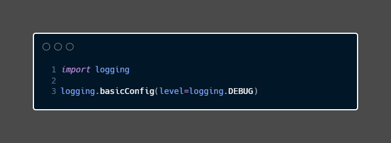

####Adding a destination file
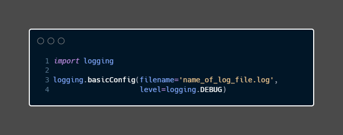

####Changing the format of the output
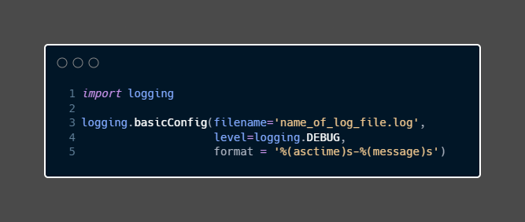

In the above example, I configure the logs to display the time and a message, But these are not the only attributes I can use. python documentation provides an extensive list of LogRecord attributes here:

[Logging documentation](https://docs.python.org/3/library/logging.html#logging-levels)

The complete code of the basic example will be:

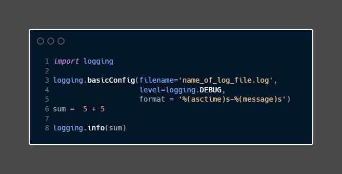


##Advanced Logging

I have just one logger in the following example -a good option if I deal with one script at a time. But for a more complex app, I will need more loggers and probably more output.
To achieve a more functional logger, I can make use of the elements mentioned previously
* Logging levels.
* Handler.
* Formatter.

The following code can be duplicated in each script to have a logger in each one of them

####Creating a logger for a specific script

I start by creating a variable:
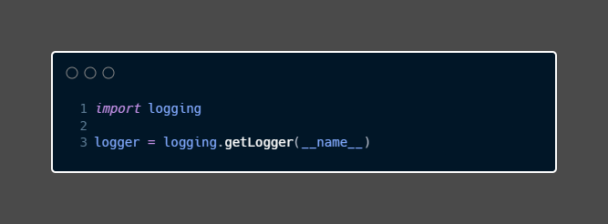
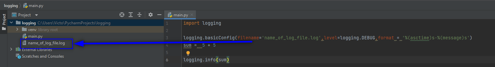

The argument __name__ is a deeper topic that I won't cover here. but a bad explanation or rather a not accurate one will say; "this will help the lower to know in which module and function it is been call".

###Logging Levels
To add the logging level to the logger, I use the function `setLevel()`.
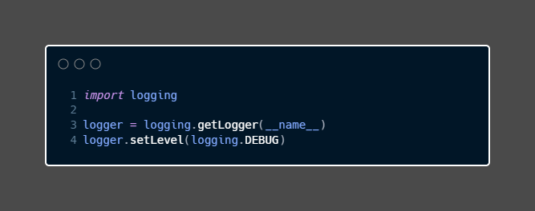

###Handler
In this case refer to which output I will use, the console or a document.

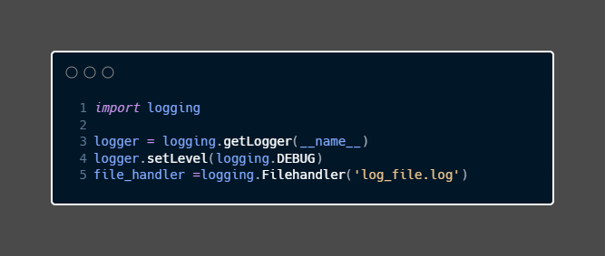
I created a file handler, but it is not linked to the logger yet, I need to add it.

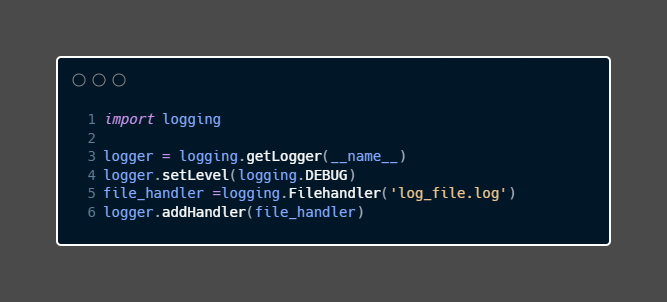

Be aware that I haven't changed the format of the output, I just define what will be the output for the `logger`.
To add a stream handler or an output to the console, I can use `StreamHandler()`.

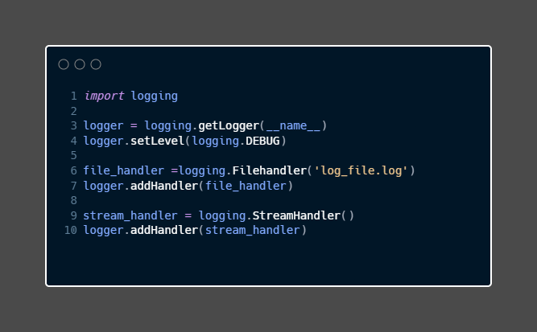

###Formatter
Now with the logger added I can think in the format I want. To modify the format I can use `setFormatter()`.

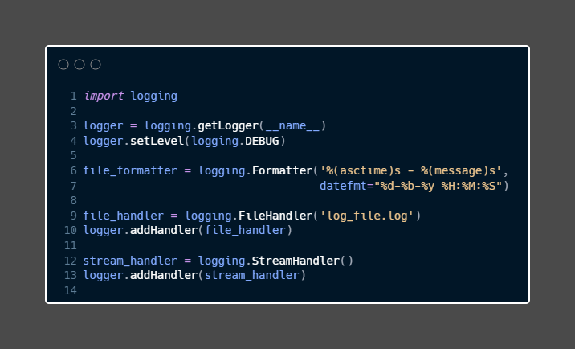

The extra argument `datefmt` allows me to modify how the time is displayed.
Similar to Handler, I have to register it with the logger. `setFormatter()` is used to add the format to the logger.
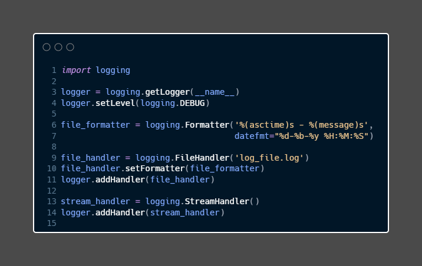

Now, all together:
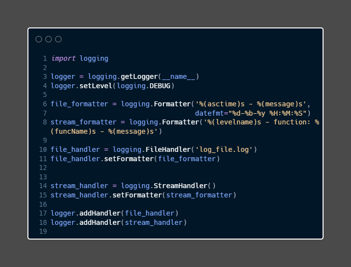

<aside>
🔥 Every time I need to call the logger, I will need to use the variable I create for it rather than the logging.
<strong>Example:</strong>
logger.info(f'Starting script')
</aside>

###Notes:
When using `try/except` blocks is a good idea to log the traceback when the action fails by using the function `.exception()` with the logger.
