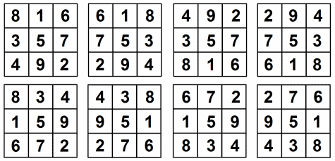

The following was a challenge in [HackerRank](https://www.hackerrank.com/challenges/magic-square-forming/problem) the name of the challenge *Forming a Magic Square*

First lets define what is a *Magic square*

## What is a Magic square

A magic square of order $n$ is an arrangement of $n^2$ numbers, usually distinct integers, in a square, such that the n numbers in all rows, all columns, and both diagonals sum to the same constant. A magic square contains the integers from $1$ to $n^2$.

|      |      |      |
|:----:|:----:|:----:|
|   2  |   7  |   6  |
|   9  |   5  |   1  |
|   4  |   3  |   8  |

The constant sum in every row, column and diagonal is called the magic constant or magic sum, $M$. The magic constant of a normal magic square depends only on n and has the following value:
$M = n(n^2+1)/2$

more information fo how to generate ir here [*Magic Square*](https://www.geeksforgeeks.org/magic-square/)

## The problem

We define a magic square to be an $nXn$  matrix of distinct positive integers from $1$ to $n^2$  where the sum of any row, column, or diagonal of length $n$ is always equal to the same number: the magic constant.

You will be given a $3x3$ matrix $s$ of integers in the inclusive range $[1,9]$. We can convert any digit $a$ to any other digit $b$ in the range $[1,9]$  at cost of $|a -b|$ . Given $s$, convert it into a magic square at minimal cost. Print this cost on a new line.

## The answer explained

We will assume that we need to develop just the function to calculate the difference, but no the code necessary to display the answer.

**Considerations**

>we are going to create an array with all the possible combination of a Magic Square $3x3$.

**Steps**

*  **Create an array:** We are going to define an array with all the possible combination.



```python

    possibles = [
        [[8,1,6],[3,5,7],[4,9,2]],
        [[6,1,8],[7,5,3],[2,9,4]],
        [[4,9,2],[3,5,7],[8,1,6]],
        [[2,9,4],[7,5,3],[6,1,8]],
        [[8,3,4],[1,5,9],[6,7,2]],
        [[4,3,8],[9,5,1],[2,7,6]],
        [[6,7,2],[1,5,9],[8,3,4]],
        [[2,7,6],[9,5,1],[4,3,8]]
        ]
```


* **Create a list** where I will store all the $|a-b|$ difference.

```python
diffs = []
```

* **First loop**, where we are going to extract every possible magic square variant, and define a variable call cost that is going to hold the difference from the element in the input and the element in the Magic square variant

```python
for possible in possibles:
	cost = 0
```

* **Second loop**, in this one we want to make a tuple that holds each row from the magic square variant and the input, for that we are going to use `zip()` with the possible and the s which is the input `zip(possible,s)` and we are going to cast it to a `list()`

```python
for p_row, s_row in list(zip(possible,s)):
```

the first iteration will be something like this:

```
[([8, 1, 6], [4, 9, 2]), ([3, 5, 7], [3, 5, 7]), ([4, 9, 2], [8, 1, 5])] ...
```

First element is going to be the row from the magic square variant and the second will be the row from the input.

* **Third loop**, Here we are going to create a tuple with each value from the Magic square variant and the input, this will be use to compare number by number

```python
for p_num, s_num in list(zip(p_row,s_row)):
```

will give an output like:

```
[(8, 4), (1, 9), (6, 2)]
[(3, 3), (5, 5), (7, 7)]
...
```

* **Comparison**, inside the third loop we are going to compare each element for the magic square variant with the each element of the input, and store the absolute total difference of all the changes done.

```python
if p_num != s_num:
	cost += abs(p_num - s_num)
```

* **Populate the diffs list** now all the different cost will be use to populate the diffs list

```python
    for possible in possibles:
        cost = 0
        for p_row, s_row in list(zip(possible,s)):
            for p_num, s_num in list(zip(p_row, s_row)):
                if p_num != s_num:
                 cost += abs(p_num - s_num)
        diffs.append(cost)
```

* **Return the minimum value in the list** returning the minimum value we will return the minimum difference ask in the challenge

```python
return min(diffs)
```

## The answer (the script)
so the the function will be like:

``` python
def formingMagicSquare(s):

    possibles = [
        [[8,1,6],[3,5,7],[4,9,2]],
        [[6,1,8],[7,5,3],[2,9,4]],
        [[4,9,2],[3,5,7],[8,1,6]],
        [[2,9,4],[7,5,3],[6,1,8]],
        [[8,3,4],[1,5,9],[6,7,2]],
        [[4,3,8],[9,5,1],[2,7,6]],
        [[6,7,2],[1,5,9],[8,3,4]],
        [[2,7,6],[9,5,1],[4,3,8]]
        ]

    diffs = []

    for possible in possibles:
        cost = 0
        for p_row, s_row in list(zip(possible,s)):
            for p_num, s_num in list(zip(p_row, s_row)):
                if p_num != s_num:
                 cost += abs(p_num - s_num)
        diffs.append(cost)
    print(diffs)
    return min(diffs)
```
