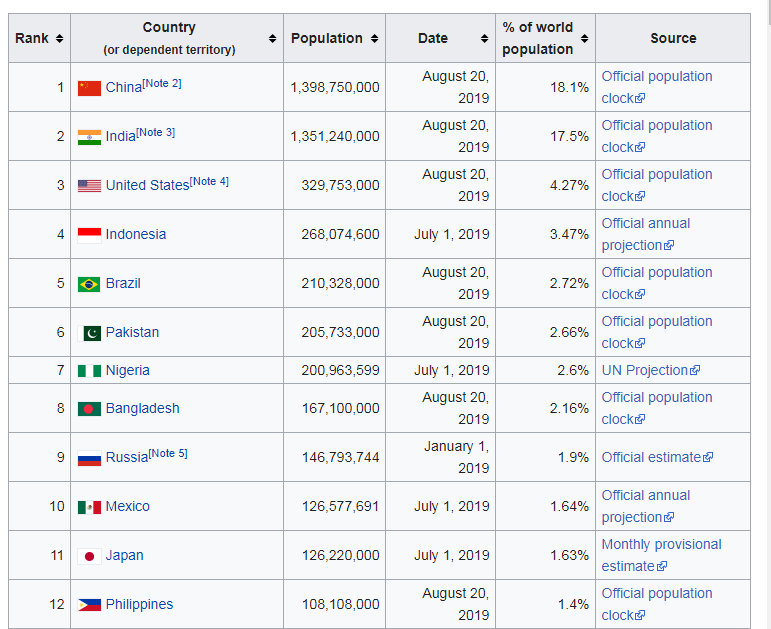
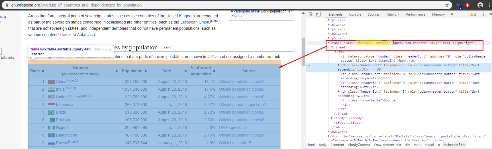
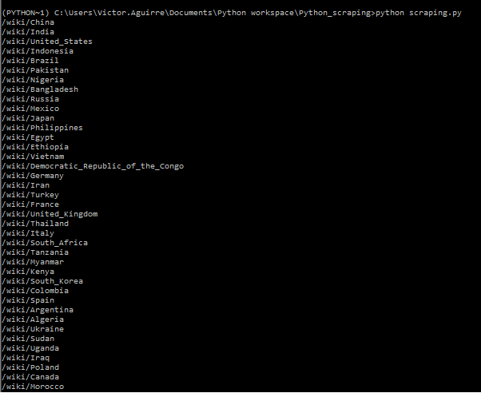

We are going to use Beautifulsoup and other libraries to scrap Wikipedia:

1. **List of Countries:** On accessing the first page, we’ll extract the list of countries, their population and percentage of world population.  
2. **Country:** We’ll then access each country’s page, and get information including total area, percentage water, and GDP (nominal).   

## Import Libraries

* **Numpy:**  To be use with arrays.
* **Pandas:** To convert the data in a tabular structure so we can manipulate it.
* **Urllib:** To open the url from which we would like to extract the data.
* **BeautifulSoup:** This library helps us to get the HTML structure of the page that we want to work with. We can then, use its functions to access specific elements and extract relevant information.  

```python
import numpy as np
import pandas as pd

from urllib.request import urlopen
from bs4 import BeautifulSoup
```

## Understanding the data

### Getting the "raw" data

First we will need to get the "raw" data, the HTML content of the specific URL, for this we will create a function that will return this "raw" data.

```python
def getHTMLContent(link):
	html = urlopen(link)
	soup = Beautifulsoup(html,'html.parser')
	return soup
```

The Function `getHTMLContent()` will receive a link or URL, later we are going to use `urlopen()` to open this URL, tis will enable us to apply [*Beautifulsoup* library](https://www.crummy.com/software/BeautifulSoup/bs4/doc/).
There are different parsers, for XML and HTML, but in this case, we will use just `html.parser`
and we return  the output of this parser, `Beautifulsoup(markup,'html.parser')`, so we can extract our data.

### Finding the data and display it with `prettify()`

we get the content of the URL but the information we need is in a table 


so we are going to store the information we got in a variable, later we will apply the method `find_all()` from Beautifulsoup  and the tag `table` so we can get all the tables in this HTML, later we are going to print it in a readable way using the method `prettify()`

```python
content = getHTMLContent(URL)
#print(content)
tables = content.find_all('table')
for table in tables:
	print(table.prettify())
```

The code will print all the table in this HTML, therefore we will need to check which is the table that we need, but first let see the code so far:

```python
import numpy as np
import pandas as pd

from urllib.request import urlopen
from bs4 import BeautifulSoup

URL= 'https://en.wikipedia.org/wiki/List_of_countries_and_dependencies_by_population'


#get the HTML 
def getHTMLContent(link):
	html = urlopen(link)
	soup = BeautifulSoup(html, 'html.parser')
	return soup


content = getHTMLContent(URL)
#print(content)
tables = content.find_all('table')
for table in tables:
	print(table.prettify())
```

Now we need one table  in specific



so we will need to find this table with the class **wikitable sortable**, 
We will use the method `find()`, since this method allow us no just find a tag but a tag with a specific tag, once we have the table we will get all the rows

```python
table = content.find('table', {'class': 'wikitable sortable'})
rows = table.find_all('tr')
```

now we have all the rows, we need to iterate over them to find the cell that contain the link to the country page> we know that HTML table are detonated with `<tr></tr>` an each row is either be heading `<th></th>` or data `<td></td>` and we know that the country page is in the second column so `cells[1]` and we use `find()` to find the `a` elements, and we extract the link or `href` with `get()`:

```python 
for row in rows:
	cells = row.find_all('td')
	if len(cells) > 1:
		country_link = cells[1].find('a')
		print(country_link.get('href'))
```


so the code will be

```python 
import numpy as np
import pandas as pd

from urllib.request import urlopen
from bs4 import BeautifulSoup

URL= 'https://en.wikipedia.org/wiki/List_of_countries_and_dependencies_by_population'


#get the HTML 
def getHTMLContent(link):
	html = urlopen(link)
	soup = BeautifulSoup(html, 'html.parser')
	return soup


content = getHTMLContent(URL)
#print(content)
tables = content.find_all('table')
#for table in tables:
	#print(table.prettify())

table = content.find('table', {'class': 'wikitable sortable'})
rows = table.find_all('tr')

for row in rows:
	cells = row.find_all('td')
	if len(cells) > 1:
		country_link = cells[1].find('a')
		print(country_link.get('href'))
```

and the result 

{: .center}