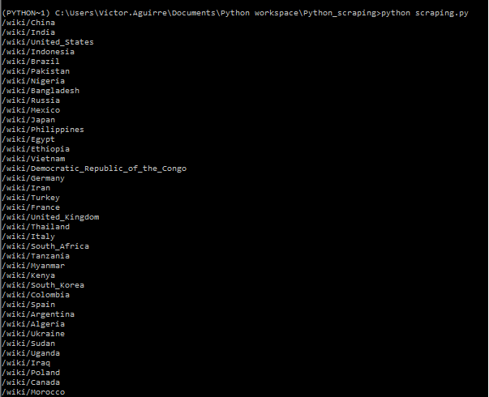
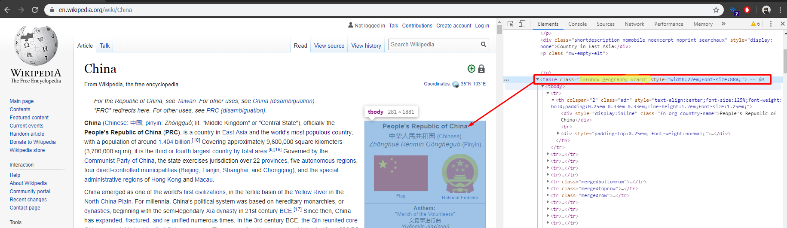
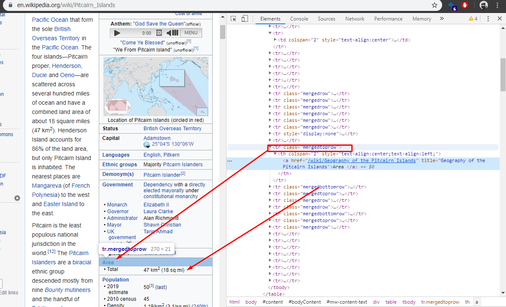
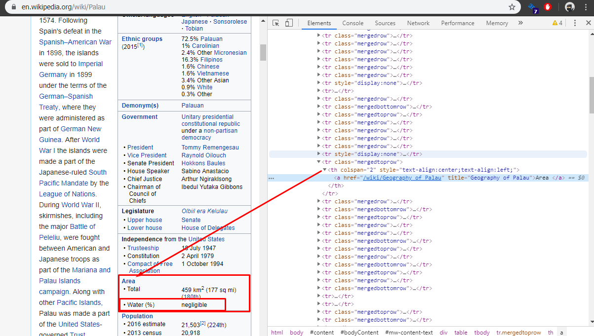

We are going to use Beautifulsoup and other libraries to scrap Wikipedia:

1. **List of Countries:** On accessing the first page, we’ll extract the list of countries, their population and percentage of world population.  
2. **Country:** We’ll then access each country’s page, and get information including total area, percentage water, and GDP (nominal).   

## Import Libraries

* **Numpy:**  To be use with arrays.
* **Pandas:** To convert the data in a tabular structure so we can manipulate it.
* **Urllib:** To open the url from which we would like to extract the data.
* **BeautifulSoup:** This library helps us to get the HTML structure of the page that we want to work with. We can then, use its functions to access specific elements and extract relevant information.  

```python
import numpy as np
import pandas as pd

from urllib.request import urlopen
from bs4 import BeautifulSoup
```

## Understanding the data

### Getting the "raw" data

First we will need to get the "raw" data, the HTML content of the specific URL, for this we will create a function that will return this "raw" data.

```python
def getHTMLContent(link):
	html = urlopen(link)
	soup = Beautifulsoup(html,'html.parser')
	return soup
```

The Function `getHTMLContent()` will receive a link or URL, later we are going to use `urlopen()` to open this URL, tis will enable us to apply [*Beautifulsoup* library](https://www.crummy.com/software/BeautifulSoup/bs4/doc/).
There are different parsers, for XML and HTML, but in this case, we will use just `html.parser`
and we return  the output of this parser, `Beautifulsoup(markup,'html.parser')`, so we can extract our data.

### Finding the data and display it with `prettify()`

we get the content of the URL but the information we need is in a table 


so we are going to store the information we got in a variable, later we will apply the method `find_all()` from Beautifulsoup  and the tag `table` so we can get all the tables in this HTML, later we are going to print it in a readable way using the method `prettify()`

```python
content = getHTMLContent(URL)
#print(content)
tables = content.find_all('table')
for table in tables:
	print(table.prettify())
```

The code will print all the table in this HTML, therefore we will need to check which is the table that we need, but first let see the code so far:

```python
import numpy as np
import pandas as pd

from urllib.request import urlopen
from bs4 import BeautifulSoup

URL= 'https://en.wikipedia.org/wiki/List_of_countries_and_dependencies_by_population'


#get the HTML 
def getHTMLContent(link):
	html = urlopen(link)
	soup = BeautifulSoup(html, 'html.parser')
	return soup


content = getHTMLContent(URL)
#print(content)
tables = content.find_all('table')
for table in tables:
	print(table.prettify())
```

Now we need one table  in specific


so we will need to find this table with the class **wikitable sortable**, 
We will use the method `find()`, since this method allow us no just find a tag but a tag with a specific tag, once we have the table we will get all the rows

```python
table = content.find('table', {'class': 'wikitable sortable'})
rows = table.find_all('tr')
```

now we have all the rows, we need to iterate over them to find the cell that contain the link to the country page> we know that HTML table are detonated with `<tr></tr>` an each row is either be heading `<th></th>` or data `<td></td>` and we know that the country page is in the second column so `cells[1]` and we use `find()` to find the `a` elements, and we extract the link or `href` with `get()`:

```python 
for row in rows:
	cells = row.find_all('td')
	if len(cells) > 1:
		country_link = cells[1].find('a')
		print(country_link.get('href'))
```
so the code will be

```python 
import numpy as np
import pandas as pd

from urllib.request import urlopen
from bs4 import BeautifulSoup

URL= 'https://en.wikipedia.org/wiki/List_of_countries_and_dependencies_by_population'


#get the HTML 
def getHTMLContent(link):
	html = urlopen(link)
	soup = BeautifulSoup(html, 'html.parser')
	return soup


content = getHTMLContent(URL)
#print(content)
tables = content.find_all('table')
#for table in tables:
	#print(table.prettify())

table = content.find('table', {'class': 'wikitable sortable'})
rows = table.find_all('tr')

for row in rows:
	cells = row.find_all('td')
	if len(cells) > 1:
		country_link = cells[1].find('a')
		print(country_link.get('href'))
```

and the result 

{: .center}

We can see that the information or links that we got back don't include the first part of the URL so we will need to prefix "https://en.wikipedia.org".

> Later we will create a variable called `root_URL` that will contain "https://en.wikipedia.org"

## Data for Each country 

Now, we Will use the list of link to go to each country page and locate the card to the right of the screen where there is the remaining information.

inspecting the country page we found that the class for card mentioned above is `infobox geography vcard`



Here is when we run into some issues, we are looking for the following fields:

* Area > Total area
* Water (%)
* GDP (nominal) > Total   
* Per capita

but their order vary in each country page, so we will need to make some adjustment.

### Modifying current code

We will start making a small modification in the code, we will create a new function that will return a list with the link of all the counties

```python
import numpy as np
import pandas as pd

from urllib.request import urlopen
from bs4 import BeautifulSoup

root_URL = 'https://en.wikipedia.org'
URL= 'https://en.wikipedia.org/wiki/List_of_countries_and_dependencies_by_population'
country_links = []

#get the HTML 
def getHTMLContent(link):
	html = urlopen(link)
	soup = BeautifulSoup(html, 'html.parser')
	return soup

# get the link of all countries 
def getCountryLinks(URL):
	content = getHTMLContent(URL)
	#tables = content.find_all('table')
	table = content.find('table', {'class': 'wikitable sortable'})
	rows = table.find_all('tr')
	for row in rows:
		cells = row.find_all('td')
		if len(cells) > 1:
			country_link = cells[1].find('a').get('href')
			#print(country_link.get('href'))
			country_links.append(country_link)

getCountryLinks(URL)
print(country_links)
```

### Values in different positions - Something to thing about it

Now, with few pages inspected we can see where will be a problem, the location of the different values we want are in different position depending of the country.

We now the information is in tags with classes `mergedrow` or `mergedrowbottom` but the position of the row that contain the information it is not constant, in the first example, we see that we don't have `water(%)` but in the second page we do have this value, making the position of population one position down in comparison with the first example 

{: .center}

{: .center}

To solve this we will add some extra code. We will start by adding a new variable called `additional_details`, later use it to append the information we collect form each country page to the table with the list of countries. Next, we will create a function `getadditionalDetails()` and a variable flag `read_content`, we will explain the usage later.

we are going to use three type of function here: 

1. `get()` With this function we will find and get the reference of a particular element.
2. `get_text()` the function will return the text that is within the opening and close tags of an element.
3. `strip()` This will remove the white spaces at both sides of the string or text.  

#### `getadditionalDetails()` function:

First, we will create a new variable

```Python
# to be use in getAdditionalDetails
additional_details = []
```

next, the function

```python 
def getAdditionalDetails(country_link):
    try:
        country_page = getHTMLContent('https://en.wikipedia.org' + country_link)
        table = country_page.find('table', {'class': 'infobox geography vcard'})     
        read_content = False

        for tr in table.find_all('tr'):

            if (tr.get('class') == ['mergedtoprow'] and not read_content):
                link = tr.find('a')
            
                if (link and (link.get_text().strip() == 'Area' or (link.get_text().strip() == 'GDP' and tr.find('span').get_text().strip() == '(nominal)'))):
                    read_content = True
            
                if (link and (link.get_text().strip() == 'Population')):
                    read_content = False
            
            elif ((tr.get('class') == ['mergedrow'] or tr.get('class') == ['mergedbottomrow']) and read_content):
                additional_details.append(tr.find('td').get_text().strip('\n')) 
            
                if (tr.find('div').get_text().strip() != '•\xa0Total area' and
                   tr.find('div').get_text().strip() != '•\xa0Total'):
                    read_content = False
        return additional_details
    
    except Exception as error:
        print('Error occurred: {}'.format(error))
        return []
```

We have a `try/except` block that will wrap the logic and it will prevent the script to crash if one of the links doesn't provide the information in the same format or if the page is empty

1. We get the links for the countries, remember those links don't have the root url so here we concatenate them with the root URL. We find the table with the classes `infobox geography vcard`, and set the flag `read_content`.

2. We use a `for` loop to iterate over all the `<tr>` tags on the table.

3. We use a decision block to check if the class in the `<tr>` is  `mergedtoprow` and `not read_content`. if the condition are match we save the content of `<a>` on the variable `link`.

4. the next two condition blocks are checking if the information on the page is following the order that we want, in which case we set the `read_content` to True , otherwise `read_content` will be set as False.

5. the `elif` part of the initial conditional will be the one that will populate the variable `additional_details`

6. Finally the `except` block, this will be used to report back if there is any issue.


## Create the dataset

