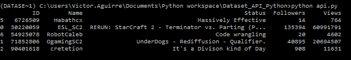

The idea will be follow the article from medium [Creating a dataset using an API with Python](https://towardsdatascience.com/creating-a-dataset-using-an-api-with-python-dcc1607616d) from this we will change code at will to fit more my personal style or just to try different things.

## Import Libraries 

There will be 3 main libraries to be use in this project:

* `request` this will help use to get content from the API usign the method `get()` and to decide the format of how are we getting this info using `json()` so we can handle the answer for he API using JSON.

* `json` with this library we can work with JSON 

* `pandas` this will help us to create the dataframes that later can be export to a .cvs file.

we will import `numpy` as well, ... just in case.

## Understanding the API

We want first to understand what is the information that the API is giving us, what type of data and what values, so for that we are going to start by calling the API and display the content.

first, the API end point is *https://wind-bow.glitch.me/twitch-api/channels/freecodecamp* this API doesn't require any authentication which will make the process easier 

```python 

import numpy as np
import pandas as pd
import requests
import json

url = "https://wind-bow.glitch.me/twitch-api/channels/freecodecamp"
JSONContent = requests.get(url).json()
content = json.dumps(JSONContent, indent=4, sort_keys=True)
print(content)
```

and the result is:

{: .center}

The screen-shot looks messy but we will see the response after explain a bit the code.

We use the variable URL in order to store the end point for the API, Later we use `requests.get(url).json()`  that will give use the response of the API (URL) in a JSON format, as a final step we dump the data with `dump()` so we can see the content in a readable way, this is done thanks to the parameters `indent=4` and `sort_key=True`.

```JSON
{
    "_id": 79776140,
    "_links": {
        "chat": "https://api.twitch.tv/kraken/chat/freecodecamp",
        "commercial": "https://api.twitch.tv/kraken/channels/freecodecamp/commercial",
        "editors": "https://api.twitch.tv/kraken/channels/freecodecamp/editors",
        "features": "https://api.twitch.tv/kraken/channels/freecodecamp/features",
        "follows": "https://api.twitch.tv/kraken/channels/freecodecamp/follows",
        "self": "https://api.twitch.tv/kraken/channels/freecodecamp",
        "stream_key": "https://api.twitch.tv/kraken/channels/freecodecamp/stream_key",
        "subscriptions": "https://api.twitch.tv/kraken/channels/freecodecamp/subscriptions",
        "teams": "https://api.twitch.tv/kraken/channels/freecodecamp/teams",
        "videos": "https://api.twitch.tv/kraken/channels/freecodecamp/videos"
    },
    "background": null,
    "banner": null,
    "broadcaster_language": "en",
    "created_at": "2015-01-14T03:36:47Z",
    "delay": null,
    "display_name": "FreeCodeCamp",
    "followers": 11770,
    "game": "Creative",
    "language": "en",
    "logo": "https://static-cdn.jtvnw.net/jtv_user_pictures/freecodecamp-profile_image-d9514f2df0962329-300x300.png",
    "mature": false,
    "name": "freecodecamp",
    "partner": false,
    "profile_banner": "https://static-cdn.jtvnw.net/jtv_user_pictures/freecodecamp-profile_banner-6f5e3445ff474aec-480.png",
    "profile_banner_background_color": null,
    "status": "Some GoLang Today #go #golang #youtube",
    "updated_at": "2018-09-19T23:01:33Z",
    "url": "https://www.twitch.tv/freecodecamp",
    "video_banner": "https://static-cdn.jtvnw.net/jtv_user_pictures/freecodecamp-channel_offline_image-b8e133c78cd51cb0-1920x1080.png",
    "views": 216340
}
```

From this response we get enough information to continue, we are going to use few properties:

* `_id`
* `display_name`
* `status`
* `followers`
* `views`

## Creating the dataset

First we will need to make a list that will contain the name of the channels that we want to get the information, later we will:

1. Use the `append()` method to populate a variable  with the properties we want.
2. use the `DataFrame()` from pandas library to create the dataframe which is a similar structure to a table 

#### List of channels

```python
# List of channels we want to access
channels = ["ESL_SC2", "OgamingSC2", "cretetion", "freecodecamp", "storbeck", "habathcx", "RobotCaleb"]
```

#### Variable to save the information after hit the API

```python
Channels_list = []
```

#### Loop to get response for each channels

```python
for channel in channels;
	JSONContent = requests.get("https://wind-bow.glitch.me/twitch-api/channels/" + channel).json()
	Channels_list.append([JSONContent["_id"],JSONContent["display_name"],JSONContent["status"],JSONContent["followers"],JSONContent["views"]])
```

we use the [] to access the specific parameter, to this point the script will loop like this:

```python 
import numpy as np
import pandas as pd
import requests
import json

url = "https://wind-bow.glitch.me/twitch-api/channels/freecodecamp"
JSONContent = requests.get(url).json()
content = json.dumps(JSONContent, indent=4, sort_keys=True)
#print(content)

channels = ["ESL_SC2", "OgamingSC2", "cretetion", "freecodecamp", "storbeck", "habathcx", "RobotCaleb"]
channels_list = []

for channel in channels:
    JSONContent = requests.get("https://wind-bow.glitch.me/twitch-api/channels/" + channel).json()
    channels_list.append([JSONContent['_id'], JSONContent['display_name'], JSONContent['status'],JSONContent['followers'], JSONContent['views']])


#print(channels_list)

dataset = pd.DataFrame(channels_list)
print(dataset.sample(5))

```

producing this result:


{: .center}

`sample(5)` allow me to display 5 random records 

## Enhancing the Dataset

Now we can see that are few things we can improve in the dataset we are creating;

1. **The headings:** there right now just numbers, but we can name them to represent the columns in more meaningful way.

2. There are some empty cells we can remove them


### The headings

we can use the method `columns()` from pandas to name the columns 

```python
dataset = pd.DataFrame(channels_list)

dataset.columns = ['ID', 'Name', 'Status', 'Followers', "Views"]

print(dataset.sample(5))
```

{: .center}

### Removing rows with EMpty columns 

In this case we are going to use `dropan(axis = 0, how = 'any', inplace = True)`
this will drop the rows that has some empty columns, after this we need to reindex the dataframe for that we use `dataset.index = pd.RangeIndex(len(dataset.index))`

```Python
dataset.dropna(axis = 0, how = 'any', inplace = True)
dataset.index = pd.RangeIndex(len(dataset.index))
```

so the code will be:

```python 
import numpy as np
import pandas as pd
import requests
import json

url = "https://wind-bow.glitch.me/twitch-api/channels/freecodecamp"
JSONContent = requests.get(url).json()
content = json.dumps(JSONContent, indent=4, sort_keys=True)
#print(content)

channels = ["ESL_SC2", "OgamingSC2", "cretetion", "freecodecamp", "storbeck", "habathcx", "RobotCaleb"]
channels_list = []

for channel in channels:
    JSONContent = requests.get("https://wind-bow.glitch.me/twitch-api/channels/" + channel).json()
    channels_list.append([JSONContent['_id'], JSONContent['display_name'], JSONContent['status'],JSONContent['followers'], JSONContent['views']])


#print(channels_list)

dataset = pd.DataFrame(channels_list)

#Name the columns
dataset.columns = ['ID', 'Name', 'Status', 'Followers', "Views"]
#drop rows with empty columns 
dataset.dropna(axis = 0, how = 'any', inplace = True)
#re-index the DataFrame
dataset.index = pd.RangeIndex(len(dataset.index))

print(dataset.sample(5))

```