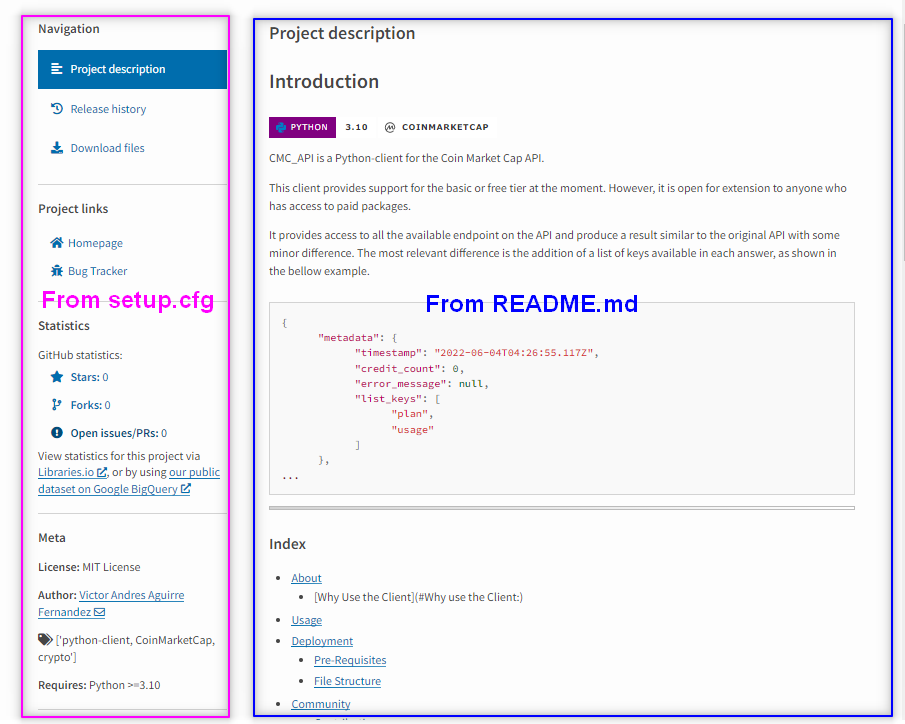
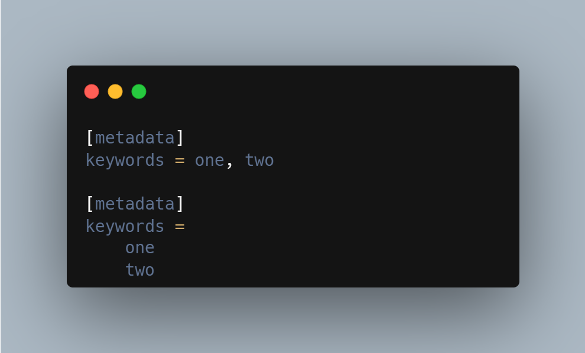
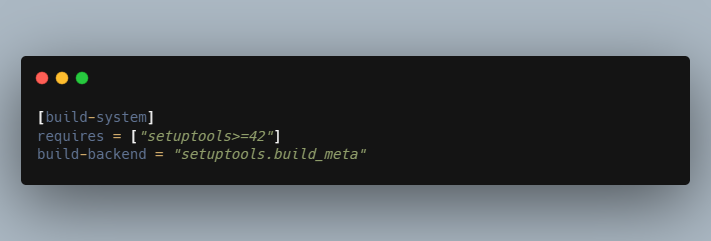
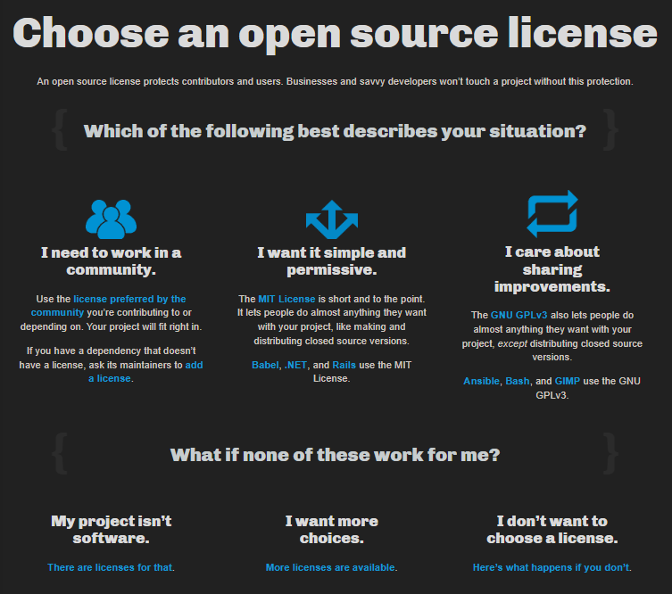
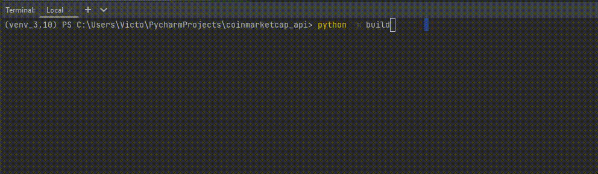
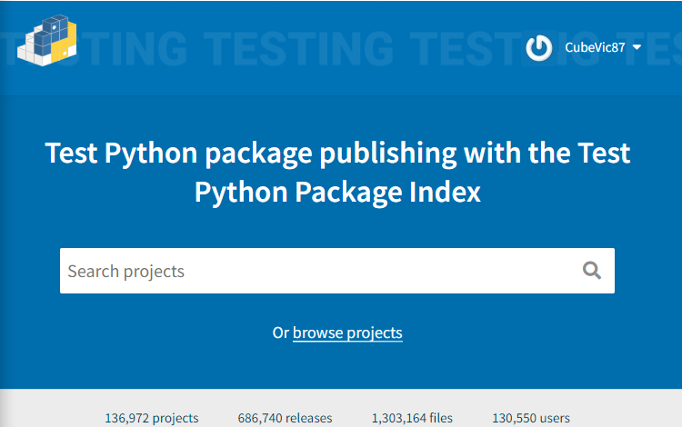
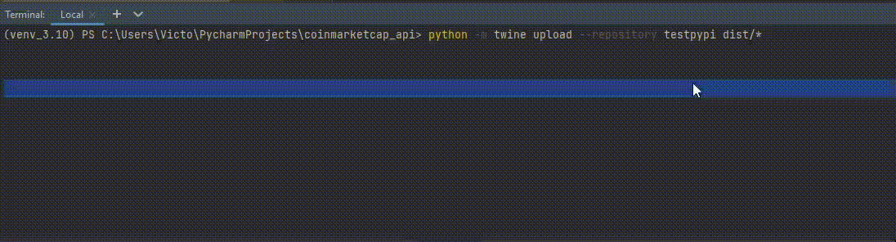
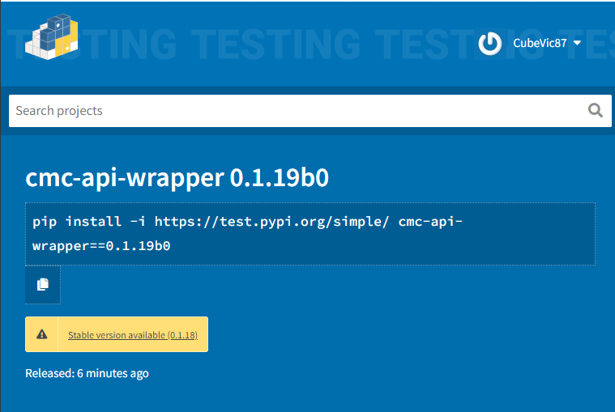
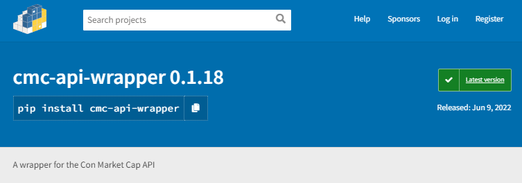

# Building a pypi package

<aside>
💡 This article will use the wrapper, I made for the Coin Market Cap API. I’m still working on this wrapper so the code might change with the time but the steps to create the package won't change.

</aside>

The structure of the project is more or less like this:

```
coinmarketcap/
├─ src/
│  ├─ cmc_api/
│  │  ├─ __init__
│  │  ├─ cmc.py
│  │  ├─ cmc_datahandler.py
│  │  ├─ cmc_helper.py
│  │  ├─ cmc_utils.py
│  ├─ test/
│  │  ├─ test_files.py
│  ├─ __init__.py
│  ├─ config.ini
├─ .gitignore
├─ README.md
```

From the `tree` above:

1. `src/` folder contains the main part of the API wrapper. 
2. `cmc_api/` folder holds the code for the wrapper.
3. `test/`contains the unittest.
4. `config.ini` is used to store some information like API credits.
5. `[README.md](http://README.md)` provides a description of the project. NOTE: this will be useful to provide a description on [pypi.org](http://pypi.org) package page.

<aside>
💡 it is important to have the __init__.py files, this serves many purposes but the essential one s to tell python which folders are modules. in most cases, this file will be empty.

</aside>

---

## The Steps

1. What files do I need to build the package?
2. What information is stored in each package?
3. What additional package do I need to build and upload the package?
4. Building, deploying on test.pypi.org.
5. Deploy on pypi.org.
6. Some errors I run into when doing the process.

---

## 1. What files do I need to build the package?

I already have a project with a specific structure, for know what is important is that I have a [README.md](http://README.md) file and the code of the project is within a folder called `/src`. This information will be important for the creation of one of the files `setup.cfg`.

The files I need for the project will be:

1. `README.md`
2. `setup.cfg`
3. `pyproject.toml`
4. `LICENSE`
5. (optional) `MANIFEST.in`.

Now the project will look like 

```bash
coinmarketcap/
├─ src/
│  ├─ cmc_api/
│  │  ├─ __init__
│  │  ├─ cmc.py
│  │  ├─ cmc_datahandler.py
│  │  ├─ cmc_helper.py
│  │  ├─ cmc_utils.py
│  ├─ test/
│  │  ├─ test_files.py
│  ├─ __init__.py
│  ├─ config.ini
├─ .gitignore
├─ LICENSE.json
├─ README.md
├─ pyproject.toml
├─ setup.cfg
```

I will describe what to add to each file in the next section for now I will provide a simple description of what they do:

 

### `README.md`

This is a markdown file, commonly used to provide some information on the GitHub repository page, [pypi.org](http://pypi.org) allow the use of this file to provide a long description of the project.

### `setup.cfg`

<aside>
🔥 There are many discussions and resources advocating for the usage of <strong>setup.py</strong> which is a way to create this `setup.cfg` file programmatically. I prefer to build the `setup.cfg` by myself.

</aside>

This file is going to provide all the details and information of the project to pypi.org, this information includes:

- Name of the package ( what are we going to use with `pip install`.
- Name of the author
- Description: Here I will tell Pypi.org the long descriptions in the [README.md](http://README.md) File.
- URL to the Github repository.
- Where to report bugs.
- Additional package required to use this project (example: `request` package needs it in this project since it is the module used to make the HTTP request)
- Documentation.
- etc



**`pyproject.toml`**

It tells build tools (like [pip](https://packaging.python.org/en/latest/key_projects/#pip) and [build](https://packaging.python.org/en/latest/key_projects/#build)) what is required to build your project.

`LICENSE`

This tells users who install your package the terms under which they can use the package.

---

## 2. What information is stored in each package?

### `README.md`

This file will be the presentation of the project, on GitHub and [pypi.org](http://pypi.org) so it is a good idea to provide useful information, below is an example of the main sections for a `README.md`

```markdown
# Product Name

[tags or shields with relevant information]

One to a two-paragraph statement about your product and what it does.

 <----- image or logo of the project

##Index

## About
Some special remarks 

## Installation or usage

## Development 

## Pre- Requisites 

## Release History

## Community or contributing guidelines

# License 
```

Here is a good template:

[GitHub - dbader/readme-template: README.md template for your open-source project](https://github.com/dbader/readme-template)

Here is part of what my project [README.md](https://github.com/CubeVic/coinmarketcapAPI/blob/main/README.md) look like on Github:


### `setup.cfg`

<aside>
☝🏾 `setup.cfg` is the configuration file for <a href="https://packaging.python.org/en/latest/key_projects/#setuptools" target="_blank" style="color:white">[setuptools]</a>. It tells <strong>setuptools</strong> about your package (such as the name and version) as well as which code files to include.

</aside>

This file is a `configparser` format, so I should not place quotes around the values, it will have a section defined with `[]` like `[metadata]`, inside this section, there will be a key-value pair that will provide the information. 

```config
[metadata]
name = example-package-YOUR-USERNAME-HERE
version = 0.0.1
author = Example Author
author_email = author@example.com
description = A small example package
long_description = file: README.md
long_description_content_type = text/markdown
url = https://github.com/pypa/sampleproject
project_urls =
    Bug Tracker = https://github.com/pypa/sampleproject/issues
classifiers =
    Programming Language :: Python :: 3
    License :: OSI Approved :: MIT License
    Operating System :: OS Independent

[options]
package_dir =
    = src
packages = find:
python_requires = >=3.6

[options.packages.find]
where = src
```

The example above is the minimal configuration for a project, notice the following:

- `[metadata]` has a parameter `long_description` which is using `[README.md](http://README.md)` file, more details about `file:` later.
- `[options]` has a parameter `package_dir` that provides direction to the folder containing the code for the project, I need to add `where` in the section `[options.packages.find]` to point to the correct direction.

The `setup.cfg` has a variety of parameters:

`[metadata]`

- `name` is the *distribution name* of your package.
- `version` is the package version.
- `author` and `author_email` are used to identify the author of the package.
- `description` is a short, one-sentence summary of the package.
- `long_description` is a detailed description of the package In this case, the long description is loaded from `README.md` (which is a common pattern) using the `file:` directive.
- `long_description_content_type` tells the index what type of markup is used for the long description. In this case, it’s Markdown.
- `url` is the URL for the homepage of the project. Either a website or a link to GitHub, GitLab, or Bitbucket.
- `project_urls` lets you list any number of extra links. Generally, this could be to documentation, issue trackers, etc.
- `classifiers` give the index and [pip](https://packaging.python.org/en/latest/key_projects/#pip) some additional metadata about your package. see [https://pypi.org/classifiers/](https://pypi.org/classifiers/).

`[options]`

- `package_dir` The directory in the project that contains all Python source files for the package. An empty package name represents the “root package”. in the example, `src` directory is designated the root package.
- `packages` is a list of all Python [import packages](https://packaging.python.org/en/latest/glossary/#term-Import-Package) that should be included in the [distribution package](https://packaging.python.org/en/latest/glossary/#term-Distribution-Package). we can use the `find:` directive to automatically discover all packages and subpackages and `options.packages.find` to specify the `package_dir` to use.
- `python_requires` gives the versions of Python supported by your project.

<aside>
☝🏾 The directives allowed are <strong>file:</strong>, <strong>attr:</strong>, <strong>find:</strong> and <strong>find_namespace:</strong> these can be used to instruct <strong>setuptools</strong> to find some information, for example the long description or the package will be in a file called <strong>README.md</strong> therefore <code>long_description = find: README.md</code>

</aside>

Complex values can be added with comma-separated values or placed it one per line



All the parameter available for the `[metadata]` are:
<script src="https://gist.github.com/CubeVic/5df12e8f8088de122ee119418af320c8.js"></script>

[//]: # ([https://gist.github.com/CubeVic/5df12e8f8088de122ee119418af320c8]&#40;https://gist.github.com/CubeVic/5df12e8f8088de122ee119418af320c8&#41;)

and for the `[options]`

<script src="https://gist.github.com/CubeVic/fac6af893d03890826234a7d21a78c4e.js"></script>

More details here [distributing-packages](https://packaging.python.org/en/latest/guides/distributing-packages-using-setuptools/) and here
[Configuring setuptools using setup.cfg files - documentation](https://setuptools.pypa.io/en/latest/userguide/declarative_config.html)

### `pyproject.toml`

The most basic configuration will be 



Where:

- `build-system.requires` gives a list of packages that are needed to build your package. package here is only used and available during the building process not afterward.
- `build-system.build-backend` If you were to use a different build system, such as [flit](https://packaging.python.org/en/latest/key_projects/#flit) or [poetry](https://packaging.python.org/en/latest/key_projects/#poetry), those would go here, in this case, I am building with the [setuptools](https://packaging.python.org/en/latest/key_projects/#setuptools).

### `LICENSE`

The best way to generate the license is through the website [https://choosealicense.com/](https://choosealicense.com/)



---

## 3. What additional package do I need to build and upload the package?

### Build

Once I Create all the files I need the tools for; Building the package and uploading the package.

First, To build the package I can use `build` 

[build](https://pypi.org/project/build/)

```commandline
pip install build
```

### Twine

Twine is a utility for [publishing](https://packaging.python.org/tutorials/packaging-projects/) Python packages on [PyPI](https://pypi.org/).

[twine](https://pypi.org/project/twine/)

```commandline
pip install twine
```

---

## 4. Building, deploying on test.pypi.org.

### Build

After installation of the package required ([build](https://pypi.org/project/build/) and [twine](https://pypi.org/project/twine/)), I can start building the package.

 I can run the following command:

```commandline
python -m build
```



As a result:

1. A folder called `dist` is created 
2. Inside the folder, the builder will save two files, one `.whl` and the other `tar.gz` these are the files I need to upload to [test.pypi.org](http://test.pypi.org) and later to pypi.org.

### test.pypi.org

This is the test side for the packages, it works similarly to [pypi.org](http://pypi.org) however I need a different account to sign up, once the account is activated I can upload the package to this side and proceed to test.



### Twine

If Twine is already installed I just need the following command to start uploading the files to test.pypi.org

```commandline
python -m twine upload --repository testpypi dist/*
```

Add the credentials (test.[pypi.org](http://pypi.org) and pypi.org provide other means of authentication, for example via access tokens )





if I want I can install the test package and test it 

```commandline
pip install -i https://test.pypi.org/simple/ cmc-api-wrapper==0.1.19b0
```

---

## 5. Deploy on pypi.org.

If everything is working, it is a good idea to test the package first in [test.pypi.org](http://test.pypi.org), I can proceed to upload it to pypi.org.

I don't need to build the package again if everything is working, so the only change is where are the packages going to be uploaded, so I need to do some changes to the twine command.

```commandline
python -m twine upload --repository pypi dist/*
```



---

## 6. Some errors I run into when doing the process.

### Error due to quotes on setup.cfg

During the building of the package I got

```commandline
WARNING: Built wheel for cmc-api-wrapper is invalid: Metadata 1.2 mandates PEP 440 version, but '-0.1.10-' is not
Failed to build cmc-api-wrapper
ERROR: Could not build wheels for cmc-api-wrapper, which is required to install pyproject.toml-based projects

```

I checked the `setup.cfg`

```config
[metadata]
name = cmc_api_wrapper
version = "0.1.10"
author = Victor Fernandez
author_email = victorxxxxxxxx@gmail.com
description = A wrapper for the Con Market Cap API
long_description = file: README.md
long_description_content_type = text/markdown
url = https://github.com/CubeVic/coinmarketcapAPI
project_urls =
    Bug Tracker = https://github.com/CubeVic/coinmarketcapAPI/issues
keywords=['python-client', 'CoinMarketCap','crypto']
classifiers =
    Programming Language :: Python :: 3
    License :: OSI Approved :: MIT License
    Operating System :: OS Independent
```

The version was `version="0.1.10"` when I remove the `"` everything work 

### Error when assuming build package was already installed

Trying to use `python -m build` I run into

```commandline
No module named build.**main**; 'build' is a package and
cannot be directly executed
```

solve it by installing it with `pip install`

```commandline
pip install build
```

**Error requests not part of the build**

I had an issue, the request module was not installed or wasn't part of the build, so when I tried to the package, I will get an error that the request package was needed it. I solve it by defining `requests` as a module on the `setup.cfg` file.

```config
[options]
packages = find:
python_requires = >=3.10
install_requires=
    requests
```