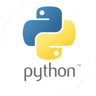

#Python 

{: .center}

[Official website](https://www.python.org/)

This is the introduction to **Python notes**, the notes are divided in:

1. Basics.  
2. Intermediate. 
3. Libraries and Modules. 
4. Frameworks. 
5. Projects.
6. Scripts & algorithms.
7. Virtual environments.  


>The difference of project and scripts, is in the nutshell, that Scripts has random scripts not always outputting useful information, but projects more complex scripts or set of scripts, either with GUI or web, but that output an specific output.

## Some useful information

### How to know the import path

```python 
import sys
print(sys.path)
``` 

### How to know the current directory

```python 
import os
print(os.getcwd())
``` 
### How to inspect a module

To inspect a module we can use `dir(name_module)` and it will output all information about the module 

### About Python Packages

* **Function**: Container of `variables` and `expressions`
* **Class**:  Container of `variables` and `functions`
* **Module**: (roughly) represent a python script which contain class, function, variables, and expressions 
* **Packages**: Solution to manage python modules. Contain multiple modules and the file **__init__.py**

some more information here [Making a Python Package](https://python-packaging-tutorial.readthedocs.io/en/latest/setup_py.html)

### Some Good Rules

1. Be explicit
2. Import Only what you needed
3. Give the right names to packages imports and variables

