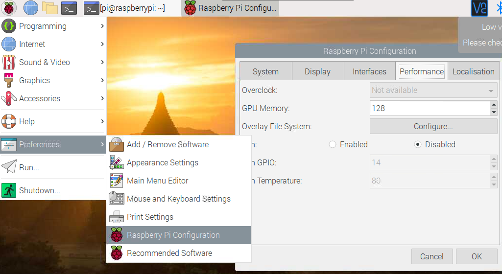
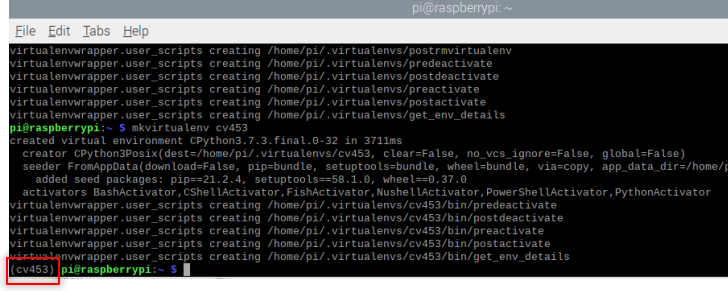
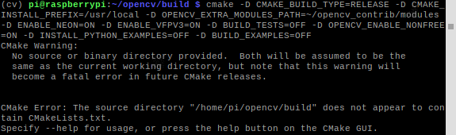
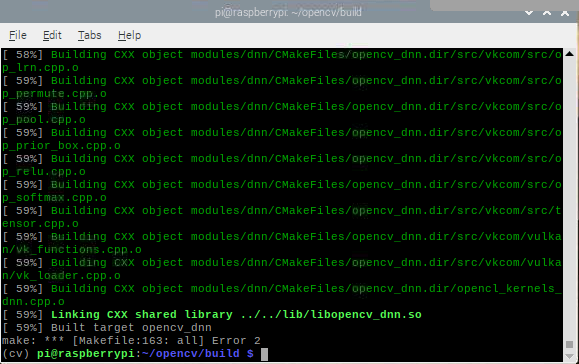

# How to install OpenCV on Raspberry pi

I will divide the process into seven steps.

## Step 1: Preparing the raspberry 

### Expanding filesystem on the Raspberry Pi

The raspberry won't be using all the space available. It will have a directory structure by default. The first step will be to expand that directory to get more space  in the micro-sd card: 

#### Access the raspberry configuration menu
To access the configuration, I need to type on the terminal the following command.
```
sudo raspi-config
```

After entering the command, a configuration menu appears on the screen. 
This menu allows us to change some configurations. 
Using the arrow keys,  I navigate to `Advance Options`.


Next, I select the option "Expand filesystem".


Finally, **<Finish>** and reboot the unit.

```
sudo reboot
```
After the reboot, the available space will expand. To verify it, I use the command `df -h`.


### Deleting software unused to release more space. 
Depending on the OS installed, might not be enough space. I can get some extra space if I remove some of the software installed. To remove the software, I can use the terminal. I will remove libreOffice and Wolfram engine.

```
sudo apt-get purge wolfram-engine
sudo apt-get purge libreoffice*
sudo apt-get clean
sudo apt-get autoremove
```
> dpkg-query -l  will provide a list all the programs installed, I can remove the following:
> * wolfram-engine.  
> * bluej.  
> * greenfoot.  
> * nodered.  
> * nuscratch.  
> * scratch.  
> * sonic-pi.  
> * libreoffice.  
> * claws-mail.  
> * claws-mail-i18n.  
> * minecraft-pi.  
> * python-pygame.  

### Increasing memory assigned to GPU

The raspberry pi share the RAM with CPU and GPU, for the early models like  pi2 and pi3 the memory assigned to GPU is 64Mbytes ( for pi4 is 76MBytes). I'm going to use the raspberry with a project that include vision, so, I will increase the memory assigned to the GPU to 128Mbytes.

1. Go to menu>preference>Raspberry pi configuration 
2. navigate to performance tab 
3. Change value assigned to the GPU
4. reboot 



### verify EEPROM is up-to-date (just for Raspberry pi 4).

This might not be needed it for new installation, but it is a good idea to double check.

1. Check if the EEPROM is up-to-date with `sudo rpi-eeprom-update`.
2. Update it if need it `rpi-eeprom-update -a`

```buildoutcfg
sudo rpi-eeprom-update
sudo rpi-eeprom-update -a
sudo reboot
```

### Verify OS version.

Before to continue with the installation I need to make sure what os I'm using. Using the commands `uname -a` i can get information about the OS.

* aarch64 ---> 64-bit OS.  
* armv7l  ---> 32-bit OS.  

> The steps I follow are for 32-bit.

## Step 2: Installing OpenCV 4 dependencies on Raspberry pi

I start by updating and upgrading the system.

```
sudo apt-get update && sudo apt-get upgrade
```

>This process might take some time 

### Install developer tools (CMake)
After updating, I have to include the developer tools on [CMake](https://cmake.org/)

```
sudo apt-get install build-essential cmake unzip pkg-config
```

### Install libraries to handle video and image.

I'm going to install libraries to work with videos and images.

```commandline
sudo apt-get install cmake gfortran
sudo apt-get install libjpeg-dev libtiff-dev libgif-dev
sudo apt-get install libavcodec-dev libavformat-dev libswscale-dev
sudo apt-get install libgtk2.0-dev libcanberra-gtk*
sudo apt-get install libxvidcore-dev libx264-dev libgtk-3-dev
sudo apt-get install libtbb2 libtbb-dev libdc1394-22-dev libv4l-dev
sudo apt-get install libopenblas-dev libatlas-base-dev libblas-dev
sudo apt-get install libjasper-dev liblapack-dev libhdf5-dev
sudo apt-get install protobuf-compiler
```
## Development toolkits

Toolkits are relevant when you are using a system like linux, this tool kits are going to affect how the app will integrate with the desktop, We have two options **GTK+** and **Qt**.

These are toolkits developer use to create the structure and how the app looks and feel, we are talking about the buttons, toolbars and menus we use in the apps. These toolkits are a time-saver for developers, since we don't need to waste time designing and writing code for evey shape, size and look of every button. we can let the toolkit take care of it.

They are different, however I won't dig deeper in that difference, I will use Qt just because that is what I feel more comfortable. 

### Install GTK
>[GTK](https://www.gtk.org/) is a UI tool kit used to render the different components for a UI.

The next step will be to Install GTK and GUI backend.  I will install an additional package that reduces the GTK warnings.

```
sudo apt-get install libgtk-3-dev
sudo apt-get install libcanberra-gtk*
```

### install Qt
>[Qt](https://www.qt.io/)  Qt is the fastest and smartest war to produce industrial-leading software that user love.

```commandline
sudo apt-get install qt5-default
```

## Step 3: Download OpenCV 4 for Raspberry pi

There are two things to download, the `opencv` and the `opencv_contrib`. 
Bellow the code to download the libraries and unzip them. It is a good practice to rename the directories.

```
cd ~
wget -O opencv.zip https://github.com/opencv/opencv/archive/4.5.3.zip
wget -O opencv_contrib.zip https://github.com/opencv/opencv_contrib/archive/4.5.3.zip
```

I ran into some issue using `wget`, so i had two options, download the zip from github directly, see links bellow, or use `curl`. I used `curl`.

* [opencv](https://github.com/opencv/opencv/releases)  
* [opencv_contrib](https://github.com/opencv/opencv_contrib/releases)

```commandline
sudo curl -L --output opencv.zip https://github.com/opencv/opencv/archive/4.5.3.zip
sudo curl -L --output opencv_contrib https://github.com/opencv/opencv_contrib/archive/refs/tags/4.5.3.zip
```
Once the download finish, we will have two zip files, the next step is to unzip them and rename them, just to make it easier to work with the directories.

```
unzip opencv.zip
unzip opencv_contrib.zip
mv opencv-4.5.3 opencv
mv opencv_contrib-4.5.3 opencv_contrib
```
> `opencv_contrib`  is a repository with additional or extra modules to increase the functionality.
 
## Step 4: Python 3 virtual environment for OpenCV 4

The first step is to check the current version of python 3 (do not use python2), after the version we will need to locate it, and finally we added to the `~/.bashrc` file.

```commandline
python3 --version
which python 3.7

# merge VIRTUALENVWRAPPER_PYTHON=location/version
echo "export VIRTUALENVWRAPPER_PYTHON=/usr/bin/python3.7" >> ~/.bashrc
# reload profile
source ~/.bashrc
```

### Get PIP
We can use `PIP` to make the installation of python packages easier.

```
sudo apt-get install python3-pip
```

### Install the virtual environment
First, we need to get the libraries with `pip`. The second step will be adding the package to the system path.

```
sudo pip3 install virtualenv
sudo pip3 install virtualenvwrapper
```
We need to do some admin work on the `~/.bashrc` file

```
echo "export WORKON_HOME=$HOME/.virtualenvs" >> ~/.bashrc
echo "source /usr/local/bin/virtualenvwrapper.sh" >> ~/.bashrc
source ~/.bashrc
```
Now, we can create the virtual environment with the name `cv453`
```
mkvirtualenv cv453
```
If there are no errors, we should get something like 


There is an extra step, that is the installation  of Numpy, this is important otherwise Cmake won't compile 
```
pip3 install numpy
```

### Step 5: Cmake and compile OpenCV 4

#### Increase the SWAP on the raspberry 
This increase will help with the compilation and avoid issues with memory.

open `/etc/dphys-swapfile` :
```
sudo nano /etc/dphys-swapfile
```

and add:

```
# set the size to absolute value, leaving empty (default) then uses computed value
#   you most likely don't want this, unless you have a special disk situation
# CONF_SWAPSIZE=100
CONF_SWAPSIZE=2048
```

restart the swap service:
```
sudo /etc/init.d/dphys-swapfile stop
sudo /etc/init.d/dphys-swapfile start
```
> Be aware the increase in the size of SWAP might affect the MicroSD card. It is worthy to remember SD cards have a limited number of write and read. It is a good idea to make a copy of the image including OpenCV and python in case the SD card fails.

#### Run CMake for OpenCV
I will use the Cmake command `make` to compile OpenCV.
> This is a time-consuming task
```
cd ~/opencv
mkdir build
cd build
```
Now we can make the compilation, here we will tell Cmake where, what and how to make the OpenCV, In the command bellow we have several flags, some of them are set as off, like the python example, this will allow us to save some memory space, here to we can enable or disable the usage of Qt.

```
cmake -D CMAKE_BUILD_TYPE=RELEASE \
-D CMAKE_INSTALL_PREFIX=/usr/local \
-D OPENCV_EXTRA_MODULES_PATH=~/opencv_contrib/modules \
-D ENABLE_NEON=ON \
-D ENABLE_VFPV3=ON \
-D WITH_OPENMP=ON \
-D WITH_OPENCL=OFF \
-D BUILD_ZLIB=ON \
-D BUILD_TIFF=ON \
-D WITH_FFMPEG=ON \
-D WITH_TBB=ON \
-D BUILD_TBB=ON \
-D BUILD_TESTS=OFF \
-D WITH_EIGEN=OFF \
-D WITH_GSTREAMER=OFF \
-D WITH_V4L=ON \
-D WITH_LIBV4L=ON \
-D WITH_VTK=OFF \
-D WITH_QT=OFF \
-D OPENCV_ENABLE_NONFREE=ON \
-D INSTALL_C_EXAMPLES=OFF \
-D INSTALL_PYTHON_EXAMPLES=OFF \
-D BUILD_opencv_python3=TRUE \
-D OPENCV_GENERATE_PKGCONFIG=ON \
-D BUILD_EXAMPLES=OFF ..
```
The `\` indicate that all is one single line, the space before '-D' is a single space.
>IMPORTANT the  `..` at the end is not a type, it is a way to tell CMAke where is the CmakeList.txt file 

##### Example of missing the `..` at the end
if you miss the last two dots you will get an error message 


Once it is finished, it is a good idea to check the result or the output:
> I didn't add the whole answer, I focus in the report 

```
General configuration for OpenCV 4.4.0 =====================================
--   Version control:               unknown
-- 
--   Extra modules:
--     Location (extra):            /home/pi/opencv_contrib/modules
--     Version control (extra):     unknown
-- 
--   Platform:
--     Timestamp:                   2021-09-29T09:05:47Z
--     Host:                        Linux 5.10.60-v7+ armv7l
--     CMake:                       3.16.3
--     CMake generator:             Unix Makefiles
--     CMake build tool:            /usr/bin/make
--     Configuration:               RELEASE
-- 
--   CPU/HW features:
--     Baseline:                    VFPV3 NEON
--       requested:                 DETECT
--       required:                  VFPV3 NEON
-- 
--   C/C++:
--     Built as dynamic libs?:      YES
--     C++ standard:                11
--     C++ Compiler:                /usr/bin/c++  (ver 8.3.0)
--     C++ flags (Release):         -fsigned-char -W -Wall -Werror=return-type -Werror=non-virtual-dtor -Werror=address -Werror=sequence-point -Wformat -Werror=format-security -Wmissing-declarations -Wundef -Winit-self -Wpointer-arith -Wshadow -Wsign-promo -Wuninitialized -Winit-self -Wsuggest-override -Wno-delete-non-virtual-dtor -Wno-comment -Wimplicit-fallthrough=3 -Wno-strict-overflow -fdiagnostics-show-option -pthread -fomit-frame-pointer -ffunction-sections -fdata-sections  -mfpu=neon -fvisibility=hidden -fvisibility-inlines-hidden -O3 -DNDEBUG  -DNDEBUG
--     C++ flags (Debug):           -fsigned-char -W -Wall -Werror=return-type -Werror=non-virtual-dtor -Werror=address -Werror=sequence-point -Wformat -Werror=format-security -Wmissing-declarations -Wundef -Winit-self -Wpointer-arith -Wshadow -Wsign-promo -Wuninitialized -Winit-self -Wsuggest-override -Wno-delete-non-virtual-dtor -Wno-comment -Wimplicit-fallthrough=3 -Wno-strict-overflow -fdiagnostics-show-option -pthread -fomit-frame-pointer -ffunction-sections -fdata-sections  -mfpu=neon -fvisibility=hidden -fvisibility-inlines-hidden -g  -O0 -DDEBUG -D_DEBUG
--     C Compiler:                  /usr/bin/cc
--     C flags (Release):           -fsigned-char -W -Wall -Werror=return-type -Werror=non-virtual-dtor -Werror=address -Werror=sequence-point -Wformat -Werror=format-security -Wmissing-declarations -Wmissing-prototypes -Wstrict-prototypes -Wundef -Winit-self -Wpointer-arith -Wshadow -Wuninitialized -Winit-self -Wno-comment -Wimplicit-fallthrough=3 -Wno-strict-overflow -fdiagnostics-show-option -pthread -fomit-frame-pointer -ffunction-sections -fdata-sections  -mfpu=neon -fvisibility=hidden -O3 -DNDEBUG  -DNDEBUG
--     C flags (Debug):             -fsigned-char -W -Wall -Werror=return-type -Werror=non-virtual-dtor -Werror=address -Werror=sequence-point -Wformat -Werror=format-security -Wmissing-declarations -Wmissing-prototypes -Wstrict-prototypes -Wundef -Winit-self -Wpointer-arith -Wshadow -Wuninitialized -Winit-self -Wno-comment -Wimplicit-fallthrough=3 -Wno-strict-overflow -fdiagnostics-show-option -pthread -fomit-frame-pointer -ffunction-sections -fdata-sections  -mfpu=neon -fvisibility=hidden -g  -O0 -DDEBUG -D_DEBUG
--     Linker flags (Release):      -Wl,--gc-sections -Wl,--as-needed  
--     Linker flags (Debug):        -Wl,--gc-sections -Wl,--as-needed  
--     ccache:                      NO
--     Precompiled headers:         NO
--     Extra dependencies:          dl m pthread rt
--     3rdparty dependencies:
-- 
--   OpenCV modules:
--     To be built:                 aruco bgsegm bioinspired calib3d ccalib core datasets dnn dnn_objdetect dnn_superres dpm face features2d flann freetype fuzzy gapi hfs highgui img_hash imgcodecs imgproc intensity_transform line_descriptor ml objdetect optflow phase_unwrapping photo plot python2 python3 quality rapid reg rgbd saliency shape stereo stitching structured_light superres surface_matching text tracking ts video videoio videostab xfeatures2d ximgproc xobjdetect xphoto
--     Disabled:                    world
--     Disabled by dependency:      -
--     Unavailable:                 alphamat cnn_3dobj cudaarithm cudabgsegm cudacodec cudafeatures2d cudafilters cudaimgproc cudalegacy cudaobjdetect cudaoptflow cudastereo cudawarping cudev cvv hdf java js julia matlab ovis sfm viz
--     Applications:                perf_tests apps
--     Documentation:               NO
--     Non-free algorithms:         YES
-- 
--   GUI: 
--     GTK+:                        YES (ver 3.24.5)
--       GThread :                  YES (ver 2.58.3)
--       GtkGlExt:                  NO
--     VTK support:                 NO
-- 
--   Media I/O: 
--     ZLib:                        /usr/lib/arm-linux-gnueabihf/libz.so (ver 1.2.11)
--     JPEG:                        /usr/lib/arm-linux-gnueabihf/libjpeg.so (ver 62)
--     WEBP:                        build (ver encoder: 0x020f)
--     PNG:                         /usr/lib/arm-linux-gnueabihf/libpng.so (ver 1.6.36)
--     TIFF:                        /usr/lib/arm-linux-gnueabihf/libtiff.so (ver 42 / 4.1.0)
--     JPEG 2000:                   build Jasper (ver 1.900.1)
--     OpenEXR:                     build (ver 2.3.0)
--     HDR:                         YES
--     SUNRASTER:                   YES
--     PXM:                         YES
--     PFM:                         YES
-- 
--   Video I/O:
--     DC1394:                      NO
--     FFMPEG:                      YES
--       avcodec:                   YES (58.35.100)
--       avformat:                  YES (58.20.100)
--       avutil:                    YES (56.22.100)
--       swscale:                   YES (5.3.100)
--       avresample:                NO
--     GStreamer:                   NO
--     v4l/v4l2:                    YES (linux/videodev2.h)
-- 
--   Parallel framework:            pthreads
-- 
--   Trace:                         YES (with Intel ITT)
-- 
--   Other third-party libraries:
--     Lapack:                      NO
--     Eigen:                       NO
--     Custom HAL:                  YES (carotene (ver 0.0.1))
--     Protobuf:                    build (3.5.1)
-- 
--   OpenCL:                        YES (no extra features)
--     Include path:                /home/pi/opencv/3rdparty/include/opencl/1.2
--     Link libraries:              Dynamic load
-- 
--   Python 2:
--     Interpreter:                 /usr/bin/python2.7 (ver 2.7.16)
--     Libraries:                   /usr/lib/arm-linux-gnueabihf/libpython2.7.so (ver 2.7.16)
--     numpy:                       /usr/lib/python2.7/dist-packages/numpy/core/include (ver 1.16.2)
--     install path:                lib/python2.7/dist-packages/cv2/python-2.7
-- 
--   Python 3:
--     Interpreter:                 /home/pi/cv/bin/python3 (ver 3.7.3)
--     Libraries:                   /usr/lib/arm-linux-gnueabihf/libpython3.7m.so (ver 3.7.3)
--     numpy:                       /home/pi/cv/lib/python3.7/site-packages/numpy/core/include (ver 1.21.2)
--     install path:                lib/python3.7/site-packages/cv2/python-3.7
-- 
--   Python (for build):            /usr/bin/python2.7
-- 
--   Java:                          
--     ant:                         NO
--     JNI:                         NO
--     Java wrappers:               NO
--     Java tests:                  NO
-- 
--   Install to:                    /usr/local
-- -----------------------------------------------------------------
-- 
-- Configuring done
-- Generating done
-- Build files have been written to: /home/pi/opencv/build

```


#### Compile OpenCV4

Compile the OpenCV
```
make -j4
```

The `-j4`  argument specifies that I have 4 cores for compilation. if there are problems with the compilation try `make` without `-j4`.



#### Install OpenCV 4

```
sudo make install
sudo ldconfig
```

#### DON'T FORGET  to reset the SWAP size 
 open the file with `/etc/dphys-swapfile` and reset `CONF_SWAPSIZE` to 100MB, reset the swap service 

```
sudo /etc/init.d/dphys-swapfile stop
sudo /etc/init.d/dphys-swapfile start
```
#### Cleaning
now we can clean the make and update the system
```commandline
make clean
sudo apt-get update
```
we can remove the zip files too
```commandline
cd ~
rm opencv.zip
rm opencv_contrib.zip
sudo reboot
```

### Step 6: Link OpenCV to python virtual environment 

This an important step if we use a virtual environment, otherwise the system won't be able to import openCV correctly 

```
cd ~/.virtualenvs/cv453/lib/python3.7/site-packages
ln -s /usr/local/lib/python3.7/site-packages/cv2/python-3.7/cv2.cpython-37m-arm-linux-gnueabihf.so
cd ~
```

### Step 7: Test OpenCV

Using the terminal

```
workon cv
python
>>> import cv2
>>> cv2.__version__

```


