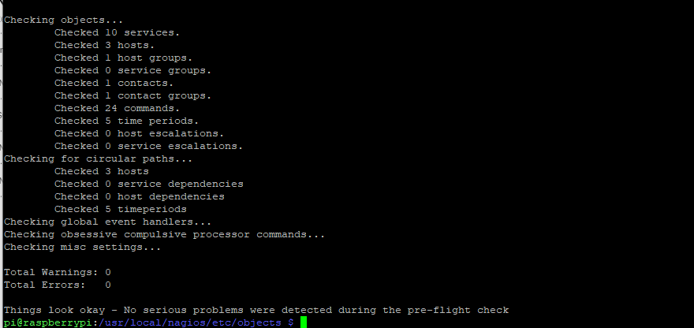

{: .center}

[Nagios](https://www.nagios.org/) is an open source software light-weight  designed to monitor system, networks and infrastructure, its light weight allow us to install it in a raspberry.

There are several version but in this tutorial we go for the [Nagios Core](https://github.com/NagiosEnterprises/nagioscore)

## 1. Prepare Raspberry

1. Update the system.

```Bash
sudo apt updates
sudo apt full-upgrade
```
2. Install the packages need it for Nagios

```Bash
sudo apt install -y autoconf build-essential wget unzip apache2 apache2-utils php libgd-dev snmp libnet-snmp-perl gettext libssl-dev wget bc gawk dc libmcrypt-dev
```

## 2. Download and compiling Nagios

####1. Move to a temporal directory `/tmp` were wi later will download the Nagios source code.

```Bash
cd /tmp
```

####2. Download the Nagios source code

```Bash
wget -O nagios.tar.gz https://github.com/NagiosEnterprises/nagioscore/archive/nagios-4.4.6.tar.gz
```

> I had an issue with SSL those i download it normally and i move it to the directory manually

####3. Extract the files

```Bash
tar xzf nagios.tar.gz
```

####4. Move to the directory and prepare for compilation
```Bash
cd /tmp/nagioscore-nagios-4.4.6/
./configure --with-httpd-conf=/etc/apache2/sites-enabled
```

####5. Compile Nagios
```Bash
make all
```

## 3. Settings up Nagios on the Raspberry

####1. Create users and groups with the `make ` command

```Bash
sudo make install-groups-users
sudo usermod -a -G nagios www-data
```
####2. Installed the binaries to the system using the command bellow

```Bash
sudo make install
```

####3. With the `make ` command we install the Nagios service and make it start at boot
this command install the Nagios core deamon

```Bash
sudo make install-daemoninit
```

####4. we set up the external command directory

```Bash
sudo make install-commandmode
```

####5. Copy a sample configuration file using `make`
this file is important without it the software wont run

```Bash
sudo make install-config
```

####6. now configure the apache server or to install the configuration for the apache

```Bash
sudo make install-webconf
sudo a2enmod rewrite
sudo a2enmod cgi
```

####7. Now we create an apache user that we will use to access the Nagios interface

The following command will create a user called nagiosadmin. You will be asked to specify a password for this user.
```Bash
sudo htpasswd -c /usr/local/nagios/etc/htpasswd.users nagiosadmin
```
The user must be called nagiosadmin to satisfy the default configuration of Nagios.

## 4. Starting Nagios on Raspberry

####1. Restart the Apache server

```Bash
sudo systemctl restart apache2
```

####2. Enable NAgios service and start it up by running the following two commands

```Bash
sudo systemctl enable nagios
sudo systemctl start nagios
```
By enabling the service, we will be allowing Nagios to start up at boot on your Raspberry Pi.

####3. Verify that Nagios has started on your Raspberry Pi by running the following command.

```Bash
sudo systemctl status nagios
```

If everything is working as intended, you should see the following text be outputted to the terminal.

```Bash
Active: active (running)
```

This text tells us that the service is active and is currently running.

## 5. Installing the Nagios Plug-ins

In this section, we will be showing you how to install these Nagios plugins on your Raspberry Pi.

####1. First change into our /tmp directory.
```Bash
cd /tmp
```
####2. Now that we are in the /tmp directory, we can download the Nagios plugins by running the command below.
```Bash
wget -O nagios-plugins.tar.gz https://github.com/nagios-plugins/nagios-plugins/releases/download/release-2.3.3/nagios-plugins-2.3.3.tar.gz
```
####3. Now extract the plugin source code to our current directory by using the following command.
```Bash
tar zxf nagios-plugins.tar.gz
```
####4. Our next step is to change into our newly created directory and configure the plugins for compilation.
```Bash
cd /tmp/nagios-plugins-2.3.3
./configure
```
####4. Once the configuration process has completed, we can compile the Nagios plugins by running the following command.
```Bash
make
```
Depending on your Raspberry Pi, this process can take some time. However, it should be a lot faster than compiling the base Nagios code.

####5. Finish up this process by installing the Nagios plugins by running the following command.
```Bash
sudo make install
```
####6. To make sure Nagios loads in the new plugins, restart the software by running the command below.
```Bash
sudo systemctl restart nagios
```
## 6. Connecting the Nagios Web interface

We can access the UI by

```
http://[IPADDRESS]/nagios
```
You can retrieve your Raspberry Pi’s local IP address by running the following command.
```
hostname -I
```

## 7. Adding Devices to Nagios

To add host we will need to create a configuration file that later Nagios will read.

####1. Navigate to `object` configuration folder for Nagios

this is a default folder that contain sample configuration files  we can check the file to get an idea

```Bash
cd /usr/local/nagios/etc/objects
```

####2. Now lets create a configuration file

We can use a name `pimylifeuphost.cfg`

```Bash
sudo nano pimylifeuphost.cfg
```

####3. within the file we can enter the following

```Bash
define host {
    use                     linux-server            ; Host group to use
    host_name               Pi My Life Up Host      ; Name of this host
    alias                   pimylifeuphost          ; Alias
    address                 [YOURHOSTIPADDRESS]     ; IP Address
}
```
> to save `ctrl` + `x` follow by `y` and enter

####4. We need to modify the Nagios file to be able to read the new host

```Bash
sudo nano /usr/local/nagios/etc/nagios.cfg
```

####5. within the file we need to do changes

Find
```Bash
cfg_file=/usr/local/nagios/etc/objects/templates.cf
```

add Bellow
```Bash
cfg_file=/usr/local/nagios/etc/objects/pimylifeuphost.cfg
```

Restart Nagios
```Bash
sudo systemctl restart nagios
```
For now we are making a ping check and nothing else, for more specialties test we need to configure the services

## 8. Adding Service to Nagios

This example we will add **check_http** and **Check_ssh**

####1. We need to modify the host configuration created earlier

```Bash
define service {
    use                     local-service
    host_name               Pi My Life Up Host
    service_description     SSH
    check_command           check_ssh
}

define service {
    use                     local-service
    host_name               Pi My Life Up Host
    service_description     HTTP
    check_command           check_http
}
```

####2. We need to check if the configuration made is correct

```Bash
sudo /usr/local/nagios/bin/nagios -v /usr/local/nagios/etc/nagios.cfg
```

If everything is okay we will see `Things look okay`



Now we restart Nagios
```Bash
sudo systemctl restart nagios
```
