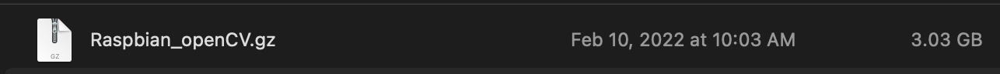
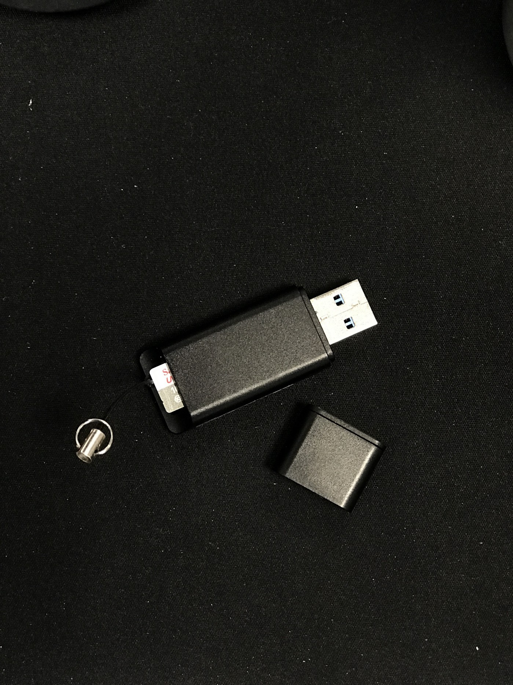

# Make a Clone of Customized Raspbian OS

I will use a Linux machine, GParted, and a Bash script to clone, shrink and compress the instance of Raspbian containing OpenCV.
GParted is a partition-editing application, used for creating, deleting, resizing, moving, checking, and copying disk partitions and their file systems.
The final result will be a compressed file like this:



##The steps
1. Pre-Requisites.  
2. Prepare the environment.  
3. Making a Clone of the custom Raspbian OS.  
4. (optional) compress the image further.  


##1. Pre-Requisites
1. A Linux machine, not the Raspberry.  
2. A working instance of the Raspbian OS.  

##2. Prepare the environment
1.Install `gparted`
```commandline
sudo apt-get install gparted
```

2.Using a USB adapter connect the SDcard to the Linux machine.  


##3. Making a Clone of the custom Raspbian OS

###1.Find the USB with the Raspbian OS.  
```commandline
sudo fdisk -l
```
###2. Clone the Raspbian OS.  
```commandline
sudo dd if=/dev/sdb of=/your/path/to/clone.img
```

where:  

* `if` Stand for the Input file, this is the path to the USB with the Raspbian OS.  
* `of` Stand for the Output file, where we will save the clone OS.  

<aside>
    🔥 This process might take between 20 and 40 minutes.
</aside>

###3. Shrinking the image

The clone can be shrunk further ( in some cases the clone can be 16GB), so it is a good idea to shrink it.
For the process, one can use the script pishrink by Drewsif:

[GitHub - Drewsif/PiShrink: Make your pi images smaller!](https://github.com/Drewsif/PiShrink)

```commandline
wget <https://raw.githubusercontent.com/Drewsif/PiShrink/master/pishrink.sh>
chmod +x pishrink.sh
sudo mv pishrink.sh /usr/local/bin
```

to execute the script
```commandline
sudo pishrink.sh /your/path/to/clone.img /your/path/to/shrink_image.img
```

##4. (optional) Compress the image further
```commandline
gzip -9 /your/path/to/shrink_image.img
```
