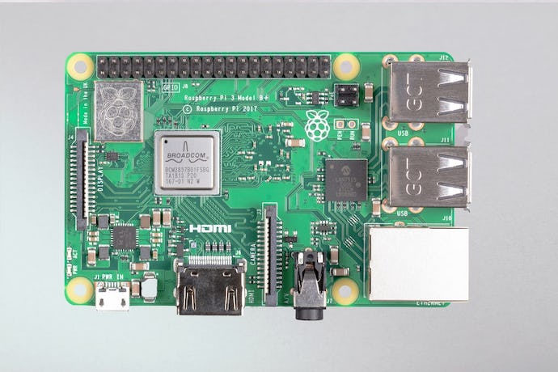
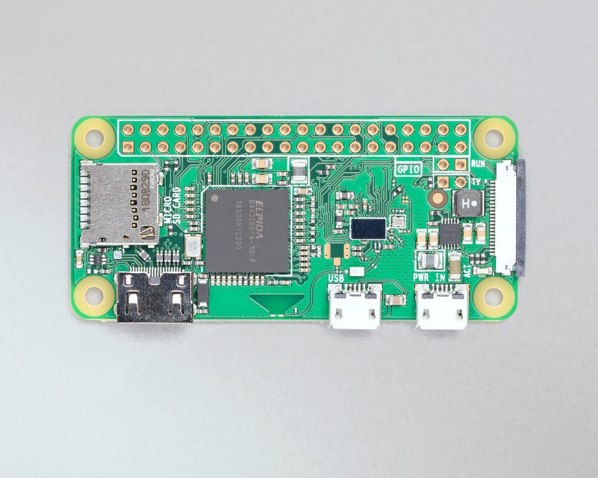
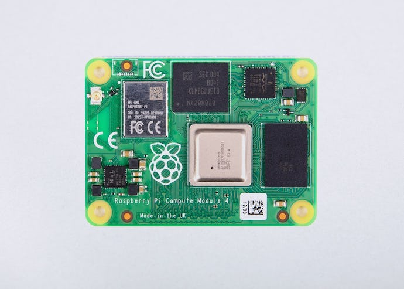
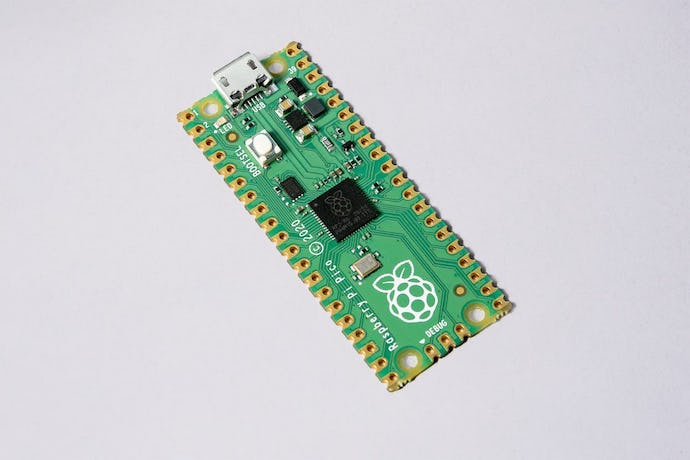

# Raspberry Pi 
{ .center}

Raspberry  pi  is a single board computer create for the UK-Based foundation [Raspberry pi](https://www.raspberrypi.org/)

-------------------------------
{loading=lazy, width="300"}   
[What is raspberry pi](https://www.youtube.com/watch?v=uXUjwk2-qx4)

Raspberry pi in all its forms is a mini-computer running a modified version of Linux Debian call Raspbian OS, although Raspberry pi foundation has created a special distribution for these devices, it is possible to install different distributions and some customize images of Raspbian OS (Linux distro special for Raspberry pi). I most mentioned that now Raspberry foundation is offering a microcontroller call raspberry pico, this microcontroller is closer to an Arduino than to a single board computer.

--------------------------------

## Raspberry models

### Model B/B+
  {loading=lazy}<figcaption>raspberrypi.com</figcaption>
  These are the most popular form factor, they required a SD card to work, and it provided different ports, from Ethernet to USB 3 (in some models). 

  * [Raspberry pi 4 Model B](https://www.raspberrypi.com/products/raspberry-pi-4-model-b/)  
  * [Raspberry pi 3 Model B+](https://www.raspberrypi.com/products/raspberry-pi-3-model-b-plus/)  
  * [Raspberry pi 3 Model B](https://www.raspberrypi.com/products/raspberry-pi-3-model-b/)  
  * [Raspberry pi 1 Model B+](https://www.raspberrypi.com/products/raspberry-pi-1-model-b-plus/)  

### Model A/A+

  {loading=lazy}<figcaption>raspberrypi.com</figcaption>
  This is a smaller form factor, with fewer ports similar performance in a smaller package.  

  * [Raspberry pi 3 Model A+](https://www.raspberrypi.com/products/raspberry-pi-3-model-a-plus/)  
  * [Raspberry pi 1 Model A+](https://www.raspberrypi.com/products/raspberry-pi-1-model-a-plus/)  

### Zero

  {loading=lazy}<figcaption>raspberrypi.com</figcaption>
  Another version of the Raspberry Pi, Although some models of the raspberry pi zero have limitations in outputs or onboard wifi, it is versatile hardware capable to run the same version of Raspbian resent on Raspberry pi model B+.    
 * [Raspberry Pi Zero W](https://www.raspberrypi.com/products/raspberry-pi-zero-w/)  
 * [Raspberry Pi Zero](https://www.raspberrypi.com/products/raspberry-pi-zero/)     

### Compute modules

  {loading=lazy}<figcaption>raspberrypi.com</figcaption>
  
  This is to compute module, these are versions of the raspberry pi without the IO or output connectors, they required other devices to be able to connect. These modules are used in several applications such as NAS, Routers, Emulators, or Clusters, the run the same software that the other Pis.
  
  * [Raspberry Pi compute module 4](https://www.raspberrypi.com/products/compute-module-4/?variant=raspberry-pi-cm4001000)  
  * [Raspberry Pi compute module 3+](https://www.raspberrypi.com/products/compute-module-3-plus/)

  
### Pico

  {loading=lazy}<figcaption>raspberrypi.com</figcaption>
  These are not single-board computers. They are a microcontroller designed and made by the Raspberry foundation.  

  * [Raspberry Pico](https://www.raspberrypi.com/products/raspberry-pi-pico/)

------------------------------------------------------------------------------------

