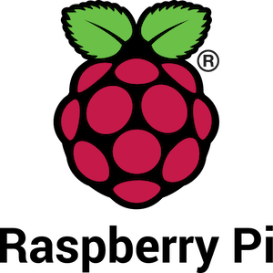
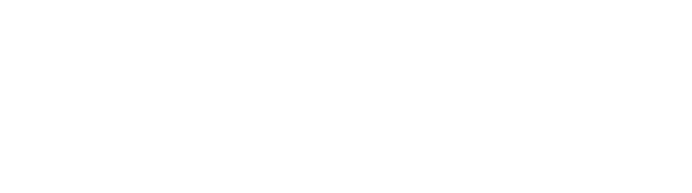
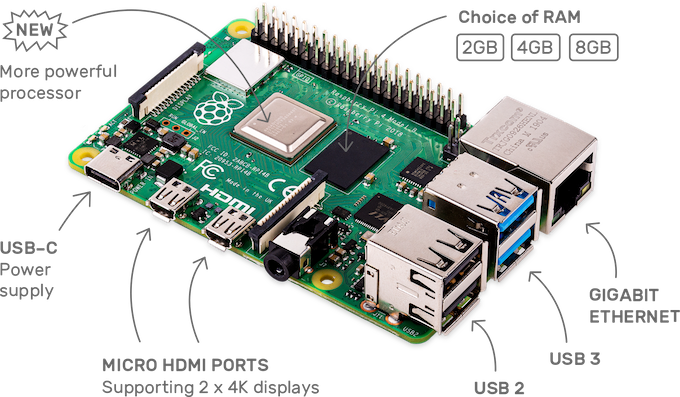
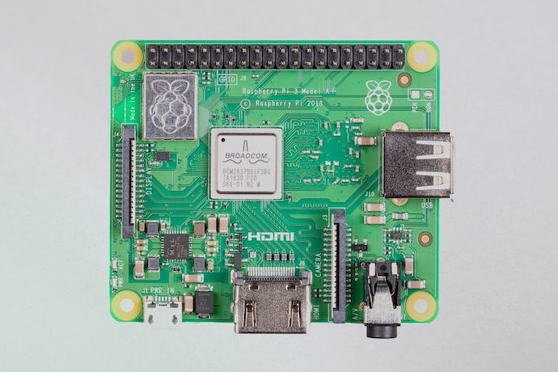

# Raspberry Pi 
 {. :center}

Raspberry  pi  is a single board computer create for the UK-Based foundation [Raspberry pi](https://www.raspberrypi.org/)

-------------------------------

[What is raspberry pi](https://www.youtube.com/watch?v=uXUjwk2-qx4)

The most simple of terms, Raspberry pi in all their forms is a mini computer running a modify version of linux debian call raspbian OS, although Raspberry pi foundation has created a special distribution with for these devices, it is possible to install different distribution and some customize images of raspbian OS (linux distro special for Raspberry pi). I most mentioned that now raspberry foundation is offering a microcontroller call raspberry pico, this microcontroller is closer to an arduino that to a single board computer.

## Raspberry models

### Model B/B+
  
  These are the most popular form factor, they required a SD card to work, and it provided different ports, from Ethernet to USB 3 (in some models)

  
Raspberry pi Model B/B+

  * [Raspberry pi 4 Model B](https://www.raspberrypi.com/products/raspberry-pi-4-model-b/)
  * [Raspberry pi 3 Model B+](https://www.raspberrypi.com/products/raspberry-pi-3-model-b-plus/)
  * [Raspberry pi 3 Model B](https://www.raspberrypi.com/products/raspberry-pi-3-model-b/)
  * [Raspberry pi 1 Model B+](https://www.raspberrypi.com/products/raspberry-pi-1-model-b-plus/)
  

### Model A/A+

  
  This is a smaller form factor, with fewer ports similar performance in a smaller package.

  
Raspberry pi Model A/A+

  * [Raspberry pi 3 Model A+](https://www.raspberrypi.com/products/raspberry-pi-3-model-a-plus/)
  * [Raspberry pi 1 Model A+](https://www.raspberrypi.com/products/raspberry-pi-1-model-a-plus/)

