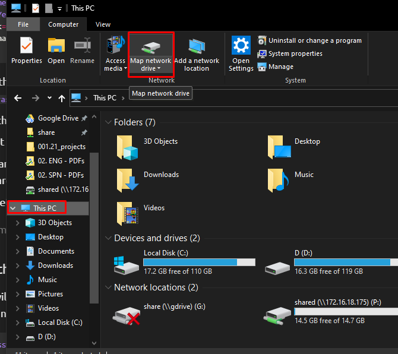
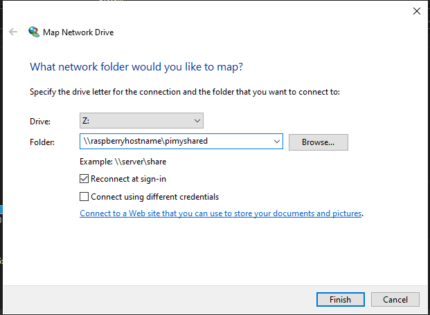

Samba is a re-implementation of the SMB network protocol, and allows Linux computer to integrate into Microsoft' active directory environments without any issue.

By using samba in the raspberry we can share directories in a way they can be accessed on almost every operating system.

This is probably the Easiest way to set up a NAS, although it exists other alternatives Samba is the one that i have use the most.

## Setting the samba server

### Initial steps

* Before set up the SMB share we need to be sure that the Raspberry is up-to-date.

```bash
sudo apt-get update
sudo apt-get upgrade
```

* Now we need to install the samba software

```bash
sudo apt-get install samba samba-common-bin
```

* Now we can set up the folder to share, this folder can be in any location, in the internal storage or in a mounted external hard drive.

```bash
mkdir /home/pi/shared
```

* To share the folder with the samba software we need to modify the **smb.conf** file

```bash
sudo nano /etc/samba/smb.conf
```

```bash
[pimyshare]
path = /home/pi/shared
writeable=Yes
create mask=0777
directory mask=0777
public=no
```

1. `[pimyshare]` the text in brackets define the point were we will access the folder itself, example `//raspberrypi/pimyshare`.
2. `path` this is the path to the directory that we are going to share
3. `writeable` set as `yes` allow the user to write in the folder.
4. `create mask` and `directory mask`  define the permission for both folder and files, if is set as  $0777$ users are allow to read, write and execute.
5. `public` if is set to `no` ti will require a valid user to grand access to the folder


> save the document in this case `ctrl` + `X` and `Y`

### Set a user for the samba share

In this case we will create a password that follow the default password of raspberry, so the user will be `pi` and the password will be `raspberry`

```bash
sudo smbpasswd -a pi
```

we need to restart the server now

```bash
sudo systemctl restart smbd
```

> we can get the host name with  `hostname -I`

### Connecting to the Samba server

In this case the configuration will be different in windows  and Windows

#### Windows

* File Explorer > Computer > Map network drive

{: .center}

* now we need to input the name of the host or the IP address follow by the name of the folder ( name in brackets in the configuration file)

{: .center}

**we will need to log in first with the user and password defined before**

#### MacOS

We will need to connect to a server and the address will be something like `smb://raspberryhost/pimyshared`
