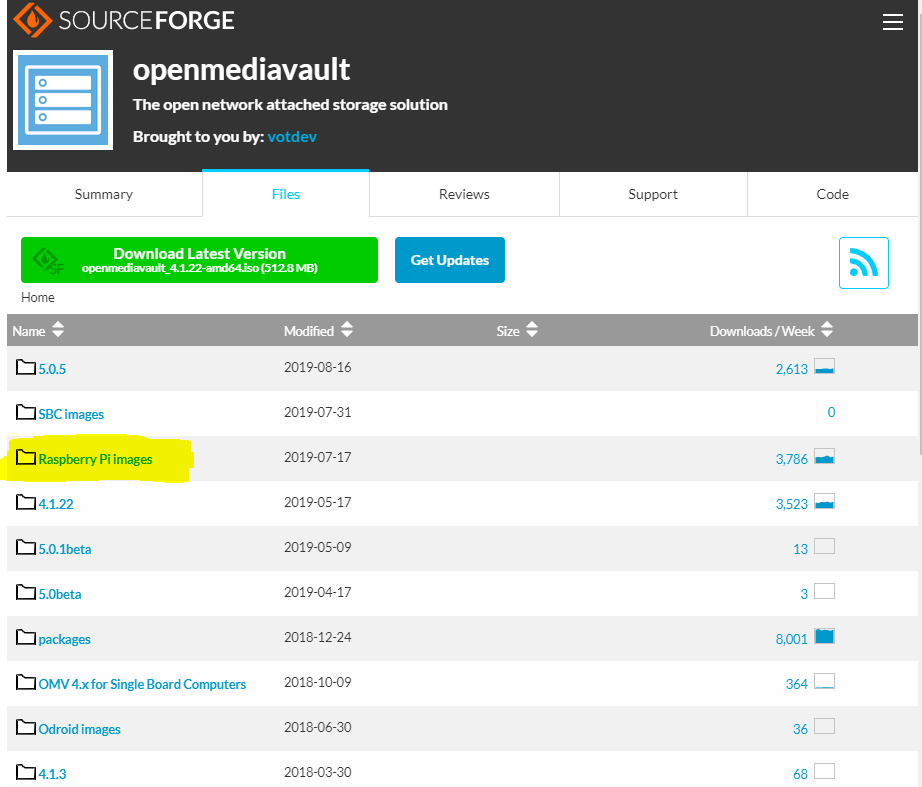

This is the Guide to install and sett up the [Open Media vault](https://www.openmediavault.org/) on the Raspberry pi ( in this case raspberry pi 3B)

From the Open media vault website
> **What is openmediavault?**
openmediavault is the next generation network attached storage (NAS) solution based on Debian Linux. It contains services like SSH, (S)FTP, SMB/CIFS, DAAP media server, RSync, BitTorrent client and many more. Thanks to the modular design of the framework it can be enhanced via plugins.

## Download Image

In this case we need to download the images for the Raspberry

We can use [balenaEtcher](https://www.balena.io/etcher/)  to flash the image, after this we can put it in the RAspberry pi and boot it up, the next steps i did it connecting a keyboard to the Raspberry and a screen, this might be possible connecting to the raspberry by SSH but i didn't try.

## Configuration

1. Let the raspberry boot up.
2. Connect using the default user and password, this will be `root` and `openmediavault`.
3. Set a new password.
4. Run `reboot`
5. Once rebooted run `sudo /etc/network/interfaces`
6. In this document add this line at the end `dns-nameservers 8.8.4.4 8.8.8.8 `
7. Run `reboot`
8. Run `sudo apt-get update`
9. Run `sudo apt-get upgrade`
10. After it finish, run `reboot`
11. Run `omv-firstaid`
12. Previous command will display a menu.
13. Select from the menu **clean apt**.
14. Select **Clear local upload package repository**.
15. Select **Clear web control panel cache**.
16. Run `reboot`
17. Run `omv-firstaid`
18. Select **Configure network interface**, select or just go OK...OK until finish.
19. Run `omv-firstaid`
20. Select **Configure web control panel** the default will be 80.
21. Run `sudo apt-get update`
22. Run `sudo apt-get upgrade`

Now we can access to the web configuration using the IP address mention in the raspberry screen, the user and password will be `admin` and `openmediavault`

source: [configure OMV on raspberry](https://forum.openmediavault.org/index.php/Thread/23693-Can-t-access-to-OMV-with-my-IP-Adress/)
